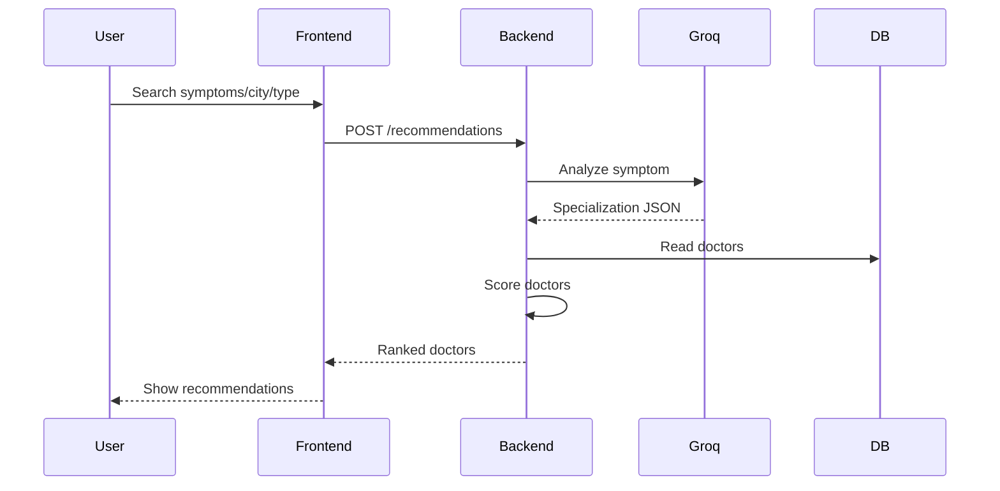
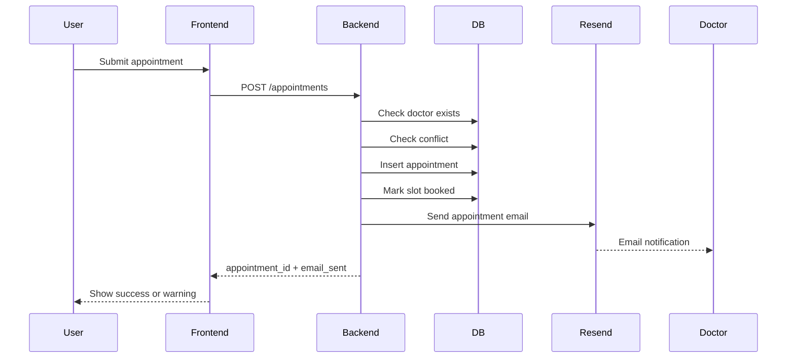
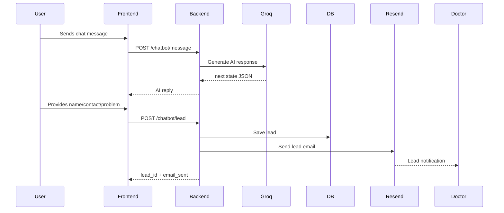
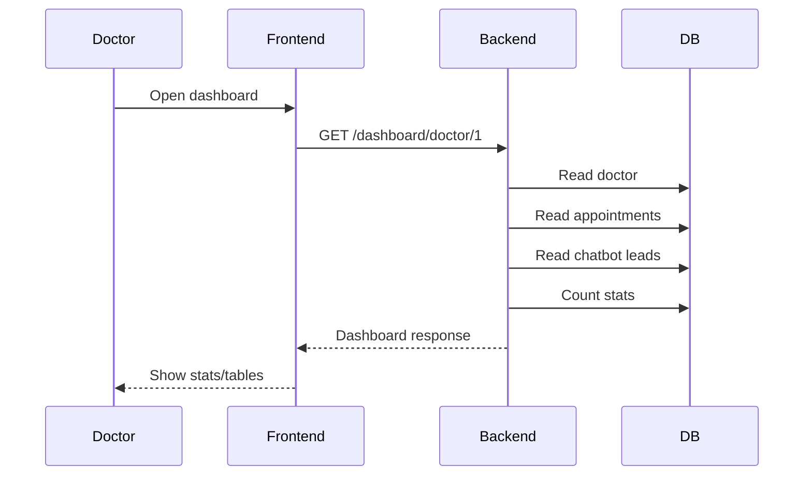

# AGENTS.md — Smart Doctor Connect AI Development Workflow

**Project:** Smart Doctor Connect AI  
**Purpose:** Master agent workflow file for Antigravity project development  
**Stack:** FastAPI + React/Next.js + SQLite/Supabase PostgreSQL + Groq + Resend  
**Core Documents:** `idea.md`, `planning.md`, `schema.md`, `backend_agent.md`, `frontend_agent.md`  
**Hackathon Constraint:** 2 hours  
**Main Rule:** Agents must not drift from the finalized project scope and API contracts.

---

# 1. Purpose of This File

This file explains how Antigravity agents should develop the full project from the agreed documentation.

It defines:

```txt
1. Which files each agent must read
2. What order agents should work in
3. How backend, frontend, and database work together
4. Which contracts are strict
5. How testing happens before commits
6. How Docker/deployment readiness is maintained
7. What must not be changed without explicit approval
```

The goal is to make the whole system buildable with multiple agents while keeping the implementation consistent.

---

# 2. Project Summary

Smart Doctor Connect AI is a web application that helps patients in Pakistan find suitable doctors using AI.

The system allows a patient to:

```txt
1. Search by symptoms, specialization, city, or consultation type
2. Get AI-powered doctor recommendations using Groq
3. View doctor profiles
4. Book online or physical appointments
5. Avoid double booking through conflict-free scheduling
6. Chat with an AI assistant when doctor is unavailable
7. Submit name, contact, and problem through chatbot
8. Notify doctor through Resend email
9. Let doctor view appointments and leads in dashboard
```

The system has these core modules:

```txt
1. Doctor Profile Module
2. AI Recommendation Module
3. Availability Module
4. Appointment Booking Module
5. AI Chatbot Lead Capture Module
6. Resend Email Notification Module
7. Doctor Dashboard Module
8. Responsive Frontend UI
9. Docker Deployment Setup
```

---

# 3. Source of Truth Documents

Agents must read project files in this order.

## 3.1 Primary Source

```txt
idea.md
```

Purpose:

```txt
Defines the final product idea, project scope, feature set, workflows, diagrams, APIs, and evaluation criteria alignment.
```

Agent rule:

```txt
If a feature is not in idea.md, do not build it unless the user explicitly asks.
```

---

## 3.2 Execution Source

```txt
planning.md
```

Purpose:

```txt
Defines the full implementation plan, module tasks, test gates, commit gates, Docker readiness, and 2-hour development order.
```

Agent rule:

```txt
Tasks should follow planning.md module sequence unless a dependency requires a small adjustment.
```

---

## 3.3 Database Source

```txt
schema.md
```

Purpose:

```txt
Defines exact database tables, fields, relationships, SQLAlchemy models, Pydantic contracts, Supabase connection plan, and API-to-table mapping.
```

Agent rule:

```txt
Database agents and backend agents must follow schema.md exactly.
```

---

## 3.4 Backend Source

```txt
backend_agent.md
```

Purpose:

```txt
Defines backend folder structure, FastAPI modules, strict REST API contracts, services, utilities, transactions, testing, deployment, and debugging.
```

Agent rule:

```txt
Backend agents must not rename endpoints, fields, services, tables, or response keys.
```

---

## 3.5 Frontend Source

```txt
frontend_agent.md
```

Purpose:

```txt
Defines frontend folder structure, pages, components, TypeScript types, REST API client, responsive behavior, UI flows, and frontend tests.
```

Agent rule:

```txt
Frontend agents must use backend_agent.md API contracts exactly.
```

---

# 4. Global Development Rules

These rules apply to every agent.

## 4.1 No Scope Drift

Do not add:

```txt
1. Full auth
2. Google OAuth
3. Payment system
4. Video consultation
5. Admin dashboard
6. Full patient dashboard
7. Reviews
8. Realtime WebSocket chat
9. Reminder cron jobs
10. Profile image upload
11. PMDC verification
```

These are future features, not 2-hour MVP features.

---

## 4.2 No API Contract Drift

Agents must not change these endpoint paths:

```txt
GET    /health

GET    /doctors
GET    /doctors/{doctor_id}
POST   /doctors
PUT    /doctors/{doctor_id}
GET    /doctors/search

POST   /recommendations

GET    /availability/{doctor_id}
POST   /availability/{doctor_id}
PUT    /availability/slot/{slot_id}

POST   /appointments
GET    /appointments/doctor/{doctor_id}
GET    /appointments/{appointment_id}
PUT    /appointments/{appointment_id}/status

POST   /chatbot/message
POST   /chatbot/lead
GET    /chatbot/leads/{doctor_id}

POST   /email/send-appointment
POST   /email/send-lead

GET    /dashboard/doctor/{doctor_id}
```

Agents must not rename these key response fields:

```txt
detected_specialization
urgency
ai_reason
recommended_doctors
safety_note
score
recommendation_reason
appointment_id
status
email_sent
available_alternative_slots
reply
next_state
collected_data
is_complete
lead_id
doctor
stats
appointments
chatbot_leads
earliest_available_slot
```

---

## 4.3 No Secret Exposure

Agents must never place these in frontend code:

```txt
GROQ_API_KEY
RESEND_API_KEY
DATABASE_URL
Supabase password
```

Frontend only uses:

```env
NEXT_PUBLIC_API_URL=http://localhost:8000
```

Backend owns all secrets.

---

## 4.4 Docker Must Stay Working

The project must remain Docker-ready.

Required files:

```txt
backend/Dockerfile
frontend/Dockerfile
docker-compose.yml
demo.env
```

Before final handoff:

```bash
docker compose --env-file demo.env up --build
```

must work.

---

## 4.5 Test Before Commit

Before committing any module:

```bash
cd backend && pytest -q
cd frontend && npm run build
docker compose --env-file demo.env config
```

If time is short, run targeted tests for changed area plus frontend build.

---

# 5. Agent Roles

Antigravity should treat the project as multiple cooperating agents.

---

## 5.1 Project Manager Agent

### Reads

```txt
idea.md
planning.md
AGENTS.md
```

### Responsibilities

```txt
1. Keep development aligned with MVP scope
2. Assign work in correct order
3. Prevent overbuilding
4. Track module completion
5. Ensure every module has tests
6. Ensure final demo path works
7. Make sure Docker readiness is not skipped
```

### Must Not Do

```txt
1. Change API contracts
2. Add new features
3. Skip testing gates
```

---

## 5.2 Database Agent

### Reads

```txt
schema.md
planning.md
backend_agent.md
AGENTS.md
```

### Responsibilities

```txt
1. Implement SQLAlchemy models
2. Ensure database tables match schema.md
3. Ensure unique constraints are present
4. Ensure SQLite works locally
5. Ensure Supabase PostgreSQL compatibility
6. Ensure DATABASE_URL works
7. Create seed data
8. Debug DB issues
```

### Owns Files

```txt
backend/app/database.py
backend/app/models.py
backend/app/seed.py
backend/tests/test_doctors.py
backend/tests/test_availability.py
backend/tests/test_appointments.py
backend/tests/test_dashboard.py
```

### Must Validate

```txt
doctors table exists
availability_slots table exists
appointments table exists
chatbot_leads table exists
unique appointment constraint exists
unique slot constraint exists
seed doctors exist
seed slots exist
```

---

## 5.3 Backend Agent

### Reads

```txt
backend_agent.md
schema.md
planning.md
idea.md
AGENTS.md
```

### Responsibilities

```txt
1. Build FastAPI backend
2. Implement strict APIs
3. Implement service layer
4. Integrate Groq
5. Integrate Resend
6. Implement appointment transactions
7. Implement chatbot lead flow
8. Implement dashboard
9. Add backend tests
10. Ensure Docker backend works
```

### Owns Files

```txt
backend/app/main.py
backend/app/config.py
backend/app/schemas.py
backend/app/routes/*
backend/app/services/*
backend/app/utils/*
backend/tests/*
backend/requirements.txt
backend/Dockerfile
backend/.dockerignore
```

### Must Validate

```txt
/health works
/doctors works
/recommendations works
/availability works
/appointments works
/chatbot/message works
/chatbot/lead works
/dashboard/doctor/1 works
email failure does not break DB writes
Groq failure uses fallback
duplicate booking is blocked
```

---

## 5.4 Frontend Agent

### Reads

```txt
frontend_agent.md
backend_agent.md
idea.md
planning.md
AGENTS.md
```

### Responsibilities

```txt
1. Build responsive Next.js/React UI
2. Use exact API contracts from backend_agent.md
3. Build homepage
4. Build search results
5. Build doctor profile page
6. Build booking page
7. Build chatbot page
8. Build doctor dashboard
9. Handle loading, error, and empty states
10. Ensure mobile responsiveness
11. Ensure no secrets are exposed
12. Add frontend Dockerfile
```

### Owns Files

```txt
frontend/app/*
frontend/components/*
frontend/lib/*
frontend/Dockerfile
frontend/.dockerignore
frontend/package.json
```

### Must Validate

```txt
homepage loads
search calls /recommendations
doctor profile loads
booking works
conflict response appears
chatbot flow works
lead saved message appears
dashboard displays appointments and leads
npm run build passes
```

---

## 5.5 AI Integration Agent

### Reads

```txt
backend_agent.md
idea.md
planning.md
AGENTS.md
```

### Responsibilities

```txt
1. Implement Groq symptom analysis
2. Implement chatbot response generation
3. Keep AI outputs strict JSON
4. Add keyword fallback
5. Ensure no diagnosis or medicine advice
6. Add emergency warning behavior
```

### Owns Files

```txt
backend/app/services/groq_service.py
backend/app/services/recommendation_service.py
backend/app/services/chatbot_service.py
backend/app/utils/symptom_map.py
backend/app/utils/scoring.py
```

### Must Validate

```txt
back pain -> Orthopedic
skin allergy -> Dermatologist
chest pain -> Cardiologist
unknown -> General Physician
Groq invalid JSON falls back
chatbot never diagnoses
emergency keywords return emergency warning
```

---

## 5.6 Email Integration Agent

### Reads

```txt
backend_agent.md
planning.md
AGENTS.md
```

### Responsibilities

```txt
1. Implement Resend email service
2. Implement appointment email
3. Implement chatbot lead email
4. Ensure email errors are safe
5. Ensure appointment/lead remain saved if email fails
```

### Owns Files

```txt
backend/app/services/email_service.py
backend/app/routes/email.py
backend/tests/test_email.py
```

### Must Validate

```txt
appointment email payload valid
lead email payload valid
email_sent true on mocked success
email_sent false on mocked failure
DB write not rolled back on email failure
```

---

## 5.7 QA Agent

### Reads

```txt
planning.md
schema.md
backend_agent.md
frontend_agent.md
AGENTS.md
```

### Responsibilities

```txt
1. Run backend tests
2. Run frontend build
3. Run Docker config/build checks
4. Run full demo flow
5. Report contract mismatches
6. Report missing screens
7. Report missing endpoints
```

### Owns

```txt
Manual QA checklist
Test reports
Final demo verification
```

### Must Validate Full Demo

```txt
1. Search "I have back pain" in Lahore
2. Confirm Orthopedic recommendation
3. Open doctor profile
4. Book appointment
5. Try duplicate booking
6. Use chatbot for unavailable doctor
7. Save lead
8. Open dashboard
9. Confirm appointment and lead visible
```

---

# 6. Development Order

Agents must follow this order to avoid integration problems.

---

## Phase 0 — Read and Lock Scope

### Agent

```txt
Project Manager Agent
```

### Reads

```txt
AGENTS.md
idea.md
planning.md
schema.md
backend_agent.md
frontend_agent.md
```

### Output

```txt
Confirmed MVP scope.
Confirmed no extra features.
Confirmed API contracts.
```

---

## Phase 1 — Backend Foundation

### Agents

```txt
Database Agent
Backend Agent
```

### Tasks

```txt
1. Create backend structure
2. Create config.py
3. Create database.py
4. Create models.py
5. Create schemas.py
6. Create main.py
7. Create health route
8. Create requirements.txt
9. Add Dockerfile
```

### Required Test

```bash
cd backend
pytest tests/test_health.py -q
uvicorn app.main:app --reload
```

---

## Phase 2 — Database and Seed Data

### Agent

```txt
Database Agent
```

### Tasks

```txt
1. Implement doctors table
2. Implement availability_slots table
3. Implement appointments table
4. Implement chatbot_leads table
5. Add unique constraints
6. Add seed doctors
7. Add seed availability slots
```

### Required Test

```bash
cd backend
python -m app.seed
pytest tests/test_doctors.py tests/test_availability.py -q
```

---

## Phase 3 — Doctor and Availability APIs

### Agent

```txt
Backend Agent
```

### Tasks

```txt
1. Implement doctor_service.py
2. Implement doctors.py routes
3. Implement availability_service.py
4. Implement availability.py routes
```

### Required Test

```bash
cd backend
pytest tests/test_doctors.py tests/test_availability.py -q
```

---

## Phase 4 — AI Recommendation

### Agents

```txt
Backend Agent
AI Integration Agent
```

### Tasks

```txt
1. Implement symptom_map.py
2. Implement scoring.py
3. Implement groq_service.py
4. Implement recommendation_service.py
5. Implement recommendations.py route
6. Add fallback behavior
```

### Required Test

```bash
cd backend
pytest tests/test_recommendations.py -q
```

Manual API test:

```bash
curl -X POST http://localhost:8000/recommendations \
  -H "Content-Type: application/json" \
  -d '{"query":"I have back pain","city":"Lahore","consultation_type":"online"}'
```

---

## Phase 5 — Email Service

### Agent

```txt
Email Integration Agent
```

### Tasks

```txt
1. Implement email_service.py
2. Implement email.py routes
3. Add safe failure behavior
```

### Required Test

```bash
cd backend
pytest tests/test_email.py -q
```

---

## Phase 6 — Appointment Booking

### Agent

```txt
Backend Agent
```

### Tasks

```txt
1. Implement appointment_service.py
2. Implement appointments.py routes
3. Add conflict check
4. Add slot booking update
5. Trigger Resend email after commit
6. Return alternative slots on conflict
```

### Required Test

```bash
cd backend
pytest tests/test_appointments.py -q
```

Manual API test:

```txt
Book 18:00 once.
Book 18:00 again.
Confirm conflict response.
```

---

## Phase 7 — Chatbot Lead Capture

### Agents

```txt
Backend Agent
AI Integration Agent
Email Integration Agent
```

### Tasks

```txt
1. Implement chatbot state machine
2. Implement emergency keyword detection
3. Implement /chatbot/message
4. Implement /chatbot/lead
5. Trigger Resend lead email after commit
```

### Required Test

```bash
cd backend
pytest tests/test_chatbot.py -q
```

---

## Phase 8 — Dashboard API

### Agent

```txt
Backend Agent
```

### Tasks

```txt
1. Implement dashboard_service.py
2. Implement dashboard.py route
3. Aggregate doctor stats
4. Return appointments and chatbot leads
```

### Required Test

```bash
cd backend
pytest tests/test_dashboard.py -q
```

---

## Phase 9 — Frontend Foundation

### Agent

```txt
Frontend Agent
```

### Tasks

```txt
1. Create frontend structure
2. Add Tailwind
3. Add lib/types.ts
4. Add lib/api.ts
5. Add constants
6. Add shared state components
```

### Required Test

```bash
cd frontend
npm run build
```

---

## Phase 10 — Frontend Pages

### Agent

```txt
Frontend Agent
```

### Build Order

```txt
1. Homepage
2. Search results page
3. Doctor profile page
4. Booking page
5. Chatbot page
6. Doctor dashboard page
```

### Required Test

```bash
cd frontend
npm run build
```

---

## Phase 11 — Full Integration

### Agents

```txt
Frontend Agent
Backend Agent
QA Agent
```

### Tasks

```txt
1. Run backend
2. Run frontend
3. Run seed
4. Execute demo path
5. Fix API mismatches
6. Verify responsive pages
```

### Required Commands

```bash
cd backend
python -m app.seed
uvicorn app.main:app --reload

cd frontend
npm run dev
```

---

## Phase 12 — Docker and Deployment Readiness

### Agents

```txt
Backend Agent
Frontend Agent
QA Agent
```

### Tasks

```txt
1. Verify backend Dockerfile
2. Verify frontend Dockerfile
3. Verify docker-compose.yml
4. Verify demo.env
5. Run compose build
```

### Required Test

```bash
docker compose --env-file demo.env up --build
```

---

# 7. File Reading Rules for Agents

## 7.1 When Starting a New Module

Before implementing any module, the responsible agent must read:

```txt
AGENTS.md
planning.md
module-specific agent file
```

Examples:

```txt
Backend module → read backend_agent.md
Frontend module → read frontend_agent.md
Database module → read schema.md
```

---

## 7.2 When Editing API Code

Read:

```txt
backend_agent.md
schema.md
frontend_agent.md
```

Reason:

```txt
Backend API changes affect frontend types and API client.
```

---

## 7.3 When Editing Database Code

Read:

```txt
schema.md
backend_agent.md
planning.md
```

Reason:

```txt
Database schema affects models, services, APIs, and dashboard.
```

---

## 7.4 When Editing Frontend API Calls

Read:

```txt
frontend_agent.md
backend_agent.md
```

Reason:

```txt
Frontend must follow backend response fields exactly.
```

---

## 7.5 When Fixing Bugs

Read:

```txt
AGENTS.md
backend_agent.md or frontend_agent.md
schema.md if DB-related
```

Then:

```txt
1. Identify broken contract
2. Fix at source
3. Add or update test
4. Run affected tests
```

---

# 8. Strict Data Flow

## 8.1 Recommendation Flow



Rules:

```txt
Frontend does not call Groq.
Backend does not write DB during recommendation.
Groq failure triggers keyword fallback.
```

---

## 8.2 Appointment Flow



Rules:

```txt
Database commit happens before email.
Email failure returns email_sent false.
Duplicate booking returns conflict response.
```

---

## 8.3 Chatbot Flow



Rules:

```txt
Frontend stores temporary chat state only.
Backend saves lead.
Email failure does not delete lead.
AI must not diagnose.
```

---

## 8.4 Dashboard Flow



---

# 9. Commit and Branch Rules

## 9.1 Recommended Branches

For 2-hour hackathon:

```txt
main
dev
```

If team has multiple developers:

```txt
feature/backend-core
feature/recommendations
feature/appointments
feature/chatbot
feature/frontend-ui
feature/dashboard
```

---

## 9.2 Commit Format

Use:

```txt
feat: add doctor search API
feat: implement AI recommendation page
fix: prevent duplicate appointment booking
test: add chatbot service tests
chore: add docker compose setup
docs: add backend agent workflow
```

---

## 9.3 Commit Gate

Before commit:

```txt
1. Module-specific tests pass
2. No API contract broken
3. No secrets committed
4. Docker config still valid
5. File changes match module ownership
```

---

# 10. Integration Contract Between Backend and Frontend

## 10.1 Shared Field Style

Backend uses snake_case.

Frontend must use snake_case in API types.

Do not convert to camelCase in API layer unless all conversions are explicit and safe.

Preferred:

```ts
doctor.is_available
doctor.consultation_type
appointment.patient_contact
```

Avoid:

```ts
doctor.isAvailable
doctor.consultationType
```

---

## 10.2 Required Frontend API Client

Frontend must centralize all backend calls in:

```txt
frontend/lib/api.ts
```

No direct `fetch()` scattered across components unless it wraps functions from `api.ts`.

---

## 10.3 Required Backend Service Pattern

Backend must centralize business logic in:

```txt
backend/app/services/
```

Routes must not contain heavy logic.

---

# 11. Testing Matrix

## 11.1 Backend Test Matrix

| Module | Test File | Required |
|---|---|---|
| Health | `test_health.py` | Yes |
| Doctors | `test_doctors.py` | Yes |
| Recommendations | `test_recommendations.py` | Yes |
| Availability | `test_availability.py` | Yes |
| Appointments | `test_appointments.py` | Yes |
| Chatbot | `test_chatbot.py` | Yes |
| Email | `test_email.py` | Yes |
| Dashboard | `test_dashboard.py` | Yes |

---

## 11.2 Frontend Test Matrix

For hackathon MVP, minimum testing is:

```txt
npm run build
Manual full demo
Responsive browser check
API integration check
```

If time allows:

```txt
Component tests
Playwright smoke test
```

---

## 11.3 Full Demo Test Matrix

| Step | Expected Result |
|---|---|
| Search back pain Lahore online | Orthopedic doctors shown |
| Open Dr. Sara profile | Profile and availability visible |
| Book 18:00 slot | Appointment created |
| Book same slot again | Conflict and alternatives shown |
| Open unavailable doctor chat | AI asks for details |
| Submit lead | Lead saved and email attempted |
| Open dashboard | Appointment and lead visible |

---

# 12. Error Handling Rules

## 12.1 Backend

Backend should return clear errors.

Examples:

```json
{
  "detail": "Doctor not found"
}
```

```json
{
  "message": "This slot is already booked.",
  "available_alternative_slots": ["18:30", "19:00", "19:30"]
}
```

---

## 12.2 Frontend

Frontend must show:

```txt
Clear message
Retry action when useful
No blank screens
```

Examples:

```txt
Doctor not found.
This slot is already booked. Please choose another time.
Appointment saved, but email notification failed.
```

---

# 13. Deployment Workflow

## 13.1 Local Development

Backend:

```bash
cd backend
python -m app.seed
uvicorn app.main:app --reload
```

Frontend:

```bash
cd frontend
npm run dev
```

---

## 13.2 Docker Development

From root:

```bash
docker compose --env-file demo.env up --build
```

Expected:

```txt
Frontend: http://localhost:3000
Backend: http://localhost:8000
Swagger: http://localhost:8000/docs
```

---

## 13.3 Backend Deployment

Use container platform.

Required env vars:

```txt
DATABASE_URL
GROQ_API_KEY
GROQ_MODEL
RESEND_API_KEY
RESEND_FROM_EMAIL
FRONTEND_URL
CORS_ORIGINS
```

Health check:

```txt
/health
```

---

## 13.4 Frontend Deployment

Use Vercel or any Next.js host.

Required env var:

```txt
NEXT_PUBLIC_API_URL=https://your-backend-url
```

---

# 14. Supabase Workflow

## 14.1 MVP Mode

Use SQLite:

```env
DATABASE_URL=sqlite:///./smart_doctor.db
```

---

## 14.2 Supabase Mode

Use Supabase PostgreSQL connection string:

```env
DATABASE_URL=postgresql+psycopg2://postgres:[PASSWORD]@[HOST]:5432/postgres
```

or pooler:

```env
DATABASE_URL=postgresql+psycopg2://postgres.[PROJECT_REF]:[PASSWORD]@[POOLER_HOST]:6543/postgres
```

---

## 14.3 Supabase Agent Rules

```txt
Do not use Supabase client in frontend for this MVP.
Do not expose Supabase database URL to frontend.
Use SQLAlchemy with DATABASE_URL only.
Run schema.md migration script when using Supabase.
```

---

# 15. AI Workflow

## 15.1 Groq Usage

Groq is used only for:

```txt
Symptom analysis
Specialization detection
Chatbot response generation
Recommendation explanation if needed
```

Do not use Groq for:

```txt
Database search
Email sending
Appointment booking
Authentication
```

---

## 15.2 AI Safety Rules

AI must never:

```txt
Diagnose
Prescribe medicine
Pretend to be doctor
Replace emergency care
```

Emergency response:

```txt
This may be an emergency. Please contact local emergency services immediately. This AI assistant cannot provide emergency care.
```

---

# 16. Resend Workflow

Resend is used only for:

```txt
New appointment email
New chatbot lead email
```

Email should be triggered after DB commit.

If email fails:

```txt
Return email_sent: false
Keep appointment or lead saved
Show warning in frontend
```

---

# 17. Final Demo Workflow

The final demo must follow this exact script.

## 17.1 Search

Input:

```txt
Query: I have back pain
City: Lahore
Consultation Type: Online
```

Expected:

```txt
Detected specialization: Orthopedic
Dr. Sara Malik recommended
AI reason shown
```

---

## 17.2 Booking

Input:

```txt
Patient Name: Ali Khan
Contact: 03001234567
Problem: Severe back pain
Date: 2026-05-12
Time: 18:00
Type: Online
```

Expected:

```txt
Appointment booked successfully
email_sent true or false
```

---

## 17.3 Conflict

Repeat same booking.

Expected:

```txt
This slot is already booked
Alternative slots shown
```

---

## 17.4 Chatbot

Open:

```txt
/chat/2
```

Use:

```txt
Name: Ali Khan
Contact: 03001234567
Problem: Severe back pain since yesterday
```

Expected:

```txt
Lead saved
Doctor notified message shown
```

---

## 17.5 Dashboard

Open:

```txt
/dashboard/doctor
```

Expected:

```txt
Stats visible
Appointment visible
Chatbot lead visible
```

---

# 18. Final Completion Checklist

The project is complete when:

```txt
[ ] idea.md exists
[ ] planning.md exists
[ ] schema.md exists
[ ] backend_agent.md exists
[ ] frontend_agent.md exists
[ ] AGENTS.md exists
[ ] backend starts locally
[ ] frontend starts locally
[ ] Docker compose starts both
[ ] /health works
[ ] /docs works
[ ] seed data exists
[ ] /recommendations works
[ ] /appointments works
[ ] duplicate booking blocked
[ ] /chatbot/message works
[ ] /chatbot/lead works
[ ] /dashboard/doctor/1 works
[ ] frontend search works
[ ] frontend booking works
[ ] frontend chatbot works
[ ] frontend dashboard works
[ ] no secrets committed
[ ] demo.env exists with placeholder values
```

---

# 19. What Agents Should Do If There Is a Conflict

If documents conflict, follow this order:

```txt
1. idea.md for product scope
2. backend_agent.md for backend API behavior
3. frontend_agent.md for frontend behavior
4. schema.md for database fields and relationships
5. planning.md for task order
6. AGENTS.md for workflow coordination
```

If API contract conflict appears:

```txt
backend_agent.md wins for endpoint behavior.
frontend_agent.md must adapt to backend_agent.md.
schema.md must remain aligned with backend_agent.md.
```

If scope conflict appears:

```txt
idea.md wins.
```

If database conflict appears:

```txt
schema.md wins, unless backend_agent.md has stricter runtime requirement.
```

---

# 20. Final Instruction to Antigravity Agents

Build the project as a coordinated MVP.

Do not overbuild.  
Do not rename contracts.  
Do not expose secrets.  
Do not skip tests.  
Do not break Docker.  
Do not add auth or payment.  
Do not call Groq or Resend from frontend.  

The final deliverable must be a working, demo-ready, Docker-ready web application where:

```txt
Patient searches symptoms
AI recommends doctor
Patient books appointment
Duplicate slot is blocked
Unavailable doctor chatbot captures lead
Doctor gets notified
Dashboard shows appointment and lead
```

This is the complete workflow for Smart Doctor Connect AI.
