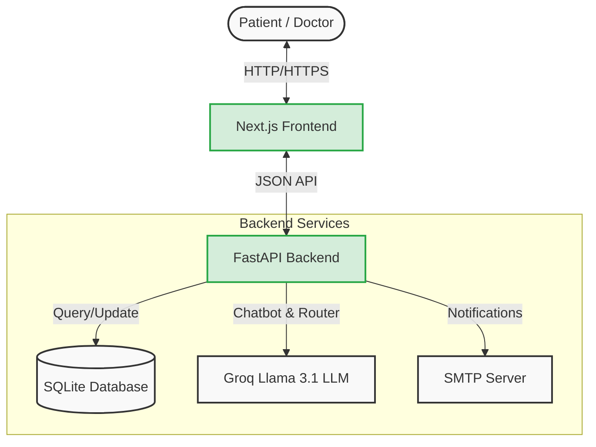
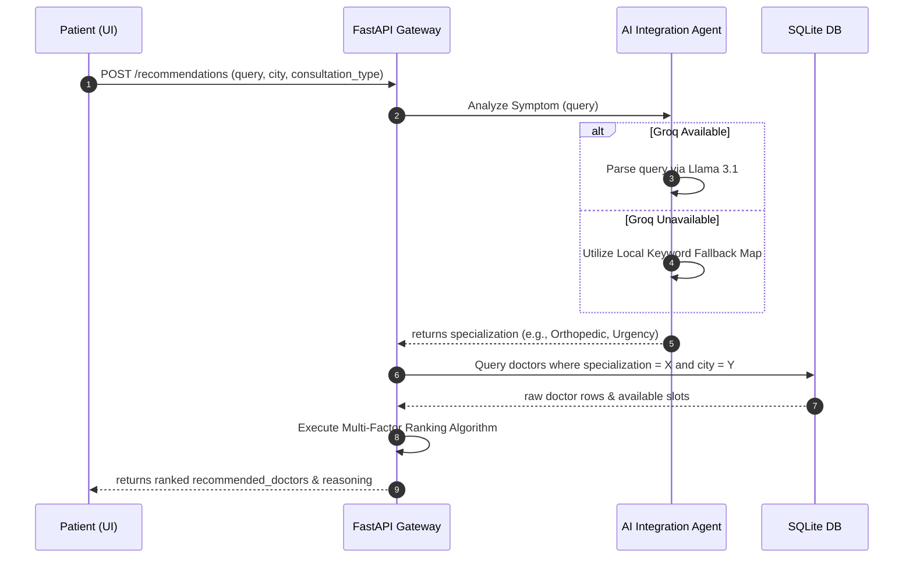
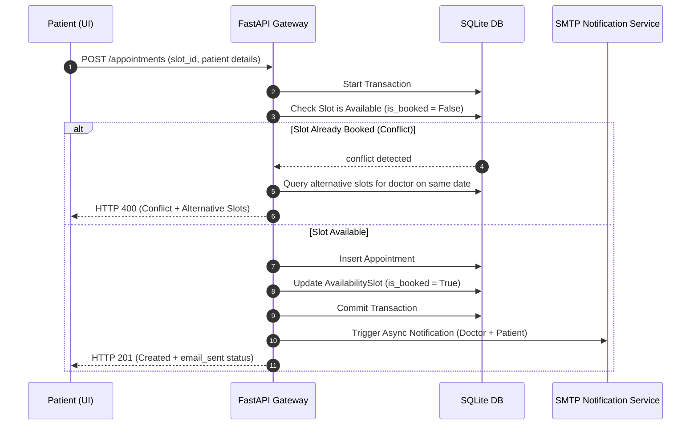
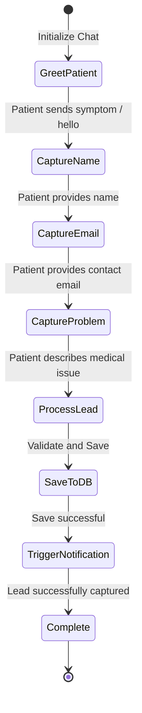
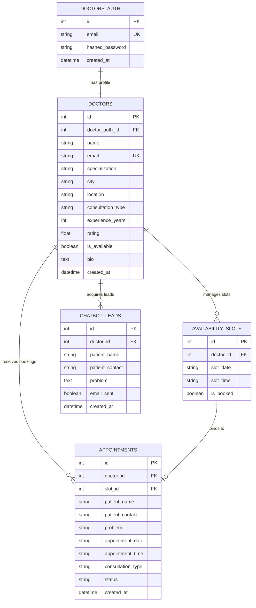

# 🏥 Smart Doctor Connect AI

<div align="center">


**Smart Doctor Connect AI** is a state-of-the-art, AI-powered healthcare discovery, scheduling, and lead-capture platform built for the Pakistani healthcare ecosystem. It bridges the gap between patients seeking specialized care and qualified doctors, ensuring intelligent matching, seamless booking, and high-conversion patient capture.

[🌐 Live Demo (Local)](http://localhost:3000) · [📂 Explore API Docs](http://localhost:8000/docs) · [🐛 Report Bug](https://github.com/Alyan-khattak/Smart_Doctor_Connect_Ai_SemiColon_Sinners/issues)

</div>

---

## 🌟 Key Features

*   **🔍 AI-Powered Symptom Router:** Translates natural language symptom queries (e.g., *"My back hurts and I can't stand up straight"*) to standard medical specializations (e.g., *Orthopedic*) using a hybrid Groq LLM and localized keyword fallback mapping.
*   **🏆 Multi-Factor Doctor Recommendation:** Ranks and scores matches based on search relevance, geography (city-specific searches), rating, availability, years of experience, and preferred consultation type (Physical/Online/Both).
*   **📅 Conflict-Free Scheduling Engine:** Fully transactional appointment scheduling engine that guarantees no double-bookings, ensuring maximum reliability for doctors.
*   **🤖 State-Machine AI Chatbot:** Engaging patient-side conversational assistant that captures inquiries, schedules, and queries for doctors when they are offline or fully booked.
*   **📧 Automated Unified Notifications:** Secure, configurable SMTP email engine sending professional transaction emails to both patients and doctors with zero external dependencies.
*   **📊 Integrated Doctor Dashboard:** Advanced control panel for physicians displaying real-time analytics, patient charts, active appointments, captured chatbot leads, and an AI-powered data synthesizer.
*   **🔐 Secure Session-Based JWT Auth:** Built-in secure authentication system for doctors with custom metadata-aware redirect handling.
*   **🐳 Production-Ready Containerization:** Dockerized backend and frontend workflows with orchestrated orchestration setups.

---

## 🏗️ System Architecture & Data Flows

### 🗺️ High-Level System Architecture



### 🧠 Symptom-to-Doctor Recommendation Flow

When a patient searches using natural language symptoms, the backend routes the query through the AI processor to generate a ranked matching matrix.



### 📅 Transaction-Safe Appointment Booking Flow



### 🤖 Chatbot Lead Capture State Machine



---

## 🗄️ Database Schema ER Diagram

The database structure is designed to support high integrity with SQLite and SQLAlchemy.



---

## 🛠️ Tech Stack & Dependencies

### Backend Engine
*   **FastAPI:** High-performance, async Python web framework.
*   **SQLAlchemy:** Secure ORM mapping for schema structure.
*   **SQLite:** Highly portable SQL database.
*   **Groq SDK:** Advanced inference engine integration.
*   **Pytest:** Standardized testing suite with mocks.
*   **JWT & Passlib:** Industry-standard secure user management.

### Frontend Client
*   **Next.js (v16.2):** Modern React framework leveraging Turbopack.
*   **React (v19.2):** Dynamic user-interface layer.
*   **TypeScript:** Type safety across API payloads.
*   **Tailwind CSS:** Rich styles and components.
*   **Lucide React:** Premium iconography.

---

## 🚀 Local Setup & Installation

### 1. Prerequisites
Ensure you have the following installed on your machine:
*   [Python 3.10+](https://www.python.org/downloads/)
*   [Node.js 18+](https://nodejs.org/)
*   [Docker](https://www.docker.com/) (Optional)

---

### 2. Backend Installation

1.  Navigate to the backend directory:
    ```bash
    cd backend
    ```

2.  Create and activate a virtual environment:
    ```bash
    # Windows (PowerShell)
    python -m venv venv
    .\venv\Scripts\Activate.ps1

    # macOS/Linux
    python3 -m venv venv
    source venv/bin/activate
    ```

3.  Install the required libraries:
    ```bash
    pip install -r requirements.txt
    ```

4.  Configure the environment variables by copying `.env.example`:
    ```bash
    cp .env.example .env
    ```
    *Open `.env` and fill in your `GROQ_API_KEY` and SMTP credentials.*

5.  Run the database migrations and seed script:
    ```bash
    python -m app.seed
    ```

6.  Launch the FastAPI server:
    ```bash
    uvicorn app.main:app --reload --port 8000
    ```
    *The API will be available at [http://localhost:8000](http://localhost:8000).*

---

### 3. Frontend Installation

1.  Navigate to the frontend directory:
    ```bash
    cd ../frontend
    ```

2.  Install packages:
    ```bash
    npm install
    ```

3.  Configure frontend environment variables inside `.env.local`:
    ```env
    NEXT_PUBLIC_API_URL=http://localhost:8000
    ```

4.  Start the Next.js development server:
    ```bash
    npm run dev
    ```
    *The client will be running at [http://localhost:3000](http://localhost:3000).*

---

## 🐳 Docker Deployment & Orchestration

The repository is configured for full multi-container orchestration out-of-the-box.

### Build and Run with Docker Compose

1.  From the project root directory, run:
    ```bash
    docker compose --env-file demo.env up --build
    ```

2.  Verify the orchestration config:
    ```bash
    docker compose --env-file demo.env config
    ```

After starting up, the following services will be online:
*   **Web Frontend:** [http://localhost:3000](http://localhost:3000)
*   **FastAPI Backend Server:** [http://localhost:8000](http://localhost:8000)
*   **Interactive Swagger API UI:** [http://localhost:8000/docs](http://localhost:8000/docs)

---

## 🔬 Testing & Quality Gate

We enforce unit testing across the entire service module pattern.

To execute backend tests:
```bash
cd backend
$env:ENABLE_EMAIL="false"; pytest -v
```

### Current Quality Metrics
*   **Backend Coverage:** 32 comprehensive tests (all passing).
*   **Frontend Health:** 100% production build compliance (`npm run build` succeeds).
*   **API Integrity:** Enforced validation schema with Pydantic.

---

## 📋 Comprehensive API Route Reference

### Public API Endpoints

| Method | Endpoint | Description | Key Payload Parameters |
| :--- | :--- | :--- | :--- |
| **GET** | `/health` | Live service check | *None* |
| **POST** | `/recommendations` | Smart symptom recommendation routing | `query`, `city`, `consultation_type` |
| **GET** | `/doctors/search` | Search doctor list with filters | `specialization`, `city`, `consultation_type` |
| **GET** | `/doctors/{doctor_id}` | Retrieve individual doctor details | `doctor_id` |
| **GET** | `/availability/{doctor_id}` | Fetch available time slots | `doctor_id`, `date` |
| **POST** | `/appointments` | Book new appointment slot | `slot_id`, `patient_name`, `patient_contact`, `problem` |
| **POST** | `/chatbot/message` | Submit message to AI Chatbot engine | `message`, `session_id`, `doctor_id`, `chat_history` |
| **POST** | `/chatbot/lead` | Save patient lead details | `doctor_id`, `patient_name`, `patient_contact`, `problem` |

### Doctor Private API Endpoints

| Method | Endpoint | Description | Authentication |
| :--- | :--- | :--- | :--- |
| **POST** | `/auth/doctor/register` | Register new physician account | *None* |
| **POST** | `/auth/doctor/login` | Login to generate JWT token | *None* |
| **GET** | `/auth/doctor/me` | Fetch active session metadata | JWT Bearer Token |
| **GET** | `/doctors/me/profile` | Get active doctor profile | JWT Bearer Token |
| **POST** | `/doctors/me/profile` | Create new doctor profile | JWT Bearer Token |
| **PUT** | `/doctors/me/profile` | Update doctor profile details | JWT Bearer Token |
| **GET** | `/dashboard/me` | Retrieve dashboard data aggregates | JWT Bearer Token |

---

## 📋 Hackathon Demo Validation Walkthrough

To review the primary workflows in under 3 minutes, follow this script:

1.  **Search Symptoms:** Go to `/`, type `"I have severe back pain and stiffness"` in the search bar, select `Lahore`, and click Search.
2.  **Verify Routing:** Ensure **Dr. Sara Malik** (Orthopedic Specialist) is recommended at the top with an AI-generated reason.
3.  **Book Appointment:** Click her profile, choose an available slot, input your email, and submit. Ensure the confirmation page loads.
4.  **Test Conflicts:** Try booking the exact same slot again. Confirm that the application displays a friendly conflict notice showing alternate slot timings instead of failing.
5.  **Test Offline Chatbot:** Open **Dr. Hamza Ali**'s profile (who is marked as unavailable). Start a chat with the AI bot, provide your details, and submit a lead.
6.  **Check Doctor Dashboard:** Register a doctor account, complete your profile, and open the doctor dashboard. Verify that your booked appointments, captured chatbot leads, and aggregated stats are rendered in high fidelity.

---

## 🛠️ Troubleshooting Guide

### 1. Doctor Profile Redirect Loop
If you log in as a doctor but are repeatedly redirected to the profile setup screen:
*   Ensure that you successfully called `POST /doctors/me/profile` to link your authentication account with a physician profile record.
*   Check that `/auth/doctor/me` returns `"has_profile": true` in the JSON response payload.

### 2. Missing Booking Slots
If a doctor's profile loads but shows no available appointment slots:
*   Default slots are created automatically upon doctor profile creation.
*   You can manually trigger slot allocation by requesting `/availability/{doctor_id}?date=YYYY-MM-DD`. If empty, the backend will dynamically generate default slots for that date.

### 3. SMTP Notification Delivery Failures
If email notifications are not being sent out:
*   Ensure `ENABLE_EMAIL=true` in your backend `.env` configuration file.
*   Double-check that you are using a secure **Google App Password** (not your standard Gmail account password) if hosting via Gmail.
*   *Note: If email delivery fails, the transaction is safely committed regardless, ensuring no loss of patient bookings.*

---

## 📄 License

Distributed under the MIT License. See `LICENSE` for more information.

---

<div align="center">
Created with ❤️ by team <b>SemiColon Sinners</b> for the MTM AI Hackathon.
</div>
