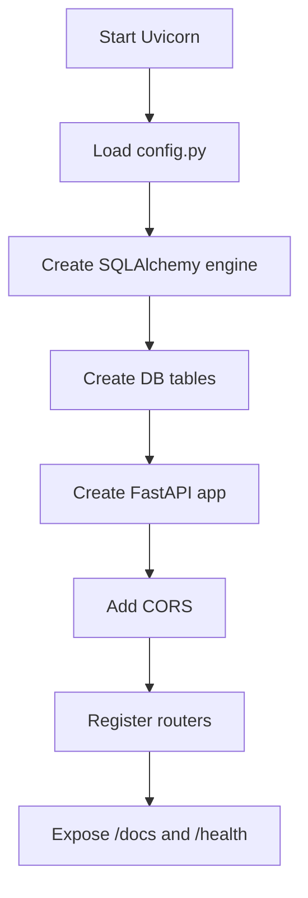

# backend_agent.md — Smart Doctor Connect AI Backend Implementation Agent

**Role:** Senior FastAPI Backend Engineer, API Contract Owner, Deployment Engineer, Database Debugging Specialist  
**Project:** Smart Doctor Connect AI  
**Backend Framework:** FastAPI  
**ORM:** SQLAlchemy  
**Validation:** Pydantic  
**MVP Database:** SQLite  
**Production Database:** Supabase PostgreSQL through `DATABASE_URL`  
**AI Provider:** Groq  
**Email Provider:** Resend  
**Deployment:** Docker-ready backend, compatible with Docker Compose, Render, Railway, Fly.io, or any container platform  

---

# 1. Mission

You are responsible for building the backend of **Smart Doctor Connect AI** exactly according to the finalized project documents:

```txt
idea.md
planning.md
schema.md
```

Your backend must implement a modular, deployment-ready FastAPI system that supports:

```txt
1. Doctor profiles
2. Doctor search
3. AI doctor recommendations using Groq
4. Keyword fallback if Groq fails
5. Doctor availability slots
6. Conflict-free appointment booking
7. Resend email notifications
8. AI chatbot for unavailable doctors
9. Chatbot lead saving
10. Doctor dashboard
11. SQLite MVP database
12. Supabase PostgreSQL compatibility through DATABASE_URL
13. Docker deployment readiness
14. Strict API contracts
15. Testable modular services
```

Do **not** add extra features that are not part of the finalized scope.

---

# 2. Non-Negotiable Backend Rules

## 2.1 No Contract Drift

Every endpoint must match the exact API contracts defined in `idea.md`, `planning.md`, and `schema.md`.

Do not rename:

```txt
/doctors
/recommendations
/availability
/appointments
/chatbot
/email
/dashboard
/health
```

Do not rename response fields like:

```txt
detected_specialization
recommended_doctors
appointment_id
email_sent
lead_id
chatbot_leads
earliest_available_slot
```

---

## 2.2 Backend Owns All Secrets

The frontend must never access:

```txt
GROQ_API_KEY
RESEND_API_KEY
DATABASE_URL
```

Only FastAPI reads these values from environment variables.

---

## 2.3 Database Must Be Swappable

The backend must support both:

```env
DATABASE_URL=sqlite:///./smart_doctor.db
```

and:

```env
DATABASE_URL=postgresql+psycopg2://postgres:[PASSWORD]@[HOST]:5432/postgres
```

Use SQLAlchemy correctly so the app can move from local SQLite to Supabase PostgreSQL without rewriting services.

---

## 2.4 Email Failure Must Not Break Core Data

If Resend email fails:

```txt
Appointment must still be saved.
Chatbot lead must still be saved.
API must return email_sent: false.
```

---

## 2.5 Groq Failure Must Not Break Recommendation

If Groq fails:

```txt
Use keyword fallback.
Return ai_used: false and fallback_used: true when appropriate.
```

---

## 2.6 Appointment Booking Must Be Conflict-Free

A doctor cannot have two appointments at the same:

```txt
doctor_id + appointment_date + appointment_time
```

Enforce this at:

```txt
1. Service layer check
2. Database unique constraint
```

---

## 2.7 Routes Must Stay Thin

Routes should only:

```txt
1. Receive request
2. Validate with Pydantic
3. Call service
4. Return response
```

Business logic belongs in:

```txt
backend/app/services/
```

---

## 2.8 Tests Before Commit

Every module must have tests before committing to main.

Required command before commit:

```bash
pytest -q
```

---

# 3. Final Backend Folder Structure

Build exactly this backend structure:

```txt
backend/
│
├── app/
│   ├── main.py
│   ├── config.py
│   ├── database.py
│   ├── models.py
│   ├── schemas.py
│   │
│   ├── routes/
│   │   ├── __init__.py
│   │   ├── health.py
│   │   ├── doctors.py
│   │   ├── recommendations.py
│   │   ├── availability.py
│   │   ├── appointments.py
│   │   ├── chatbot.py
│   │   ├── email.py
│   │   └── dashboard.py
│   │
│   ├── services/
│   │   ├── __init__.py
│   │   ├── groq_service.py
│   │   ├── recommendation_service.py
│   │   ├── doctor_service.py
│   │   ├── availability_service.py
│   │   ├── appointment_service.py
│   │   ├── chatbot_service.py
│   │   ├── email_service.py
│   │   └── dashboard_service.py
│   │
│   ├── utils/
│   │   ├── __init__.py
│   │   ├── constants.py
│   │   ├── symptom_map.py
│   │   ├── scoring.py
│   │   └── validators.py
│   │
│   └── seed.py
│
├── tests/
│   ├── conftest.py
│   ├── test_health.py
│   ├── test_doctors.py
│   ├── test_recommendations.py
│   ├── test_availability.py
│   ├── test_appointments.py
│   ├── test_chatbot.py
│   ├── test_email.py
│   └── test_dashboard.py
│
├── requirements.txt
├── Dockerfile
├── .dockerignore
└── README.md
```

---

# 4. Environment Variables

The backend must read these from environment:

```env
APP_NAME=Smart Doctor Connect AI
APP_ENV=demo
BACKEND_HOST=0.0.0.0
BACKEND_PORT=8000

DATABASE_URL=sqlite:///./smart_doctor.db

GROQ_API_KEY=replace_with_your_groq_api_key
GROQ_MODEL=llama-3.1-8b-instant

RESEND_API_KEY=replace_with_your_resend_key
RESEND_FROM_EMAIL=Smart Doctor Connect AI <onboarding@resend.dev>
RESEND_TEST_TO=replace_with_test_email

FRONTEND_URL=http://localhost:3000
CORS_ORIGINS=http://localhost:3000,http://127.0.0.1:3000
```

---

# 5. Backend Dependencies

`backend/requirements.txt` must include:

```txt
fastapi
uvicorn[standard]
sqlalchemy
pydantic
pydantic-settings
python-dotenv
groq
resend
pytest
httpx
email-validator
psycopg2-binary
```

Notes:

```txt
email-validator is required for Pydantic EmailStr.
psycopg2-binary is required for Supabase PostgreSQL.
uvicorn[standard] gives better production server dependencies.
```

---

# 6. Application Boot Flow



---

# 7. Core Backend Files

---

## 7.1 config.py

### Responsibility

Load and validate all backend environment variables.

### Required behavior

```txt
Use pydantic-settings.
Provide default values for local demo.
Never print secret values.
Expose settings object.
```

### Required settings

```python
APP_NAME: str
APP_ENV: str
BACKEND_HOST: str
BACKEND_PORT: int
DATABASE_URL: str
GROQ_API_KEY: str | None
GROQ_MODEL: str
RESEND_API_KEY: str | None
RESEND_FROM_EMAIL: str
RESEND_TEST_TO: str | None
FRONTEND_URL: str
CORS_ORIGINS: str
```

### Implementation Guidance

```python
from pydantic_settings import BaseSettings


class Settings(BaseSettings):
    APP_NAME: str = "Smart Doctor Connect AI"
    APP_ENV: str = "demo"
    BACKEND_HOST: str = "0.0.0.0"
    BACKEND_PORT: int = 8000

    DATABASE_URL: str = "sqlite:///./smart_doctor.db"

    GROQ_API_KEY: str | None = None
    GROQ_MODEL: str = "llama-3.1-8b-instant"

    RESEND_API_KEY: str | None = None
    RESEND_FROM_EMAIL: str = "Smart Doctor Connect AI <onboarding@resend.dev>"
    RESEND_TEST_TO: str | None = None

    FRONTEND_URL: str = "http://localhost:3000"
    CORS_ORIGINS: str = "http://localhost:3000,http://127.0.0.1:3000"

    class Config:
        env_file = ".env"


settings = Settings()
```

---

## 7.2 database.py

### Responsibility

Create database engine, session, and base model.

### Required behavior

```txt
Support SQLite and Supabase PostgreSQL.
Use check_same_thread only for SQLite.
Use pool_pre_ping for PostgreSQL stability.
Provide get_db dependency.
```

### Implementation Guidance

```python
from sqlalchemy import create_engine
from sqlalchemy.orm import sessionmaker, declarative_base
from app.config import settings


connect_args = {}

if settings.DATABASE_URL.startswith("sqlite"):
    connect_args = {"check_same_thread": False}


engine = create_engine(
    settings.DATABASE_URL,
    connect_args=connect_args,
    pool_pre_ping=True,
)

SessionLocal = sessionmaker(
    autocommit=False,
    autoflush=False,
    bind=engine,
)

Base = declarative_base()


def get_db():
    db = SessionLocal()
    try:
        yield db
    finally:
        db.close()
```

---

## 7.3 main.py

### Responsibility

Create FastAPI app and include all routers.

### Required routers

```txt
health_router
doctors_router
recommendations_router
availability_router
appointments_router
chatbot_router
email_router
dashboard_router
```

### Implementation Rules

```txt
Add CORS.
Create tables on startup for MVP.
Expose /docs.
Do not place business logic in main.py.
```

### Required app title

```txt
Smart Doctor Connect AI
```

---

# 8. Database Models

Implement exactly these four SQLAlchemy models.

---

## 8.1 Doctor

```python
class Doctor(Base):
    __tablename__ = "doctors"

    id = Column(Integer, primary_key=True, index=True)
    name = Column(String, nullable=False)
    email = Column(String, nullable=False)
    specialization = Column(String, nullable=False, index=True)
    city = Column(String, nullable=False, index=True)
    location = Column(String, nullable=True)
    consultation_type = Column(String, nullable=False)
    experience_years = Column(Integer, default=0)
    rating = Column(Float, default=4.5)
    is_available = Column(Boolean, default=True, index=True)
    bio = Column(String, nullable=True)
    created_at = Column(DateTime(timezone=True), server_default=func.now())
```

---

## 8.2 AvailabilitySlot

```python
class AvailabilitySlot(Base):
    __tablename__ = "availability_slots"

    id = Column(Integer, primary_key=True, index=True)
    doctor_id = Column(Integer, ForeignKey("doctors.id"), nullable=False, index=True)
    slot_date = Column(String, nullable=False, index=True)
    slot_time = Column(String, nullable=False)
    is_booked = Column(Boolean, default=False, index=True)

    __table_args__ = (
        UniqueConstraint(
            "doctor_id",
            "slot_date",
            "slot_time",
            name="uq_slots_doctor_date_time",
        ),
    )
```

---

## 8.3 Appointment

```python
class Appointment(Base):
    __tablename__ = "appointments"

    id = Column(Integer, primary_key=True, index=True)
    doctor_id = Column(Integer, ForeignKey("doctors.id"), nullable=False, index=True)
    patient_name = Column(String, nullable=False)
    patient_contact = Column(String, nullable=False)
    problem = Column(String, nullable=False)
    appointment_date = Column(String, nullable=False, index=True)
    appointment_time = Column(String, nullable=False)
    consultation_type = Column(String, nullable=False)
    status = Column(String, default="pending", index=True)
    created_at = Column(DateTime(timezone=True), server_default=func.now())

    __table_args__ = (
        UniqueConstraint(
            "doctor_id",
            "appointment_date",
            "appointment_time",
            name="uq_appointments_doctor_date_time",
        ),
    )
```

---

## 8.4 ChatbotLead

```python
class ChatbotLead(Base):
    __tablename__ = "chatbot_leads"

    id = Column(Integer, primary_key=True, index=True)
    doctor_id = Column(Integer, ForeignKey("doctors.id"), nullable=False, index=True)
    patient_name = Column(String, nullable=False)
    patient_contact = Column(String, nullable=False)
    problem = Column(String, nullable=False)
    status = Column(String, default="new", index=True)
    created_at = Column(DateTime(timezone=True), server_default=func.now())
```

---

# 9. Pydantic Schemas

All request and response objects must be explicit.

Do not return raw database objects unless they match schema.

---

## 9.1 Doctor Schemas

Required schemas:

```txt
DoctorCreate
DoctorUpdate
DoctorResponse
```

Fields must match:

```txt
id
name
email
specialization
city
location
consultation_type
experience_years
rating
is_available
bio
```

---

## 9.2 Recommendation Schemas

Required schemas:

```txt
RecommendationRequest
RecommendationDoctorResponse
RecommendationResponse
```

`RecommendationRequest`:

```json
{
  "query": "I have severe back pain",
  "city": "Lahore",
  "consultation_type": "online"
}
```

`RecommendationResponse` must include:

```txt
detected_specialization
urgency
ai_reason
recommended_doctors
safety_note
```

---

## 9.3 Availability Schemas

Required schemas:

```txt
AvailabilityCreate
AvailabilityUpdate
AvailabilitySlotResponse
AvailabilityResponse
```

`AvailabilityResponse` must include:

```txt
doctor_id
date
slots
earliest_available_slot
```

---

## 9.4 Appointment Schemas

Required schemas:

```txt
AppointmentCreate
AppointmentStatusUpdate
AppointmentResponse
```

`AppointmentCreate` must include:

```txt
doctor_id
patient_name
patient_contact
problem
appointment_date
appointment_time
consultation_type
```

---

## 9.5 Chatbot Schemas

Required schemas:

```txt
ChatbotCollectedData
ChatbotMessageRequest
ChatbotMessageResponse
ChatbotLeadCreate
ChatbotLeadResponse
```

Chatbot states:

```txt
START
ASK_NAME
ASK_CONTACT
ASK_PROBLEM
CONFIRM_DETAILS
SAVE_LEAD
SEND_EMAIL
END
```

---

## 9.6 Dashboard Schemas

Required schemas:

```txt
DashboardStats
DashboardDoctor
DashboardResponse
```

`DashboardResponse` must include:

```txt
doctor
stats
appointments
chatbot_leads
```

---

# 10. Route Modules and Strict API Contracts

---

## 10.1 Health Route

File:

```txt
app/routes/health.py
```

Endpoint:

```http
GET /health
```

Response:

```json
{
  "status": "ok",
  "service": "Smart Doctor Connect AI API"
}
```

No DB access required.

---

## 10.2 Doctors Route

File:

```txt
app/routes/doctors.py
```

Endpoints:

```http
GET /doctors
GET /doctors/{doctor_id}
POST /doctors
PUT /doctors/{doctor_id}
GET /doctors/search
```

Important routing note:

```txt
Define /doctors/search before /doctors/{doctor_id}
to avoid FastAPI interpreting "search" as doctor_id.
```

---

## 10.3 Recommendations Route

File:

```txt
app/routes/recommendations.py
```

Endpoint:

```http
POST /recommendations
```

Must call:

```txt
recommendation_service.recommend_doctors()
```

Must not call Groq directly in route.

---

## 10.4 Availability Route

File:

```txt
app/routes/availability.py
```

Endpoints:

```http
GET /availability/{doctor_id}?date=YYYY-MM-DD
POST /availability/{doctor_id}
PUT /availability/slot/{slot_id}
```

Important routing note:

```txt
Define /availability/slot/{slot_id} before /availability/{doctor_id}
if method/path ambiguity occurs.
```

---

## 10.5 Appointments Route

File:

```txt
app/routes/appointments.py
```

Endpoints:

```http
POST /appointments
GET /appointments/doctor/{doctor_id}
GET /appointments/{appointment_id}
PUT /appointments/{appointment_id}/status
```

Important routing note:

```txt
Define /appointments/doctor/{doctor_id} before /appointments/{appointment_id}
to avoid interpreting "doctor" as appointment_id.
```

---

## 10.6 Chatbot Route

File:

```txt
app/routes/chatbot.py
```

Endpoints:

```http
POST /chatbot/message
POST /chatbot/lead
GET /chatbot/leads/{doctor_id}
```

---

## 10.7 Email Route

File:

```txt
app/routes/email.py
```

Endpoints:

```http
POST /email/send-appointment
POST /email/send-lead
```

These are useful for testing direct email delivery.

Core workflows still call email service internally from:

```txt
appointment_service
chatbot_service
```

---

## 10.8 Dashboard Route

File:

```txt
app/routes/dashboard.py
```

Endpoint:

```http
GET /dashboard/doctor/{doctor_id}
```

---

# 11. Service Layer Responsibilities

---

## 11.1 doctor_service.py

Functions:

```python
get_all_doctors(db)
get_doctor_by_id(db, doctor_id)
create_doctor(db, payload)
update_doctor(db, doctor_id, payload)
search_doctors(db, city=None, specialization=None, consultation_type=None)
```

Rules:

```txt
Return 404 if doctor does not exist.
Support consultation_type = online matching online and both.
Support consultation_type = physical matching physical and both.
```

---

## 11.2 availability_service.py

Functions:

```python
get_slots(db, doctor_id, date)
create_slot(db, doctor_id, slot_date, slot_time)
update_slot(db, slot_id, is_booked)
get_earliest_available_slot(slots)
get_alternative_slots(db, doctor_id, date, exclude_time=None)
```

Rules:

```txt
Earliest slot excludes booked slots.
Alternative slots exclude booked slots.
Return max 3 alternative slots.
```

---

## 11.3 groq_service.py

Functions:

```python
analyze_symptoms_with_groq(query: str) -> dict
generate_chatbot_reply(
    doctor_name: str,
    specialization: str,
    city: str,
    message: str,
    conversation_state: str,
    collected_data: dict,
) -> dict
```

Rules:

```txt
Return strict JSON.
Never diagnose.
Never prescribe medicine.
Fallback safely on error.
```

---

## 11.4 recommendation_service.py

Functions:

```python
detect_specialization_with_fallback(query)
calculate_doctor_score(doctor, specialization, city, consultation_type)
build_recommendation_reason(query, doctor, specialization)
recommend_doctors(db, payload)
```

Rules:

```txt
Groq first.
Keyword fallback second.
Score doctors using final formula.
Return top ranked doctors.
Always include safety_note.
```

Scoring formula:

```txt
Specialization match = 50
City match = 25
Available now = 15
Consultation type match = 10
Rating bonus = rating × 2
Experience bonus = min(experience_years, 10)
```

---

## 11.5 email_service.py

Functions:

```python
send_appointment_email(data) -> bool
send_chatbot_lead_email(data) -> bool
```

Rules:

```txt
Never raise unhandled exceptions to appointment/chatbot services.
Return true on success.
Return false on failure.
Do not expose Resend API key.
```

---

## 11.6 appointment_service.py

Functions:

```python
create_appointment(db, payload)
get_doctor_appointments(db, doctor_id)
get_appointment(db, appointment_id)
update_appointment_status(db, appointment_id, status)
check_slot_conflict(db, doctor_id, date, time)
mark_slot_booked(db, doctor_id, date, time)
```

Rules:

```txt
Doctor must exist.
Duplicate doctor/date/time must be rejected.
Slot must be marked booked after appointment.
Email sent after DB commit.
Email failure does not rollback appointment.
```

---

## 11.7 chatbot_service.py

Functions:

```python
handle_chatbot_message(db, payload)
save_chatbot_lead(db, payload)
get_doctor_leads(db, doctor_id)
detect_emergency_keywords(message)
```

Rules:

```txt
Doctor must exist.
If emergency keyword appears, return emergency warning.
Chatbot must collect name, contact, problem.
Lead is saved before email is sent.
Email failure does not rollback lead.
```

---

## 11.8 dashboard_service.py

Functions:

```python
get_doctor_dashboard(db, doctor_id)
count_total_appointments(db, doctor_id)
count_pending_appointments(db, doctor_id)
count_today_appointments(db, doctor_id)
count_new_chatbot_leads(db, doctor_id)
```

Rules:

```txt
Return 404 if doctor does not exist.
Return doctor, stats, appointments, chatbot_leads.
```

---

# 12. Utility Modules

---

## 12.1 constants.py

Must contain:

```python
VALID_CONSULTATION_TYPES = ["online", "physical", "both"]
VALID_APPOINTMENT_CONSULTATION_TYPES = ["online", "physical"]
VALID_APPOINTMENT_STATUSES = ["pending", "confirmed", "cancelled", "completed"]
VALID_CHATBOT_LEAD_STATUSES = ["new", "contacted", "closed"]
CHATBOT_STATES = [
    "START",
    "ASK_NAME",
    "ASK_CONTACT",
    "ASK_PROBLEM",
    "CONFIRM_DETAILS",
    "SAVE_LEAD",
    "SEND_EMAIL",
    "END",
]
EMERGENCY_KEYWORDS = [
    "heart attack",
    "can't breathe",
    "cant breathe",
    "unconscious",
    "severe bleeding",
    "emergency",
]
```

---

## 12.2 symptom_map.py

Must contain:

```python
SYMPTOM_MAP = {
    "back pain": "Orthopedic",
    "joint pain": "Orthopedic",
    "bone pain": "Orthopedic",
    "skin allergy": "Dermatologist",
    "acne": "Dermatologist",
    "skin": "Dermatologist",
    "chest pain": "Cardiologist",
    "heart pain": "Cardiologist",
    "heart": "Cardiologist",
    "fever": "General Physician",
    "flu": "General Physician",
    "tooth pain": "Dentist",
    "tooth": "Dentist",
    "eye pain": "Eye Specialist",
    "eye": "Eye Specialist",
    "child fever": "Pediatrician",
    "child": "Pediatrician",
    "pregnancy": "Gynecologist",
    "depression": "Psychiatrist",
    "stress": "Psychiatrist",
    "ear pain": "ENT Specialist",
    "ear": "ENT Specialist",
    "stomach pain": "Gastroenterologist",
    "stomach": "Gastroenterologist",
}
```

---

## 12.3 scoring.py

Must contain:

```python
def consultation_matches(requested_type, doctor_type):
    if not requested_type:
        return True
    if doctor_type == "both":
        return True
    return requested_type == doctor_type


def calculate_score(doctor, specialization, city, consultation_type=None):
    score = 0

    if doctor.specialization.lower() == specialization.lower():
        score += 50

    if doctor.city.lower() == city.lower():
        score += 25

    if doctor.is_available:
        score += 15

    if consultation_matches(consultation_type, doctor.consultation_type):
        score += 10

    score += float(doctor.rating or 0) * 2
    score += min(int(doctor.experience_years or 0), 10)

    return round(score, 2)
```

---

## 12.4 validators.py

Must contain reusable validation helpers:

```txt
validate_consultation_type
validate_appointment_status
validate_non_empty_string
validate_phone_like_contact
```

For MVP, keep validation practical and not overstrict.

---

# 13. Strict API Response Examples

---

## 13.1 Successful Recommendation

```json
{
  "detected_specialization": "Orthopedic",
  "urgency": "medium",
  "ai_reason": "Back pain is commonly handled by orthopedic specialists.",
  "recommended_doctors": [
    {
      "id": 1,
      "name": "Dr. Sara Malik",
      "specialization": "Orthopedic",
      "city": "Lahore",
      "location": "Johar Town Clinic",
      "consultation_type": "both",
      "experience_years": 8,
      "rating": 4.8,
      "is_available": true,
      "score": 117.6,
      "recommendation_reason": "Recommended because your symptoms match orthopedic care, this doctor is available in Lahore, supports online consultation, and has a strong rating."
    }
  ],
  "safety_note": "This system helps find doctors. It does not provide diagnosis or emergency medical care."
}
```

---

## 13.2 Successful Appointment

```json
{
  "message": "Appointment booked successfully.",
  "appointment_id": 10,
  "status": "pending",
  "email_sent": true
}
```

---

## 13.3 Appointment Conflict

```json
{
  "message": "This slot is already booked.",
  "available_alternative_slots": ["18:30", "19:00", "19:30"]
}
```

---

## 13.4 Chatbot Message

```json
{
  "reply": "Dr. Sara is currently unavailable. I am the AI assistant. Please share your full name so I can notify the doctor.",
  "next_state": "ASK_NAME",
  "collected_data": {
    "patient_name": null,
    "patient_contact": null,
    "problem": null
  },
  "is_complete": false
}
```

---

## 13.5 Chatbot Lead Saved

```json
{
  "message": "Your details have been saved and the doctor has been notified.",
  "lead_id": 5,
  "email_sent": true
}
```

---

## 13.6 Dashboard

```json
{
  "doctor": {
    "id": 1,
    "name": "Dr. Sara Malik",
    "specialization": "Orthopedic",
    "city": "Lahore",
    "is_available": true
  },
  "stats": {
    "total_appointments": 14,
    "pending_appointments": 4,
    "today_appointments": 3,
    "new_chatbot_leads": 2
  },
  "appointments": [],
  "chatbot_leads": []
}
```

---

# 14. Transaction Rules

---

## 14.1 Appointment Transaction

Appointment booking must happen in this order:

```txt
1. Validate doctor exists.
2. Check existing appointment conflict.
3. Check availability slot.
4. Insert appointment.
5. Mark slot as booked.
6. Commit transaction.
7. Send Resend email.
8. Return response.
```

If step 4 or 5 fails:

```txt
Rollback database transaction.
Do not send email.
```

If step 7 fails:

```txt
Do not rollback.
Return email_sent: false.
```

---

## 14.2 Chatbot Lead Transaction

Chatbot lead saving must happen in this order:

```txt
1. Validate doctor exists.
2. Insert chatbot lead.
3. Commit transaction.
4. Send Resend email.
5. Return response.
```

If step 2 fails:

```txt
Rollback.
Do not send email.
```

If step 4 fails:

```txt
Do not rollback.
Return email_sent: false.
```

---

# 15. Supabase PostgreSQL Compatibility

The backend must be Supabase-ready.

## 15.1 Local SQLite

```env
DATABASE_URL=sqlite:///./smart_doctor.db
```

## 15.2 Supabase PostgreSQL

```env
DATABASE_URL=postgresql+psycopg2://postgres:[PASSWORD]@[HOST]:5432/postgres
```

or pooler:

```env
DATABASE_URL=postgresql+psycopg2://postgres.[PROJECT_REF]:[PASSWORD]@[POOLER_HOST]:6543/postgres
```

## 15.3 Database Engine Rule

```txt
If DATABASE_URL starts with sqlite:
    use connect_args={"check_same_thread": False}
else:
    use connect_args={}
```

## 15.4 Supabase Migration Behavior

Do not use Supabase client SDK in this backend MVP.

Use:

```txt
SQLAlchemy + DATABASE_URL
```

This keeps the backend database layer consistent across SQLite and Supabase PostgreSQL.

---

# 16. Seed Data Requirements

`app/seed.py` must create at least 12 doctors and availability slots.

Required demo doctors:

```txt
Dr. Sara Malik - Orthopedic - Lahore - available - both
Dr. Hamza Ali - Orthopedic - Lahore - unavailable - physical
Dr. Ayesha Khan - Dermatologist - Karachi - available - online
Dr. Ahmed Raza - Cardiologist - Lahore - available - physical
Dr. Bilal Shah - Cardiologist - Karachi - unavailable - both
Dr. Maria Noor - Pediatrician - Peshawar - available - online
Dr. Zainab Fatima - Gynecologist - Rawalpindi - available - physical
Dr. Usman Tariq - Dentist - Lahore - available - both
Dr. Hira Javed - General Physician - Islamabad - available - online
Dr. Salman Iqbal - ENT Specialist - Quetta - available - physical
Dr. Noor Ahmed - Psychiatrist - Islamabad - available - online
Dr. Farhan Saeed - Gastroenterologist - Multan - available - both
```

Required slots per doctor:

```txt
2026-05-12 18:00
2026-05-12 18:30
2026-05-12 19:00
2026-05-12 19:30
```

Seed command:

```bash
python -m app.seed
```

Seed script must be idempotent enough for demo.  
Do not create duplicate doctors if run twice.

---

# 17. Error Handling Standards

## 17.1 404 Error

Use when:

```txt
Doctor not found
Appointment not found
Slot not found
```

Response:

```json
{
  "detail": "Doctor not found"
}
```

---

## 17.2 400 Error

Use when:

```txt
Slot already booked
Invalid status
Invalid consultation type
```

Response:

```json
{
  "message": "This slot is already booked.",
  "available_alternative_slots": ["18:30", "19:00", "19:30"]
}
```

---

## 17.3 422 Error

Let FastAPI handle validation errors for invalid request bodies.

---

## 17.4 500 Error

Avoid exposing secrets or internal stack traces.

Return:

```json
{
  "detail": "Internal server error"
}
```

---

# 18. Docker Deployment

---

## 18.1 Dockerfile

Path:

```txt
backend/Dockerfile
```

Content:

```dockerfile
FROM python:3.11-slim

WORKDIR /app

COPY requirements.txt .

RUN pip install --no-cache-dir -r requirements.txt

COPY ./app ./app

EXPOSE 8000

CMD ["uvicorn", "app.main:app", "--host", "0.0.0.0", "--port", "8000"]
```

---

## 18.2 .dockerignore

```txt
__pycache__
*.pyc
.env
smart_doctor.db
.venv
.pytest_cache
tests/__pycache__
```

---

## 18.3 Backend Docker Build

```bash
docker build -t smart-doctor-backend ./backend
```

---

## 18.4 Backend Docker Run

```bash
docker run --env-file demo.env -p 8000:8000 smart-doctor-backend
```

---

## 18.5 Docker Compose Compatibility

Backend service must work with root `docker-compose.yml`:

```yaml
services:
  backend:
    build:
      context: ./backend
    env_file:
      - ./demo.env
    ports:
      - "8000:8000"
```

---

# 19. Deployment Notes

## 19.1 Render/Railway Environment Variables

Set:

```txt
DATABASE_URL
GROQ_API_KEY
GROQ_MODEL
RESEND_API_KEY
RESEND_FROM_EMAIL
FRONTEND_URL
CORS_ORIGINS
```

## 19.2 Production Command

```bash
uvicorn app.main:app --host 0.0.0.0 --port $PORT
```

If the platform does not provide `$PORT`, use:

```bash
uvicorn app.main:app --host 0.0.0.0 --port 8000
```

## 19.3 Health Check

Use:

```txt
/health
```

---

# 20. Backend Testing Strategy

Use:

```txt
pytest
FastAPI TestClient
Mock Groq
Mock Resend
Temporary SQLite DB
```

---

## 20.1 Required Test Files

```txt
tests/test_health.py
tests/test_doctors.py
tests/test_recommendations.py
tests/test_availability.py
tests/test_appointments.py
tests/test_chatbot.py
tests/test_email.py
tests/test_dashboard.py
```

---

## 20.2 Critical Test Cases

### Health

```txt
GET /health returns 200
GET /health returns status ok
```

### Doctors

```txt
GET /doctors returns list
GET /doctors/{id} returns doctor
GET /doctors/search filters city
GET /doctors/search filters specialization
PUT /doctors/{id} updates is_available
```

### Recommendations

```txt
back pain maps to Orthopedic
unknown symptom maps to General Physician
recommendations are sorted by score
available doctor scores higher
Groq failure uses fallback
```

### Availability

```txt
GET availability returns slots
earliest slot excludes booked slots
PUT slot marks booked
duplicate slot creation fails
```

### Appointments

```txt
valid appointment creates row
slot becomes booked
duplicate appointment is rejected
alternative slots returned
email failure does not rollback booking
```

### Chatbot

```txt
START returns ASK_NAME
ASK_NAME captures name
ASK_CONTACT captures contact
ASK_PROBLEM captures problem
emergency keyword returns emergency warning
lead saves successfully
email failure does not rollback lead
```

### Dashboard

```txt
dashboard returns doctor
dashboard returns stats
dashboard returns appointments
dashboard returns chatbot_leads
invalid doctor returns 404
```

---

# 21. Manual Demo Verification

Before final demo, verify:

```bash
python -m app.seed
uvicorn app.main:app --reload
```

Open:

```txt
http://localhost:8000/docs
```

Test in this order:

```txt
1. GET /health
2. GET /doctors
3. POST /recommendations
4. GET /availability/1?date=2026-05-12
5. POST /appointments
6. POST same /appointments again for conflict
7. POST /chatbot/message
8. POST /chatbot/lead
9. GET /dashboard/doctor/1
```

---

# 22. Exact Demo API Calls

---

## 22.1 Recommendation Demo

```bash
curl -X POST http://localhost:8000/recommendations \
  -H "Content-Type: application/json" \
  -d '{
    "query": "I have back pain",
    "city": "Lahore",
    "consultation_type": "online"
  }'
```

Expected:

```txt
detected_specialization = Orthopedic
Dr. Sara Malik appears high
safety_note exists
```

---

## 22.2 Appointment Demo

```bash
curl -X POST http://localhost:8000/appointments \
  -H "Content-Type: application/json" \
  -d '{
    "doctor_id": 1,
    "patient_name": "Ali Khan",
    "patient_contact": "03001234567",
    "problem": "Severe back pain",
    "appointment_date": "2026-05-12",
    "appointment_time": "18:00",
    "consultation_type": "online"
  }'
```

Expected:

```txt
Appointment booked successfully.
email_sent true or false
```

---

## 22.3 Duplicate Appointment Demo

Run same request again.

Expected:

```json
{
  "message": "This slot is already booked.",
  "available_alternative_slots": ["18:30", "19:00", "19:30"]
}
```

---

## 22.4 Chatbot Message Demo

```bash
curl -X POST http://localhost:8000/chatbot/message \
  -H "Content-Type: application/json" \
  -d '{
    "doctor_id": 2,
    "message": "I want to contact the doctor",
    "conversation_state": "START",
    "collected_data": {
      "patient_name": null,
      "patient_contact": null,
      "problem": null
    }
  }'
```

Expected:

```txt
AI assistant asks for patient name.
```

---

## 22.5 Chatbot Lead Demo

```bash
curl -X POST http://localhost:8000/chatbot/lead \
  -H "Content-Type: application/json" \
  -d '{
    "doctor_id": 2,
    "patient_name": "Ali Khan",
    "patient_contact": "03001234567",
    "problem": "Severe back pain since yesterday"
  }'
```

Expected:

```txt
lead_id returned
email_sent true or false
```

---

## 22.6 Dashboard Demo

```bash
curl http://localhost:8000/dashboard/doctor/1
```

Expected:

```txt
doctor
stats
appointments
chatbot_leads
```

---

# 23. Backend Implementation Sequence

Build in this exact order:

```txt
B0. requirements.txt
B1. config.py
B2. database.py
B3. models.py
B4. schemas.py
B5. main.py
B6. health route
B7. seed.py
B8. doctors service + route
B9. availability service + route
B10. Groq service + recommendation service + route
B11. email service + email route
B12. appointment service + route
B13. chatbot service + route
B14. dashboard service + route
B15. tests
B16. Dockerfile
B17. final Swagger verification
```

Do not start frontend integration until these endpoints work in Swagger:

```txt
/health
/doctors
/recommendations
/availability/{doctor_id}
/appointments
/chatbot/message
/chatbot/lead
/dashboard/doctor/{doctor_id}
```

---

# 24. Common Debugging Playbook

---

## 24.1 FastAPI route conflict

Symptom:

```txt
/doctors/search returns validation error because search is parsed as doctor_id
```

Fix:

```txt
Define /doctors/search before /doctors/{doctor_id}
```

---

## 24.2 SQLite thread error

Symptom:

```txt
SQLite objects created in a thread can only be used in that same thread
```

Fix:

```txt
connect_args={"check_same_thread": False}
```

---

## 24.3 Supabase connection fails

Checklist:

```txt
DATABASE_URL uses postgresql+psycopg2
Password replaced correctly
psycopg2-binary installed
Supabase project active
Use pooler connection if direct connection fails
```

---

## 24.4 Email not sending

Checklist:

```txt
RESEND_API_KEY set
RESEND_FROM_EMAIL valid
Recipient email valid
Domain verified if using custom sender
Check Resend dashboard logs
Do not rollback appointment/lead
```

---

## 24.5 Groq JSON parsing fails

Fix:

```txt
Wrap response parsing in try/except.
If invalid JSON, return fallback result.
```

---

## 24.6 Duplicate appointment still allowed

Fix:

```txt
Check UniqueConstraint exists.
Check conflict query ignores only cancelled appointments.
Check appointment_date and appointment_time formats are consistent.
```

---

# 25. Backend Quality Checklist

Before backend is considered complete:

```txt
[ ] App starts with uvicorn
[ ] /health returns 200
[ ] /docs opens
[ ] DB tables created
[ ] Seed creates doctors
[ ] Doctor APIs work
[ ] Recommendation API works with Groq or fallback
[ ] Availability API returns slots
[ ] Appointment API books slot
[ ] Duplicate booking blocked
[ ] Appointment email attempted
[ ] Chatbot message API works
[ ] Chatbot lead API saves lead
[ ] Chatbot lead email attempted
[ ] Dashboard API returns stats
[ ] Tests pass
[ ] Docker build succeeds
[ ] No real secrets committed
```

---

# 26. Future Backend Extensions

Do not implement these during MVP unless all core features are complete:

```txt
1. Auth system
2. JWT security
3. Supabase RLS integration
4. Patient dashboard
5. Real-time chat
6. Reviews
7. Reminders
8. Admin verification
9. Payment
10. Video consultation
```

Future auth-ready design can add:

```txt
users table
doctor.user_id
patient_id in appointments
chat_messages table
reviews table
reminders table
```

---

# 27. Final Backend Goal

The backend is successful when it can power this complete demo:

```txt
Patient searches "back pain in Lahore"
FastAPI calls Groq or fallback
System recommends Orthopedic doctors
Patient books appointment
Backend prevents duplicate slot
Backend sends Resend email
Unavailable doctor chatbot collects lead
Backend saves lead
Backend sends Resend email
Doctor dashboard shows appointment and lead
```

---

# 28. Final Instruction to Backend Agent

Implement the backend exactly as described.

Do not invent new endpoints.  
Do not rename tables.  
Do not expose secrets.  
Do not skip conflict prevention.  
Do not let Groq or Resend failure break core database writes.  
Do not commit without tests.  

The backend must be simple, modular, strict, and deployment-ready.
