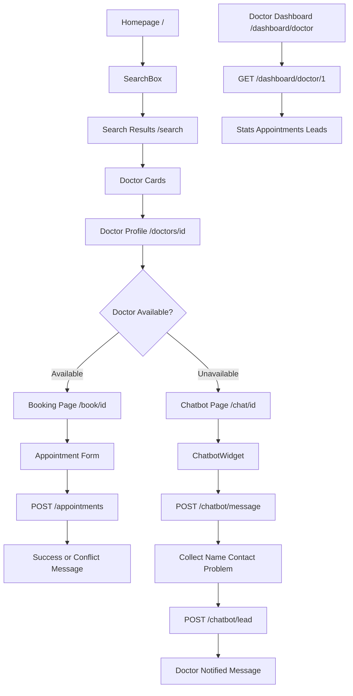
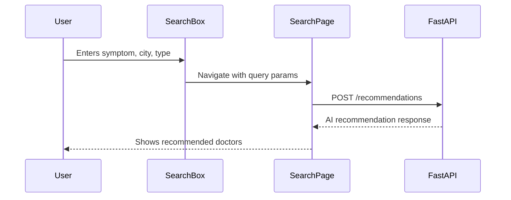
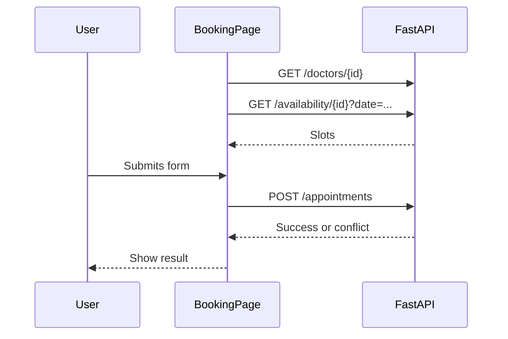
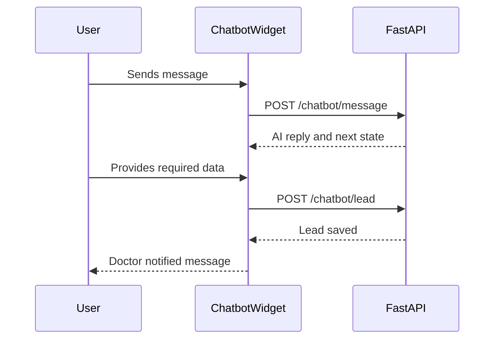
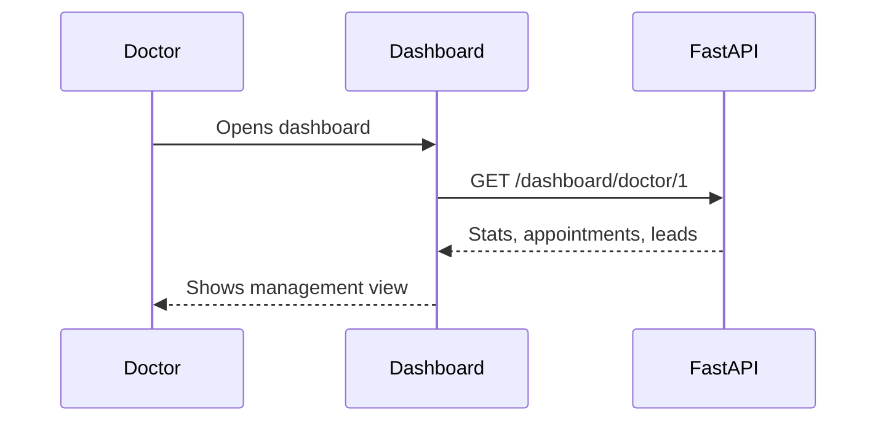

# frontend_agent.md — Smart Doctor Connect AI Frontend Implementation Agent

**Role:** Senior Frontend Engineer, UI/UX Engineer, API Integration Engineer  
**Project:** Smart Doctor Connect AI  
**Frontend:** Next.js / React + Tailwind CSS  
**Backend Contract Owner:** `backend_agent.md`  
**Backend API:** FastAPI REST  
**AI Provider:** Groq through backend only  
**Email Provider:** Resend through backend only  
**Database:** Accessed only through backend API  
**Goal:** Build a responsive, easy-to-use, contract-safe frontend that fully matches the final `idea.md`, `planning.md`, `schema.md`, and `backend_agent.md`.

---

# 1. Frontend Mission

The frontend must make the hackathon demo clear, fast, and impressive.

The user journey must be simple:

```txt
Patient opens website
↓
Searches by symptoms/city/consultation type
↓
Views AI-recommended doctors
↓
Opens doctor profile
↓
Books appointment if doctor is available
↓
Uses AI chatbot if doctor is unavailable
↓
Doctor dashboard shows appointments and leads
```

The UI must show the project’s core value immediately:

```txt
AI doctor recommendation
Doctor availability
Fast appointment booking
Unavailable doctor chatbot
Doctor notification through backend
Doctor dashboard
```

The frontend must not add extra features outside the final agreed MVP.

---

# 2. Non-Negotiable Frontend Rules

## 2.1 No API Contract Drift

The frontend must call backend endpoints exactly as defined in `backend_agent.md`.

Do not rename endpoints.

Do not rename request fields.

Do not rename response fields.

Correct API paths:

```txt
GET    /health
GET    /doctors
GET    /doctors/{doctor_id}
POST   /doctors
PUT    /doctors/{doctor_id}
GET    /doctors/search

POST   /recommendations

GET    /availability/{doctor_id}?date=YYYY-MM-DD
POST   /availability/{doctor_id}
PUT    /availability/slot/{slot_id}

POST   /appointments
GET    /appointments/doctor/{doctor_id}
GET    /appointments/{appointment_id}
PUT    /appointments/{appointment_id}/status

POST   /chatbot/message
POST   /chatbot/lead
GET    /chatbot/leads/{doctor_id}

POST   /email/send-appointment
POST   /email/send-lead

GET    /dashboard/doctor/{doctor_id}
```

---

## 2.2 Frontend Must Never Access Secrets

The frontend must never contain:

```txt
GROQ_API_KEY
RESEND_API_KEY
DATABASE_URL
Supabase service role key
```

Frontend only uses:

```env
NEXT_PUBLIC_API_URL=http://localhost:8000
```

---

## 2.3 Backend Owns AI and Email

The frontend must never call:

```txt
Groq API directly
Resend API directly
Database directly
```

Frontend calls FastAPI only.

---

## 2.4 Mobile-First UI

Every page must be responsive.

Minimum support:

```txt
Mobile width: 360px+
Tablet width: 768px+
Desktop width: 1024px+
```

---

## 2.5 Demo-First Navigation

The hackathon demo should work even without login.

Use a simple demo doctor ID for dashboard:

```txt
doctor_id = 1
```

No full auth, no Google OAuth, no patient account system.

---

## 2.6 Error States Are Required

Every API call must handle:

```txt
loading
success
empty result
backend error
network error
validation error
```

---

## 2.7 Medical Safety Note Must Be Visible

The frontend must display:

```txt
Smart Doctor Connect AI helps patients find suitable doctors. It does not provide diagnosis, prescriptions, or emergency medical care.
```

This must appear on:

```txt
Homepage
Search results page
Chatbot page
Booking page
```

---

# 3. Final Frontend Folder Structure

Build exactly this structure inside `frontend/`.

```txt
frontend/
│
├── app/
│   ├── layout.tsx
│   ├── page.tsx
│   ├── globals.css
│   │
│   ├── search/
│   │   └── page.tsx
│   │
│   ├── doctors/
│   │   └── [doctorId]/
│   │       └── page.tsx
│   │
│   ├── book/
│   │   └── [doctorId]/
│   │       └── page.tsx
│   │
│   ├── chat/
│   │   └── [doctorId]/
│   │       └── page.tsx
│   │
│   └── dashboard/
│       └── doctor/
│           └── page.tsx
│
├── components/
│   ├── Navbar.tsx
│   ├── Footer.tsx
│   ├── HeroSection.tsx
│   ├── SearchBox.tsx
│   ├── DoctorCard.tsx
│   ├── DoctorProfile.tsx
│   ├── AppointmentForm.tsx
│   ├── ChatbotWidget.tsx
│   ├── AvailabilityBadge.tsx
│   ├── DashboardStats.tsx
│   ├── AppointmentTable.tsx
│   ├── LeadTable.tsx
│   ├── SafetyNote.tsx
│   ├── LoadingState.tsx
│   ├── ErrorState.tsx
│   └── EmptyState.tsx
│
├── lib/
│   ├── api.ts
│   ├── types.ts
│   ├── constants.ts
│   ├── formatters.ts
│   └── validators.ts
│
├── public/
│   └── logo.png
│
├── Dockerfile
├── .dockerignore
├── package.json
├── next.config.js
├── tailwind.config.ts
├── postcss.config.js
├── tsconfig.json
└── README.md
```

---

# 4. Page Map and User Journey

## 4.1 Final Page Routes

```txt
/                         Homepage
/search                   Search results page
/doctors/[doctorId]       Doctor profile page
/book/[doctorId]          Appointment booking page
/chat/[doctorId]          AI chatbot page
/dashboard/doctor         Doctor dashboard page
```

---

## 4.2 Complete UI Flow Diagram



---

# 5. UI Design System

## 5.1 Visual Style

Use a clean medical/healthcare look.

```txt
Primary color: blue or teal
Background: white / very light blue
Cards: rounded corners
Spacing: generous
Typography: clear and readable
Buttons: large enough for mobile
```

Suggested Tailwind classes:

```txt
Page background: bg-slate-50
Main card: bg-white rounded-2xl shadow-sm border
Primary button: bg-blue-600 hover:bg-blue-700 text-white
Success badge: bg-green-100 text-green-700
Unavailable badge: bg-red-100 text-red-700
Info badge: bg-blue-100 text-blue-700
Warning badge: bg-amber-100 text-amber-700
```

---

## 5.2 Layout Rules

```txt
Use max-w-7xl mx-auto px-4 sm:px-6 lg:px-8 for main containers.
Use grid layouts on desktop.
Use single-column layout on mobile.
Use sticky or simple top navbar.
Avoid dense tables on mobile; allow horizontal scroll where needed.
```

---

## 5.3 Accessibility Rules

```txt
Every input must have label or aria-label.
Buttons must have visible text.
Use semantic HTML.
Do not rely only on color for status.
Keep contrast readable.
Use focus states.
Form errors must be visible.
```

---

# 6. TypeScript Types

Create these in:

```txt
frontend/lib/types.ts
```

---

## 6.1 Doctor Type

```ts
export type Doctor = {
  id: number;
  name: string;
  email?: string;
  specialization: string;
  city: string;
  location?: string | null;
  consultation_type: "online" | "physical" | "both";
  experience_years: number;
  rating: number;
  is_available: boolean;
  bio?: string | null;
};
```

---

## 6.2 Recommendation Types

```ts
export type RecommendationRequest = {
  query: string;
  city: string;
  consultation_type?: "online" | "physical" | "both" | "";
};

export type RecommendationDoctor = {
  id: number;
  name: string;
  specialization: string;
  city: string;
  location?: string | null;
  consultation_type: "online" | "physical" | "both";
  experience_years: number;
  rating: number;
  is_available: boolean;
  score: number;
  recommendation_reason: string;
};

export type RecommendationResponse = {
  detected_specialization: string;
  urgency?: "low" | "medium" | "high" | string;
  ai_reason?: string;
  recommended_doctors: RecommendationDoctor[];
  safety_note: string;
  ai_used?: boolean;
  fallback_used?: boolean;
};
```

---

## 6.3 Availability Types

```ts
export type AvailabilitySlot = {
  slot_id: number;
  time: string;
  is_booked: boolean;
};

export type AvailabilityResponse = {
  doctor_id: number;
  date: string;
  slots: AvailabilitySlot[];
  earliest_available_slot?: string | null;
};
```

---

## 6.4 Appointment Types

```ts
export type AppointmentRequest = {
  doctor_id: number;
  patient_name: string;
  patient_contact: string;
  problem: string;
  appointment_date: string;
  appointment_time: string;
  consultation_type: "online" | "physical";
};

export type AppointmentSuccessResponse = {
  message: string;
  appointment_id: number;
  status: "pending" | "confirmed" | "cancelled" | "completed";
  email_sent: boolean;
};

export type AppointmentConflictResponse = {
  message: string;
  available_alternative_slots: string[];
};

export type Appointment = {
  id: number;
  doctor_id: number;
  patient_name: string;
  patient_contact: string;
  problem: string;
  appointment_date: string;
  appointment_time: string;
  consultation_type: "online" | "physical";
  status: "pending" | "confirmed" | "cancelled" | "completed";
};
```

---

## 6.5 Chatbot Types

```ts
export type ChatbotState =
  | "START"
  | "ASK_NAME"
  | "ASK_CONTACT"
  | "ASK_PROBLEM"
  | "CONFIRM_DETAILS"
  | "SAVE_LEAD"
  | "SEND_EMAIL"
  | "END";

export type ChatbotCollectedData = {
  patient_name: string | null;
  patient_contact: string | null;
  problem: string | null;
};

export type ChatbotMessageRequest = {
  doctor_id: number;
  message: string;
  conversation_state: ChatbotState;
  collected_data: ChatbotCollectedData;
};

export type ChatbotMessageResponse = {
  reply: string;
  next_state: ChatbotState;
  collected_data: ChatbotCollectedData;
  is_complete: boolean;
};

export type ChatbotLeadRequest = {
  doctor_id: number;
  patient_name: string;
  patient_contact: string;
  problem: string;
};

export type ChatbotLeadResponse = {
  message: string;
  lead_id: number;
  email_sent: boolean;
};

export type ChatMessage = {
  id: string;
  sender: "patient" | "ai" | "system";
  text: string;
};
```

---

## 6.6 Dashboard Types

```ts
export type DashboardDoctor = {
  id: number;
  name: string;
  specialization: string;
  city: string;
  is_available: boolean;
};

export type DashboardStats = {
  total_appointments: number;
  pending_appointments: number;
  today_appointments: number;
  new_chatbot_leads: number;
};

export type ChatbotLead = {
  id: number;
  patient_name: string;
  patient_contact: string;
  problem: string;
  status: "new" | "contacted" | "closed";
  created_at?: string;
};

export type DashboardResponse = {
  doctor: DashboardDoctor;
  stats: DashboardStats;
  appointments: Appointment[];
  chatbot_leads: ChatbotLead[];
};
```

---

# 7. API Client

Create in:

```txt
frontend/lib/api.ts
```

## 7.1 API Base URL

```ts
const API_URL = process.env.NEXT_PUBLIC_API_URL || "http://localhost:8000";
```

---

## 7.2 API Helper

```ts
async function request<T>(
  path: string,
  options?: RequestInit
): Promise<T> {
  const response = await fetch(`${API_URL}${path}`, {
    ...options,
    headers: {
      "Content-Type": "application/json",
      ...(options?.headers || {}),
    },
  });

  const data = await response.json().catch(() => null);

  if (!response.ok) {
    throw new Error(data?.message || data?.detail || "Something went wrong");
  }

  return data as T;
}
```

---

## 7.3 Required API Functions

```ts
import {
  Doctor,
  RecommendationRequest,
  RecommendationResponse,
  AvailabilityResponse,
  AppointmentRequest,
  AppointmentSuccessResponse,
  AppointmentConflictResponse,
  ChatbotMessageRequest,
  ChatbotMessageResponse,
  ChatbotLeadRequest,
  ChatbotLeadResponse,
  DashboardResponse,
} from "./types";


export function getDoctors() {
  return request<Doctor[]>("/doctors");
}


export function getDoctor(id: number) {
  return request<Doctor>(`/doctors/${id}`);
}


export function searchDoctors(params: {
  city?: string;
  specialization?: string;
  consultation_type?: string;
}) {
  const search = new URLSearchParams();

  if (params.city) search.set("city", params.city);
  if (params.specialization) search.set("specialization", params.specialization);
  if (params.consultation_type) {
    search.set("consultation_type", params.consultation_type);
  }

  return request<{ results: Doctor[] }>(`/doctors/search?${search.toString()}`);
}


export function recommendDoctors(payload: RecommendationRequest) {
  return request<RecommendationResponse>("/recommendations", {
    method: "POST",
    body: JSON.stringify(payload),
  });
}


export function getAvailability(doctorId: number, date: string) {
  return request<AvailabilityResponse>(
    `/availability/${doctorId}?date=${encodeURIComponent(date)}`
  );
}


export function bookAppointment(payload: AppointmentRequest) {
  return request<AppointmentSuccessResponse | AppointmentConflictResponse>(
    "/appointments",
    {
      method: "POST",
      body: JSON.stringify(payload),
    }
  );
}


export function sendChatbotMessage(payload: ChatbotMessageRequest) {
  return request<ChatbotMessageResponse>("/chatbot/message", {
    method: "POST",
    body: JSON.stringify(payload),
  });
}


export function saveChatbotLead(payload: ChatbotLeadRequest) {
  return request<ChatbotLeadResponse>("/chatbot/lead", {
    method: "POST",
    body: JSON.stringify(payload),
  });
}


export function getDoctorDashboard(doctorId: number) {
  return request<DashboardResponse>(`/dashboard/doctor/${doctorId}`);
}
```

---

# 8. Shared Constants

Create in:

```txt
frontend/lib/constants.ts
```

```ts
export const CITIES = [
  "Lahore",
  "Karachi",
  "Islamabad",
  "Rawalpindi",
  "Peshawar",
  "Quetta",
  "Multan",
  "Faisalabad",
];

export const CONSULTATION_TYPES = [
  { label: "Online", value: "online" },
  { label: "Physical", value: "physical" },
  { label: "Both", value: "both" },
];

export const BOOKING_CONSULTATION_TYPES = [
  { label: "Online", value: "online" },
  { label: "Physical", value: "physical" },
];

export const DEMO_DOCTOR_ID = 1;

export const SAFETY_NOTE =
  "Smart Doctor Connect AI helps patients find suitable doctors. It does not provide diagnosis, prescriptions, or emergency medical care.";
```

---

# 9. Shared Components

---

## 9.1 Navbar.tsx

Purpose:

```txt
Global navigation for demo.
```

Links:

```txt
Home /
Search /search
Doctor Dashboard /dashboard/doctor
```

Mobile behavior:

```txt
Simple stacked or collapsed menu.
```

Do not add auth links.

---

## 9.2 SafetyNote.tsx

Purpose:

```txt
Reusable medical disclaimer.
```

UI:

```txt
Small alert box with info icon.
```

Text:

```txt
Smart Doctor Connect AI helps patients find suitable doctors. It does not provide diagnosis, prescriptions, or emergency medical care.
```

---

## 9.3 SearchBox.tsx

Fields:

```txt
query
city
consultation_type
```

Validation:

```txt
query required
city required
consultation_type optional
```

On submit:

```txt
Navigate to /search?query=...&city=...&consultation_type=...
```

Do not call backend inside SearchBox unless used directly on homepage.

---

## 9.4 DoctorCard.tsx

Must show:

```txt
Doctor name
Specialization
City
Location
Rating
Experience
Availability badge
Consultation type
Recommendation reason if provided
Buttons:
- View Profile
- Book Appointment
- Chat
```

Button behavior:

```txt
View Profile → /doctors/[doctorId]
Book Appointment → /book/[doctorId]
Chat → /chat/[doctorId]
```

If doctor unavailable:

```txt
Book button may still show but Chat button should be visually emphasized.
```

---

## 9.5 AvailabilityBadge.tsx

Inputs:

```txt
is_available
consultation_type
```

Display examples:

```txt
Available Now
Unavailable
Online
Physical
Online & Physical
```

---

## 9.6 AppointmentForm.tsx

Fields:

```txt
patient_name
patient_contact
problem
appointment_date
appointment_time
consultation_type
```

Must call:

```txt
GET /availability/{doctor_id}?date=YYYY-MM-DD
POST /appointments
```

Must handle:

```txt
Success
Conflict response
Email sent false
Network error
```

---

## 9.7 ChatbotWidget.tsx

State:

```txt
messages
conversation_state
collected_data
input
loading
leadSaved
error
```

Must call:

```txt
POST /chatbot/message
POST /chatbot/lead
```

Must show progress:

```txt
Name collected
Contact collected
Problem collected
```

---

## 9.8 DashboardStats.tsx

Cards:

```txt
Total appointments
Pending appointments
Today appointments
New chatbot leads
Availability status
```

---

## 9.9 AppointmentTable.tsx

Columns:

```txt
Patient
Contact
Problem
Date
Time
Type
Status
```

Mobile:

```txt
Use overflow-x-auto.
```

---

## 9.10 LeadTable.tsx

Columns:

```txt
Patient
Contact
Problem
Status
Created At
```

Mobile:

```txt
Use cards or horizontal scroll.
```

---

## 9.11 LoadingState.tsx

Simple:

```txt
Spinner or skeleton text.
```

---

## 9.12 ErrorState.tsx

Props:

```txt
message
retry optional
```

---

## 9.13 EmptyState.tsx

Used when:

```txt
No doctors
No appointments
No leads
No slots
```

---

# 10. Page-Level Implementation

---

## 10.1 Root Layout — app/layout.tsx

Must include:

```txt
Navbar
main wrapper
Footer
global font/style
```

Metadata:

```txt
title: Smart Doctor Connect AI
description: AI-powered doctor discovery and appointment booking
```

---

## 10.2 Homepage — app/page.tsx

Purpose:

```txt
Introduce system and start search.
```

Sections:

```txt
HeroSection
SearchBox
How it works
Top features
SafetyNote
```

Hero copy:

```txt
Find the right doctor instantly with AI
Search by symptoms, city, or specialization and book online or physical appointments.
```

How it works:

```txt
1. Describe your symptoms
2. AI suggests the right specialist
3. Book appointment or chat with AI assistant
```

CTA:

```txt
Start Search
View Doctor Dashboard
```

Testing:

```txt
Homepage loads under 2 seconds.
Search form navigates correctly.
Mobile layout stacks cleanly.
```

---

## 10.3 Search Results Page — app/search/page.tsx

Purpose:

```txt
Call /recommendations and display AI-ranked doctors.
```

Read query params:

```txt
query
city
consultation_type
```

Flow:

```txt
1. Read params.
2. If params missing, show SearchBox.
3. If params present, call recommendDoctors().
4. Show loading state.
5. Show detected specialization.
6. Show urgency.
7. Show AI reason.
8. Show SafetyNote.
9. Show doctor cards.
10. Show empty state if no doctors.
```

API:

```txt
POST /recommendations
```

Must display:

```txt
detected_specialization
ai_reason
safety_note
recommended_doctors
```

Error behavior:

```txt
Show ErrorState with retry button.
```

---

## 10.4 Doctor Profile Page — app/doctors/[doctorId]/page.tsx

Purpose:

```txt
Show full doctor profile and action buttons.
```

API:

```txt
GET /doctors/{doctor_id}
GET /availability/{doctor_id}?date=YYYY-MM-DD
```

Display:

```txt
Name
Specialization
City
Location
Experience
Rating
Availability
Consultation type
Bio
Earliest available slot
SafetyNote
```

Buttons:

```txt
Book Appointment → /book/[doctorId]
Chat with AI Assistant → /chat/[doctorId]
Back to Search
```

Conditional UI:

```txt
If doctor.is_available = true:
    emphasize Book Appointment

If doctor.is_available = false:
    emphasize Chat with AI Assistant
```

---

## 10.5 Booking Page — app/book/[doctorId]/page.tsx

Purpose:

```txt
Book appointment with a selected doctor.
```

API:

```txt
GET /doctors/{doctor_id}
GET /availability/{doctor_id}?date=YYYY-MM-DD
POST /appointments
```

Flow:

```txt
1. Fetch doctor.
2. Default date: 2026-05-12 for hackathon demo or today's date if implemented.
3. Fetch availability slots.
4. Show selectable unbooked slots.
5. User fills appointment form.
6. Submit to /appointments.
7. Show success or conflict.
8. If conflict, show available_alternative_slots.
```

Success UI:

```txt
Appointment booked successfully.
Status: pending.
Doctor email notification: Sent / Failed but saved.
```

Conflict UI:

```txt
This slot is already booked.
Please select an alternative slot.
```

Validation:

```txt
Patient name required
Contact required
Problem required
Date required
Time required
Consultation type required
```

---

## 10.6 Chatbot Page — app/chat/[doctorId]/page.tsx

Purpose:

```txt
Allow patient to talk with AI assistant when doctor unavailable.
```

API:

```txt
GET /doctors/{doctor_id}
POST /chatbot/message
POST /chatbot/lead
```

Flow:

```txt
1. Fetch doctor.
2. Show doctor information.
3. If doctor available, still allow chat but explain doctor is available for booking.
4. Start chatbot at state START.
5. Patient sends message.
6. Call /chatbot/message.
7. Append AI reply.
8. Update collected_data and next_state.
9. When data complete, call /chatbot/lead.
10. Show doctor notified message.
```

Required collected data:

```txt
patient_name
patient_contact
problem
```

Emergency behavior:

```txt
If AI response contains emergency warning, show it in red/amber alert style.
```

---

## 10.7 Doctor Dashboard Page — app/dashboard/doctor/page.tsx

Purpose:

```txt
Demo doctor view showing appointments and chatbot leads.
```

API:

```txt
GET /dashboard/doctor/1
```

Use:

```ts
DEMO_DOCTOR_ID = 1
```

Display:

```txt
Doctor name
Specialization
City
Availability
Stats cards
Appointments table
Chatbot leads table
```

Refresh:

```txt
Add Refresh button that recalls dashboard API.
```

No auth required for MVP.

---

# 11. Component Data Flow

## 11.1 Search Flow



---

## 11.2 Booking Flow



---

## 11.3 Chatbot Flow



---

## 11.4 Dashboard Flow



---

# 12. Frontend Validation Rules

Create in:

```txt
frontend/lib/validators.ts
```

## 12.1 Search Validation

```txt
query required
city required
consultation_type optional
```

## 12.2 Appointment Validation

```txt
patient_name required
patient_contact required
problem required
appointment_date required
appointment_time required
consultation_type must be online or physical
```

## 12.3 Chatbot Validation

```txt
message cannot be empty
lead cannot be submitted until name/contact/problem exist
```

## 12.4 Contact Validation

Keep simple for MVP:

```txt
minimum 7 characters
allow phone or email
```

Do not overbuild strict phone formatting.

---

# 13. Loading, Empty, and Error States

## 13.1 Loading

Use loading states on:

```txt
Search results
Doctor profile
Booking availability
Appointment submit
Chatbot message send
Dashboard fetch
```

## 13.2 Empty States

Show helpful empty messages:

```txt
No doctors found. Try changing city or consultation type.
No available slots for this date.
No appointments yet.
No chatbot leads yet.
```

## 13.3 Error States

Display backend message if available.

Examples:

```txt
Doctor not found.
This slot is already booked.
Network error. Please try again.
```

---

# 14. Responsiveness Requirements

## 14.1 Homepage

Mobile:

```txt
Single column
Large search box
CTA buttons full-width
```

Desktop:

```txt
Two-column hero optional
Search card centered
Feature cards in three columns
```

---

## 14.2 Search Results

Mobile:

```txt
Doctor cards stacked
Filters/search form stacked
Buttons full-width
```

Desktop:

```txt
Search summary top
Doctor cards in grid
```

---

## 14.3 Doctor Profile

Mobile:

```txt
Profile card stacked
Action buttons full-width
```

Desktop:

```txt
Profile details and action panel side-by-side
```

---

## 14.4 Booking Page

Mobile:

```txt
Form one column
Slots as grid with two columns
Submit full-width
```

Desktop:

```txt
Doctor summary on side
Form on main panel
Slots in grid
```

---

## 14.5 Chatbot Page

Mobile:

```txt
Chat window height 70vh
Input sticky at bottom of chat card
```

Desktop:

```txt
Centered chat card max width
Doctor info side panel optional
```

---

## 14.6 Dashboard

Mobile:

```txt
Stats cards stacked
Tables horizontally scrollable or card-style
```

Desktop:

```txt
Stats cards in grid
Tables full-width
```

---

# 15. Docker and Deployment Readiness

## 15.1 Frontend Dockerfile

Path:

```txt
frontend/Dockerfile
```

Content:

```dockerfile
FROM node:20-alpine

WORKDIR /app

COPY package*.json ./

RUN npm install

COPY . .

EXPOSE 3000

CMD ["npm", "run", "dev"]
```

For production later:

```dockerfile
FROM node:20-alpine AS builder

WORKDIR /app
COPY package*.json ./
RUN npm install
COPY . .
RUN npm run build

FROM node:20-alpine AS runner
WORKDIR /app
COPY --from=builder /app ./
EXPOSE 3000
CMD ["npm", "start"]
```

For hackathon demo, dev Dockerfile is acceptable.

---

## 15.2 Frontend .dockerignore

```txt
node_modules
.next
.env.local
npm-debug.log
```

---

## 15.3 Frontend Environment

Path:

```txt
frontend/.env.local
```

Content:

```env
NEXT_PUBLIC_API_URL=http://localhost:8000
```

Docker Compose should pass:

```yaml
environment:
  NEXT_PUBLIC_API_URL: "http://localhost:8000"
```

---

# 16. Testing Strategy

## 16.1 Required Frontend Test Gates

Before committing frontend changes:

```bash
npm run build
```

Manual tests are required because hackathon time is short.

---

## 16.2 Page Test Cases

### Homepage

```txt
TC-FE-001: Homepage loads
TC-FE-002: Search form displays
TC-FE-003: Empty query prevents submit
TC-FE-004: Search navigates to /search with params
TC-FE-005: Mobile layout stacks correctly
```

### Search Page

```txt
TC-FE-006: Search page reads query params
TC-FE-007: Calls POST /recommendations
TC-FE-008: Shows loading state
TC-FE-009: Shows detected_specialization
TC-FE-010: Shows doctor cards
TC-FE-011: Shows empty state if no doctors
TC-FE-012: Shows error state on backend failure
```

### Doctor Profile Page

```txt
TC-FE-013: Doctor profile loads by ID
TC-FE-014: Shows availability badge
TC-FE-015: Shows book button
TC-FE-016: Shows chat button
TC-FE-017: Invalid doctor shows error
```

### Booking Page

```txt
TC-FE-018: Booking page loads doctor
TC-FE-019: Slots load for selected date
TC-FE-020: Booked slots are disabled
TC-FE-021: Required fields validate
TC-FE-022: Successful booking shows appointment_id
TC-FE-023: Conflict shows alternative slots
TC-FE-024: email_sent false still shows appointment saved
```

### Chatbot Page

```txt
TC-FE-025: Chatbot page loads
TC-FE-026: Sends START message
TC-FE-027: AI asks for name
TC-FE-028: AI asks for contact
TC-FE-029: AI asks for problem
TC-FE-030: Lead submits after required data complete
TC-FE-031: Doctor notified message appears
TC-FE-032: Emergency warning is visually highlighted
```

### Dashboard Page

```txt
TC-FE-033: Dashboard loads
TC-FE-034: Stats cards render
TC-FE-035: Appointments table renders
TC-FE-036: Leads table renders
TC-FE-037: Refresh button reloads data
TC-FE-038: Empty tables show empty state
```

---

# 17. Manual End-to-End Demo Test

Run backend:

```bash
cd backend
python -m app.seed
uvicorn app.main:app --reload
```

Run frontend:

```bash
cd frontend
npm run dev
```

Demo path:

```txt
1. Open /
2. Search:
   Query = I have back pain
   City = Lahore
   Consultation = online

3. Confirm /search shows:
   Detected specialization = Orthopedic
   Dr. Sara Malik appears
   AI reason visible

4. Open Dr. Sara profile.
5. Click Book Appointment.
6. Book:
   Name = Ali Khan
   Contact = 03001234567
   Problem = Severe back pain
   Date = 2026-05-12
   Time = 18:00
   Type = online

7. Confirm success.
8. Try same booking again.
9. Confirm conflict and alternatives.

10. Open /chat/2 for unavailable doctor.
11. Complete chatbot:
    Name = Ali Khan
    Contact = 03001234567
    Problem = Severe back pain since yesterday

12. Confirm lead saved.
13. Open /dashboard/doctor.
14. Confirm appointment and lead visible.
```

---

# 18. Implementation Order

Build the frontend in this order.

```txt
F0. Project setup and Tailwind
F1. Type definitions
F2. API client
F3. Shared UI components
F4. Homepage
F5. Search results page
F6. Doctor profile page
F7. Booking page
F8. Chatbot page
F9. Dashboard page
F10. Responsive polish
F11. Dockerfile
F12. Final E2E test
```

---

# 19. Module-by-Module Tasks

Each module has a testing task before commit.

---

## Module F0 — Frontend Setup

### F0.T0 — Initialize project

```bash
npx create-next-app@latest frontend
cd frontend
npm install lucide-react
```

### F0.T1 — Configure Tailwind

Ensure Tailwind works in:

```txt
app/globals.css
tailwind.config.ts
```

### F0.T2 — Create folder structure

Create:

```txt
components/
lib/
app/search/
app/doctors/[doctorId]/
app/book/[doctorId]/
app/chat/[doctorId]/
app/dashboard/doctor/
```

### F0.T3 — Add environment file

Create:

```txt
frontend/.env.local
```

With:

```env
NEXT_PUBLIC_API_URL=http://localhost:8000
```

### F0.T4 — Testing

```txt
TC-F0-001: npm install succeeds
TC-F0-002: npm run dev starts
TC-F0-003: homepage opens
TC-F0-004: Tailwind classes apply
TC-F0-005: .env.local is not committed with secrets
```

Run:

```bash
npm run build
```

### F0.T5 — Commit

```txt
chore: initialize frontend project structure
```

---

## Module F1 — Types and API Client

### F1.T0 — Create lib/types.ts

Add all types from section 6.

### F1.T1 — Create lib/api.ts

Add all API functions from section 7.

### F1.T2 — Create constants

Create:

```txt
lib/constants.ts
```

Add:

```txt
CITIES
CONSULTATION_TYPES
BOOKING_CONSULTATION_TYPES
DEMO_DOCTOR_ID
SAFETY_NOTE
```

### F1.T3 — Create validators

Create:

```txt
lib/validators.ts
```

Functions:

```txt
validateSearchForm
validateAppointmentForm
validateChatMessage
```

### F1.T4 — Testing

```txt
TC-F1-001: TypeScript compiles
TC-F1-002: API URL comes from NEXT_PUBLIC_API_URL
TC-F1-003: recommendDoctors path is /recommendations
TC-F1-004: bookAppointment path is /appointments
TC-F1-005: saveChatbotLead path is /chatbot/lead
```

Run:

```bash
npm run build
```

### F1.T5 — Commit

```txt
feat: add frontend types constants and API client
```

---

## Module F2 — Shared Components

### F2.T0 — Build layout components

```txt
Navbar
Footer
SafetyNote
```

### F2.T1 — Build state components

```txt
LoadingState
ErrorState
EmptyState
```

### F2.T2 — Build doctor components

```txt
DoctorCard
AvailabilityBadge
DoctorProfile
```

### F2.T3 — Build form/table components

```txt
SearchBox
AppointmentForm
ChatbotWidget
DashboardStats
AppointmentTable
LeadTable
```

### F2.T4 — Testing

```txt
TC-F2-001: All components import without error
TC-F2-002: Navbar links work
TC-F2-003: SafetyNote renders
TC-F2-004: DoctorCard handles available doctor
TC-F2-005: DoctorCard handles unavailable doctor
TC-F2-006: Tables handle empty arrays
TC-F2-007: Mobile classes do not break layout
```

Run:

```bash
npm run build
```

### F2.T5 — Commit

```txt
feat: add reusable frontend UI components
```

---

## Module F3 — Homepage

### F3.T0 — Build HeroSection

Must include:

```txt
Find the right doctor instantly with AI
```

### F3.T1 — Add SearchBox

Fields:

```txt
Symptom/query
City
Consultation type
```

### F3.T2 — Add How It Works section

Steps:

```txt
Describe symptoms
AI suggests specialist
Book or chat
```

### F3.T3 — Add SafetyNote

Show disclaimer.

### F3.T4 — Testing

```txt
TC-F3-001: Homepage loads
TC-F3-002: Hero text visible
TC-F3-003: SearchBox visible
TC-F3-004: Search submits to /search
TC-F3-005: Mobile layout works
```

Run:

```bash
npm run build
```

### F3.T5 — Commit

```txt
feat: build responsive homepage
```

---

## Module F4 — Search Results Page

### F4.T0 — Read URL params

Read:

```txt
query
city
consultation_type
```

### F4.T1 — Call recommendations API

Call:

```txt
POST /recommendations
```

### F4.T2 — Render AI summary

Show:

```txt
detected_specialization
urgency
ai_reason
safety_note
```

### F4.T3 — Render doctor cards

Use:

```txt
DoctorCard
```

### F4.T4 — Testing

```txt
TC-F4-001: /search loads
TC-F4-002: Missing params show SearchBox
TC-F4-003: Valid params call /recommendations
TC-F4-004: Loading state shown
TC-F4-005: Doctor cards render
TC-F4-006: Empty result shows EmptyState
TC-F4-007: Backend error shows ErrorState
TC-F4-008: Mobile cards stack correctly
```

Run:

```bash
npm run build
```

### F4.T5 — Commit

```txt
feat: implement AI recommendation search results page
```

---

## Module F5 — Doctor Profile Page

### F5.T0 — Fetch doctor

Call:

```txt
GET /doctors/{doctor_id}
```

### F5.T1 — Fetch availability

Call:

```txt
GET /availability/{doctor_id}?date=2026-05-12
```

### F5.T2 — Render doctor profile

Show all required doctor fields.

### F5.T3 — Add action buttons

```txt
Book Appointment
Chat with AI Assistant
Back to Search
```

### F5.T4 — Testing

```txt
TC-F5-001: Profile loads for valid doctor
TC-F5-002: Shows specialization
TC-F5-003: Shows availability badge
TC-F5-004: Shows earliest slot
TC-F5-005: Book button navigates correctly
TC-F5-006: Chat button navigates correctly
TC-F5-007: Invalid doctor shows error
TC-F5-008: Mobile profile is readable
```

Run:

```bash
npm run build
```

### F5.T5 — Commit

```txt
feat: implement doctor profile page
```

---

## Module F6 — Booking Page

### F6.T0 — Fetch doctor and slots

Call:

```txt
GET /doctors/{doctor_id}
GET /availability/{doctor_id}?date=...
```

### F6.T1 — Build appointment form

Fields:

```txt
patient_name
patient_contact
problem
appointment_date
appointment_time
consultation_type
```

### F6.T2 — Submit booking

Call:

```txt
POST /appointments
```

### F6.T3 — Handle responses

Cases:

```txt
Success with email_sent true
Success with email_sent false
Conflict with alternatives
Network error
Validation error
```

### F6.T4 — Testing

```txt
TC-F6-001: Booking page loads
TC-F6-002: Slots display
TC-F6-003: Booked slots disabled
TC-F6-004: Form validates required fields
TC-F6-005: Successful booking shows appointment_id
TC-F6-006: Duplicate slot shows alternatives
TC-F6-007: email_sent false still shows saved warning
TC-F6-008: Mobile form works
```

Run:

```bash
npm run build
```

### F6.T5 — Commit

```txt
feat: implement appointment booking page
```

---

## Module F7 — Chatbot Page

### F7.T0 — Fetch doctor

Call:

```txt
GET /doctors/{doctor_id}
```

### F7.T1 — Build chat UI

Use:

```txt
ChatbotWidget
```

### F7.T2 — Send chatbot messages

Call:

```txt
POST /chatbot/message
```

### F7.T3 — Save lead

When collected data complete, call:

```txt
POST /chatbot/lead
```

### F7.T4 — Testing

```txt
TC-F7-001: Chatbot page loads
TC-F7-002: START state works
TC-F7-003: AI asks for name
TC-F7-004: AI asks for contact
TC-F7-005: AI asks for problem
TC-F7-006: Lead saves after complete data
TC-F7-007: Doctor notified message appears
TC-F7-008: Emergency warning is highlighted
TC-F7-009: Mobile chat layout works
```

Run:

```bash
npm run build
```

### F7.T5 — Commit

```txt
feat: implement unavailable doctor AI chatbot page
```

---

## Module F8 — Doctor Dashboard Page

### F8.T0 — Fetch dashboard

Call:

```txt
GET /dashboard/doctor/1
```

### F8.T1 — Render stats

Use:

```txt
DashboardStats
```

### F8.T2 — Render appointment table

Use:

```txt
AppointmentTable
```

### F8.T3 — Render lead table

Use:

```txt
LeadTable
```

### F8.T4 — Testing

```txt
TC-F8-001: Dashboard loads
TC-F8-002: Doctor info shows
TC-F8-003: Stats show
TC-F8-004: Appointments show
TC-F8-005: Leads show
TC-F8-006: Refresh reloads data
TC-F8-007: Empty data handled
TC-F8-008: Mobile dashboard is readable
```

Run:

```bash
npm run build
```

### F8.T5 — Commit

```txt
feat: implement doctor dashboard frontend
```

---

## Module F9 — Final Responsive Polish

### F9.T0 — Check all pages on mobile

Widths:

```txt
360px
768px
1024px
1440px
```

### F9.T1 — Add consistent spacing

Use:

```txt
py-8
gap-6
rounded-2xl
shadow-sm
```

### F9.T2 — Improve buttons

Rules:

```txt
Full-width on mobile
Inline on desktop
Clear labels
```

### F9.T3 — Add final safety notes

Ensure SafetyNote appears on:

```txt
/
search
doctor profile
booking
chatbot
```

### F9.T4 — Testing

```txt
TC-F9-001: No horizontal overflow on mobile
TC-F9-002: Search usable on mobile
TC-F9-003: Booking usable on mobile
TC-F9-004: Chat usable on mobile
TC-F9-005: Dashboard readable on mobile
TC-F9-006: npm run build succeeds
```

Run:

```bash
npm run build
```

### F9.T5 — Commit

```txt
style: polish responsive frontend UI
```

---

## Module F10 — Docker and Final Demo

### F10.T0 — Add Dockerfile

Use frontend Dockerfile from section 15.

### F10.T1 — Add .dockerignore

Use frontend .dockerignore from section 15.

### F10.T2 — Verify docker-compose compatibility

Run from root:

```bash
docker compose --env-file demo.env up --build
```

### F10.T3 — Complete full demo flow

```txt
Search
Profile
Booking
Conflict
Chatbot
Dashboard
```

### F10.T4 — Testing

```txt
TC-F10-001: Frontend container builds
TC-F10-002: Frontend opens at localhost:3000
TC-F10-003: Frontend calls backend at localhost:8000
TC-F10-004: Full demo path works
TC-F10-005: No API keys visible in frontend code
```

Run:

```bash
npm run build
docker compose --env-file demo.env up --build
```

### F10.T5 — Commit

```txt
chore: add frontend docker readiness and final demo verification
```

---

# 20. Frontend Demo Script

Use this during judging.

## Scene 1 — Homepage

Say:

```txt
This is Smart Doctor Connect AI. A patient does not need to know the exact specialist. They can simply describe symptoms.
```

Search:

```txt
Query: I have back pain
City: Lahore
Consultation: Online
```

---

## Scene 2 — AI Search Results

Show:

```txt
Detected Specialization: Orthopedic
AI Reason
Recommended doctor cards
Available Now badge
```

Say:

```txt
The backend uses Groq to understand the symptom and ranks doctors by specialization, city, availability, consultation type, rating, and experience.
```

---

## Scene 3 — Doctor Profile

Open Dr. Sara Malik.

Show:

```txt
Specialization
City
Experience
Rating
Availability
Earliest available slot
```

---

## Scene 4 — Booking

Book:

```txt
Ali Khan
03001234567
Severe back pain
2026-05-12
18:00
Online
```

Show:

```txt
Appointment booked successfully.
Doctor notification sent or saved even if email fails.
```

---

## Scene 5 — Conflict-Free Scheduling

Book same slot again.

Show:

```txt
This slot is already booked.
Alternative slots available.
```

---

## Scene 6 — Chatbot

Open unavailable doctor chat.

Show chatbot collecting:

```txt
Name
Contact
Problem
```

Show:

```txt
Doctor has been notified.
```

---

## Scene 7 — Doctor Dashboard

Open dashboard.

Show:

```txt
Stats
Appointment
Chatbot lead
```

Say:

```txt
Even if the doctor is unavailable, no patient is lost because the AI assistant captures the lead and notifies the doctor.
```

---

# 21. Frontend Quality Checklist

Before final submission:

```txt
[ ] Homepage responsive
[ ] Search form works
[ ] Search results call /recommendations
[ ] Doctor cards render
[ ] Doctor profile loads
[ ] Booking page loads slots
[ ] Appointment booking works
[ ] Duplicate conflict displayed
[ ] Chatbot flow works
[ ] Lead saving works
[ ] Dashboard displays appointment and lead
[ ] Safety note visible
[ ] npm run build passes
[ ] Docker build works
[ ] No secrets in frontend
[ ] API paths match backend_agent.md
```

---

# 22. Common Frontend Debugging

## 22.1 CORS Error

Symptom:

```txt
Frontend cannot call backend.
```

Fix:

```txt
Check NEXT_PUBLIC_API_URL.
Check backend CORS_ORIGINS contains http://localhost:3000.
Restart backend.
```

---

## 22.2 404 API Error

Symptom:

```txt
Frontend endpoint not found.
```

Fix:

```txt
Compare path with backend_agent.md.
Check plural spelling.
Check dynamic route ID.
```

---

## 22.3 Search Page Does Not Fetch

Checklist:

```txt
URL params exist.
query and city are not empty.
API_URL is correct.
Backend is running.
```

---

## 22.4 Booking Conflict Not Showing

Checklist:

```txt
Backend returns available_alternative_slots.
Frontend checks if "available_alternative_slots" exists.
Do not treat every response as success.
```

---

## 22.5 Chatbot Does Not Save Lead

Checklist:

```txt
collected_data has patient_name.
collected_data has patient_contact.
collected_data has problem.
doctor_id is valid.
POST /chatbot/lead payload matches backend contract.
```

---

## 22.6 Dashboard Empty

Checklist:

```txt
Use DEMO_DOCTOR_ID = 1.
Book appointment for doctor_id 1.
Lead must be for doctor_id 1 if testing dashboard 1.
Refresh dashboard.
```

---

# 23. Backend Coordination Rules

Frontend must coordinate with backend as follows:

```txt
1. Backend is source of truth.
2. Frontend does not transform API field names.
3. Frontend uses snake_case fields because backend uses snake_case.
4. Frontend displays email_sent false as warning, not failure.
5. Frontend displays conflict response clearly.
6. Frontend does not assume Groq always works.
7. Frontend does not assume Resend always works.
```

---

# 24. Final Frontend Goal

The frontend is complete when a non-technical judge can use it without explanation:

```txt
Search symptoms
Understand AI suggestion
Choose doctor
Book appointment
See conflict prevention
Use chatbot when doctor unavailable
View doctor dashboard
```

---

# 25. Final Instruction to Frontend Agent

Build a clean, responsive, demo-first frontend.

Do not overbuild.  
Do not add auth.  
Do not add payment.  
Do not add extra dashboards.  
Do not call Groq or Resend directly.  
Do not change backend API contracts.  
Do not hide errors.  
Do not skip mobile responsiveness.  

The frontend must be simple, beautiful, consistent, and fully aligned with the backend.
