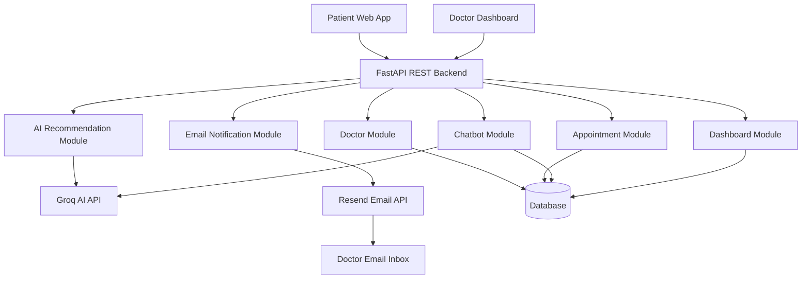
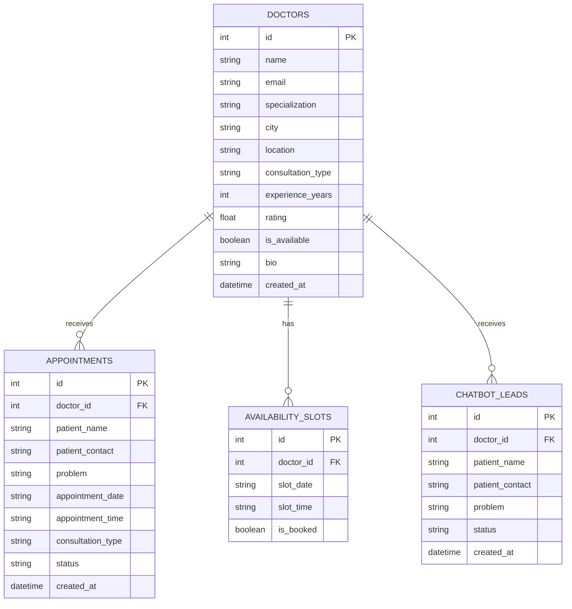
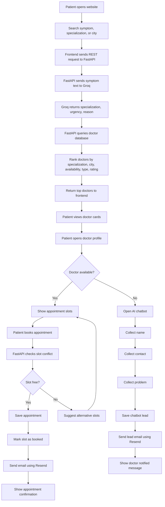
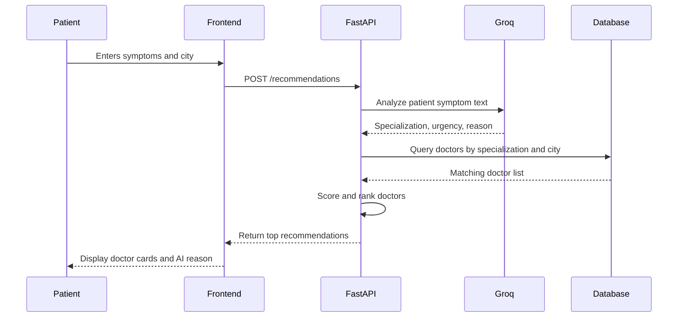
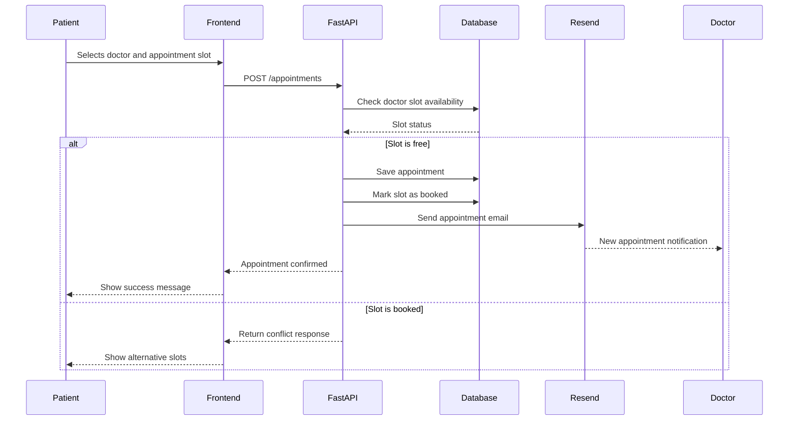
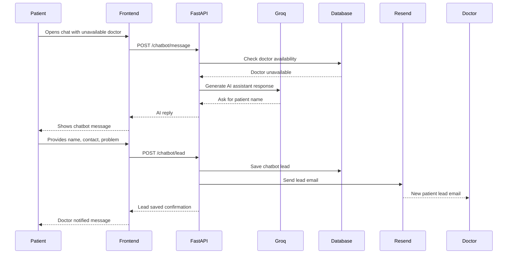
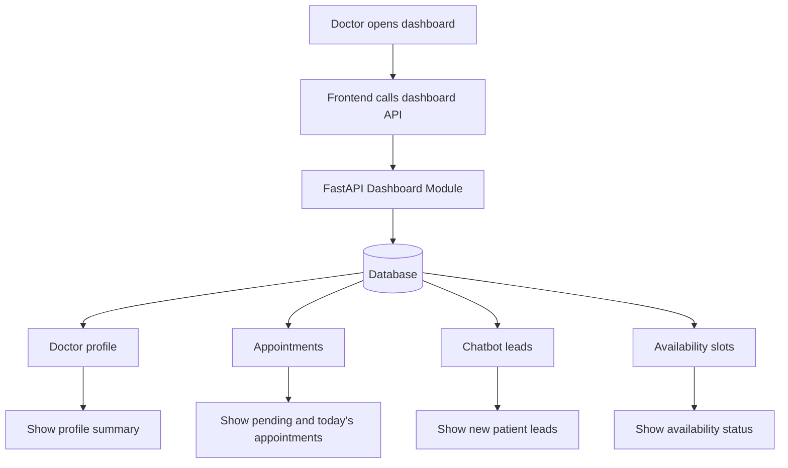
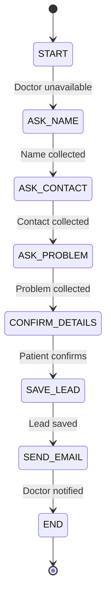

# Smart Doctor Connect AI — Final Refined Hackathon Idea

**Hackathon:** MTM (Mind-to-Machine) AI Hackathon by GDGoC CUI Wah  
**Project Name:** Smart Doctor Connect AI  
**Platform:** Web Application  
**Backend:** FastAPI REST API  
**Frontend:** React / Next.js + Tailwind CSS  
**AI Provider:** Groq API  
**Email Provider:** Resend  
**Database:** SQLite for 3-hour MVP, Supabase PostgreSQL for scalable version  
**Goal:** Build a complete AI-powered doctor discovery, chatbot, and appointment booking system that fully satisfies the hackathon requirements and evaluation criteria.

---

# 1. Executive Summary

Smart Doctor Connect AI is a healthcare web application designed for Pakistan where patients can quickly find the right doctor based on symptoms, specialization, city, consultation type, and doctor availability.

The system solves three major problems:

1. Patients do not know which doctor is available nearby or online.
2. Doctors miss patients because they do not have automated follow-up and communication systems.
3. Existing doctor discovery is fragmented, slow, and usually depends on phone calls or word-of-mouth.

The application allows a patient to type:

> “I have back pain in Lahore”

The system then:

1. Uses Groq AI to understand the symptom.
2. Detects the likely specialization, such as Orthopedic.
3. Searches available doctors in the selected city.
4. Ranks doctors by specialization match, location, availability, consultation type, rating, and experience.
5. Shows top recommended doctors with AI explanation.
6. Allows appointment booking.
7. If the doctor is unavailable, starts an AI chatbot.
8. Chatbot collects patient name, contact number, and problem.
9. Saves the lead in the database.
10. Sends an email notification to the doctor using Resend.

This is intentionally designed as a strong but realistic 3-hour hackathon MVP.

---

# 2. Problem Understanding

## 2.1 Core Problem

Healthcare access in Pakistan is fragmented and time-consuming.

Patients often face these problems:

- They do not know which specialist they need.
- They do not know which doctor is available.
- They do not know whether the doctor supports online or physical consultation.
- They rely on calling clinics manually.
- They depend on word-of-mouth recommendations.
- They lose time during urgent but non-emergency medical needs.

Doctors face these problems:

- They miss potential patients when busy.
- They do not have automated communication.
- They do not have a smart lead capture system.
- They do not have a simple appointment management dashboard.
- They cannot easily manage online and physical appointment demand.

## 2.2 North Star Scenario

A patient in Karachi wants a dermatologist immediately but does not know which doctor is available online or nearby.

Smart Doctor Connect AI solves this by allowing the patient to search:

> “skin allergy in Karachi”

The AI detects:

```txt
Specialization: Dermatologist
Location: Karachi
Need: Immediate consultation
```

The system then shows:

```txt
Top available dermatologists in Karachi
Online/physical consultation options
Availability status
Book appointment button
AI chatbot fallback if unavailable
```

---

# 3. Final MVP Scope

This project is designed to win in a short hackathon by focusing only on high-impact features.

## 3.1 Must-Have MVP Features

```txt
1. Doctor profile listing
2. Search doctors by city, specialization, symptoms, and consultation type
3. Groq AI symptom-to-specialization detection
4. Doctor recommendation ranking
5. Doctor profile detail page
6. Appointment booking
7. Conflict-free slot booking
8. AI chatbot for unavailable doctors
9. Chatbot collects patient name, contact, and problem
10. Database storage for appointments and chatbot leads
11. Resend email notification to doctor
12. Simple doctor dashboard
13. Mobile-responsive frontend
```

## 3.2 Optional Bonus Features

```txt
1. Waiting time prediction
2. Earliest available slot suggestion
3. Patient confirmation email
4. AI-generated follow-up reminder text
5. Doctor availability toggle
6. Simple analytics cards in dashboard
```

## 3.3 Features Not Included in 3-Hour MVP

These are useful for a final product but overkill for the hackathon MVP:

```txt
1. Google OAuth
2. Full admin panel
3. Full Supabase Auth
4. Realtime WebSocket chat
5. Video consultation
6. Payment system
7. Complex calendar view
8. Reviews and ratings submission
9. Doctor verification workflow
10. Cron-based reminder automation
11. Profile picture upload
12. Full patient dashboard
```

These can be mentioned as future scalability features in the final pitch.

---

# 4. Final Technology Stack

## 4.1 Frontend

```txt
Framework: Next.js or React with Vite
Language: TypeScript preferred, JavaScript acceptable for speed
Styling: Tailwind CSS
Icons: Lucide React
UI Components: shadcn/ui optional
API Communication: REST calls to FastAPI
```

## 4.2 Backend

```txt
Framework: FastAPI
Language: Python
API Style: REST
Validation: Pydantic
ORM: SQLAlchemy
Server: Uvicorn
```

## 4.3 Database

For 3-hour MVP:

```txt
SQLite
```

For final scalable version:

```txt
Supabase PostgreSQL
```

## 4.4 AI

```txt
Provider: Groq API
Use Cases:
- Symptom analysis
- Specialization detection
- Chatbot response generation
- AI recommendation explanation
- Urgency classification
```

## 4.5 Email

```txt
Provider: Resend
Use Cases:
- Appointment notification email to doctor
- Chatbot lead notification email to doctor
- Optional patient confirmation email
```

## 4.6 Deployment

```txt
Frontend: Vercel
Backend: Render / Railway
Database: SQLite for demo or Supabase PostgreSQL for deployed version
```

---

# 5. System Architecture



## Architecture Explanation

The frontend never directly calls Groq or Resend.  
All secret keys remain inside the FastAPI backend.

```txt
Frontend → FastAPI → Groq
Frontend → FastAPI → Resend
Frontend → FastAPI → Database
```

This keeps the system secure, modular, and scalable.

---

# 6. Main User Roles

## 6.1 Patient

The patient can:

```txt
1. Search for doctors
2. Enter symptoms
3. View AI-recommended doctors
4. View doctor profile
5. Book appointment
6. Chat with AI assistant if doctor is unavailable
7. Receive confirmation message
```

## 6.2 Doctor

The doctor can:

```txt
1. Have a public profile
2. Set available/unavailable status
3. View appointments
4. View chatbot leads
5. Receive email notifications
6. Confirm or update appointment status
```

## 6.3 AI Assistant

The AI assistant can:

```txt
1. Understand patient symptom text
2. Suggest doctor specialization
3. Explain recommendation
4. Chat when doctor is unavailable
5. Collect patient name, contact, and problem
6. Avoid giving medical diagnosis or medicine advice
7. Trigger lead saving and email notification
```

---

# 7. Complete Feature Modules

---

## Module 1: Doctor Profile Module

### Purpose

Stores and displays doctor information so patients can search doctors nationwide.

### Requirement Satisfied

```txt
Doctor profiles with:
- Name
- Specialization
- Location
- Consultation type
- Optional experience and ratings
- Searchable nationwide
```

### Data Fields

```txt
doctor_id
name
email
specialization
city
location
consultation_type
experience_years
rating
is_available
bio
created_at
```

### Core Functions

```txt
create_doctor()
get_all_doctors()
get_doctor_by_id()
search_doctors()
update_doctor_availability()
```

### REST APIs

```http
GET /doctors
GET /doctors/{doctor_id}
POST /doctors
PUT /doctors/{doctor_id}
GET /doctors/search?city=Lahore&specialization=Cardiologist&consultation_type=online
```

### MVP Decision

For 3-hour hackathon, seed 10–15 doctors manually instead of building full doctor registration.

Example seed doctor:

```json
{
  "id": 1,
  "name": "Dr. Sara Malik",
  "email": "sara@example.com",
  "specialization": "Orthopedic",
  "city": "Lahore",
  "location": "Johar Town Clinic",
  "consultation_type": "both",
  "experience_years": 8,
  "rating": 4.8,
  "is_available": true,
  "bio": "Experienced orthopedic specialist for bone, joint, and back pain."
}
```

---

## Module 2: AI Recommendation Module

### Purpose

Detects the correct medical specialization from patient symptoms and recommends doctors.

### Requirement Satisfied

```txt
- Clients enter symptoms, specialization, or location
- AI automatically suggests suitable doctors
- Keyword matching for MVP
- Optional NLP/ML for smarter matching
- Top doctors based on availability and ratings
```

### Input Examples

```txt
"I have back pain"
"skin allergy in Karachi"
"chest pain and shortness of breath"
"Cardiologist in Lahore"
"child fever in Peshawar"
```

### Groq Output Format

Groq should return strict JSON:

```json
{
  "specialization": "Orthopedic",
  "urgency": "medium",
  "keywords": ["back pain"],
  "reason": "Back pain is commonly handled by orthopedic specialists."
}
```

### AI Recommendation Process

```txt
1. Receive patient query
2. Send query to Groq
3. Groq returns specialization, urgency, keywords, reason
4. If Groq fails, use keyword fallback
5. Search doctors by specialization and city
6. Score each doctor
7. Sort doctors by score
8. Return top 3 or top 5 doctors
```

### Scoring Formula

```txt
Specialization match = 50 points
City match = 25 points
Available now = 15 points
Consultation type match = 10 points
Rating bonus = rating × 2
Experience bonus = min(experience_years, 10)
```

### Example Score

```txt
Patient query: back pain in Lahore
Detected specialization: Orthopedic

Doctor:
Dr. Sara Malik
Specialization: Orthopedic
City: Lahore
Available: Yes
Consultation type: Online
Rating: 4.8
Experience: 8 years

Score:
50 specialization
25 city
15 availability
10 consultation type
9.6 rating bonus
8 experience bonus

Total = 117.6
```

### REST API

```http
POST /recommendations
```

Request:

```json
{
  "query": "I have back pain",
  "city": "Lahore",
  "consultation_type": "online"
}
```

Response:

```json
{
  "detected_specialization": "Orthopedic",
  "urgency": "medium",
  "ai_reason": "Back pain is commonly handled by orthopedic specialists.",
  "recommended_doctors": [
    {
      "id": 1,
      "name": "Dr. Sara Malik",
      "specialization": "Orthopedic",
      "city": "Lahore",
      "consultation_type": "both",
      "rating": 4.8,
      "experience_years": 8,
      "is_available": true,
      "score": 117.6,
      "recommendation_reason": "Recommended because your symptoms match orthopedic care, the doctor is available in Lahore, supports online consultation, and has a high rating."
    }
  ]
}
```

---

## Module 3: Appointment Booking Module

### Purpose

Allows patients to book online or physical appointments with doctors.

### Requirement Satisfied

```txt
- Supports online or physical appointments
- AI can suggest optimal slots
- Manual availability input by doctors for MVP
- Fast appointment booking
- Conflict-free scheduling
```

### Appointment Fields

```txt
appointment_id
doctor_id
patient_name
patient_contact
problem
appointment_date
appointment_time
consultation_type
status
created_at
```

### Appointment Statuses

```txt
pending
confirmed
cancelled
completed
```

### Booking Flow

```txt
1. Patient opens doctor profile
2. Patient selects appointment date
3. System shows available slots
4. Patient selects time slot
5. Patient enters name, contact, and problem
6. FastAPI checks if slot is already booked
7. If free, appointment is saved
8. Slot is marked as booked
9. Resend sends email to doctor
10. Patient gets confirmation message
```

### Conflict-Free Scheduling Rule

```txt
Same doctor + same date + same time cannot be booked twice.
```

### REST APIs

```http
POST /appointments
GET /appointments/doctor/{doctor_id}
GET /appointments/{appointment_id}
PUT /appointments/{appointment_id}/status
```

Request:

```json
{
  "doctor_id": 1,
  "patient_name": "Ali Khan",
  "patient_contact": "03001234567",
  "problem": "Severe back pain",
  "appointment_date": "2026-05-12",
  "appointment_time": "18:30",
  "consultation_type": "online"
}
```

Success Response:

```json
{
  "message": "Appointment booked successfully.",
  "appointment_id": 12,
  "status": "pending",
  "email_sent": true
}
```

Conflict Response:

```json
{
  "message": "This slot is already booked. Please choose another time.",
  "available_alternative_slots": ["19:00", "19:30", "20:00"]
}
```

---

## Module 4: Availability Module

### Purpose

Tracks doctor availability and available appointment slots.

### Requirement Satisfied

```txt
- Real-time availability updates
- Availability-based recommendations
- AI suggests earliest available slot
- Conflict-free scheduling
```

### MVP Approach

Use fixed slots per doctor:

```txt
5:00 PM
5:30 PM
6:00 PM
6:30 PM
7:00 PM
7:30 PM
```

### Data Fields

```txt
slot_id
doctor_id
slot_date
slot_time
is_booked
```

### REST APIs

```http
GET /availability/{doctor_id}?date=2026-05-12
POST /availability/{doctor_id}
PUT /availability/slot/{slot_id}
```

### Earliest Slot Logic

```txt
1. Fetch all slots for doctor and date
2. Filter slots where is_booked = false
3. Sort by time
4. Return first available slot
```

### Waiting Time Prediction

Simple bonus formula:

```txt
waiting_time = number_of_booked_slots_before_selected_slot × 15 minutes
```

Example:

```txt
Booked slots before selected slot: 2
Estimated waiting time: 30 minutes
```

---

## Module 5: AI Chatbot Module

### Purpose

Handles patient communication when the doctor is unavailable.

### Requirement Satisfied

```txt
- Each doctor profile has chat interface
- If doctor unavailable, AI automatically responds
- AI collects client details
- Stores data in database
- Sends email notification to doctor
- Optional follow-up reminders
```

### Chatbot Activation Rule

```txt
If doctor.is_available = false:
    activate AI chatbot
Else:
    show appointment booking and normal contact options
```

### Chatbot Must Collect

```txt
1. Patient full name
2. Patient contact number
3. Patient medical problem
```

### Chatbot Must Not Do

```txt
1. Give diagnosis
2. Recommend medicine
3. Claim to be a real doctor
4. Replace emergency medical care
```

### Emergency Safety Rule

If patient says:

```txt
heart attack
can't breathe
unconscious
severe bleeding
emergency
```

AI should reply:

```txt
This may be an emergency. Please call local emergency services immediately. This AI assistant cannot provide emergency care.
```

### Chatbot Conversation State

```txt
START
ASK_NAME
ASK_CONTACT
ASK_PROBLEM
CONFIRM_DETAILS
SAVE_LEAD
SEND_EMAIL
END
```

### REST APIs

```http
POST /chatbot/message
POST /chatbot/lead
GET /chatbot/leads/{doctor_id}
```

### /chatbot/message Request

```json
{
  "doctor_id": 1,
  "message": "I want to contact the doctor",
  "conversation_state": "START",
  "collected_data": {
    "patient_name": null,
    "patient_contact": null,
    "problem": null
  }
}
```

### /chatbot/message Response

```json
{
  "reply": "Dr. Sara is currently unavailable. I am the AI assistant. Please share your full name so I can notify the doctor.",
  "next_state": "ASK_NAME",
  "collected_data": {
    "patient_name": null,
    "patient_contact": null,
    "problem": null
  },
  "is_complete": false
}
```

### /chatbot/lead Request

```json
{
  "doctor_id": 1,
  "patient_name": "Ali Khan",
  "patient_contact": "03001234567",
  "problem": "Severe back pain since yesterday"
}
```

### /chatbot/lead Response

```json
{
  "message": "Your details have been saved and the doctor has been notified.",
  "lead_id": 5,
  "email_sent": true
}
```

---

## Module 6: Resend Email Notification Module

### Purpose

Sends email notifications to doctors for new appointments and chatbot leads.

### Requirement Satisfied

```txt
- Email notification delivery
- Communication automation
- Doctor does not miss patient leads
```

### Email Trigger Events

```txt
1. New appointment booked
2. New chatbot lead collected
```

### Optional Email Trigger Events

```txt
1. Appointment confirmed
2. Appointment cancelled
3. Follow-up reminder
4. Patient confirmation
```

### REST APIs

```http
POST /email/send-appointment
POST /email/send-lead
```

### Appointment Email Template

```txt
Subject: New Appointment Request - Smart Doctor Connect AI

Hello Dr. {doctor_name},

A new appointment has been booked.

Patient Name: {patient_name}
Contact: {patient_contact}
Problem: {problem}
Date: {appointment_date}
Time: {appointment_time}
Consultation Type: {consultation_type}

Please check your dashboard for details.
```

### Chatbot Lead Email Template

```txt
Subject: New Patient Lead - Smart Doctor Connect AI

Hello Dr. {doctor_name},

A patient tried to contact you while you were unavailable.

Patient Name: {patient_name}
Contact: {patient_contact}
Problem: {problem}

Please contact the patient as soon as possible.
```

---

## Module 7: Doctor Dashboard Module

### Purpose

Allows the doctor to view appointments, chatbot leads, and availability status.

### Requirement Satisfied

```txt
- Simple doctor profile management
- Appointment tracking
- Lead tracking
- Communication follow-up
```

### Dashboard Cards

```txt
Total appointments
Pending appointments
Today appointments
New chatbot leads
Availability status
```

### Dashboard Tables

```txt
Upcoming appointments table
Chatbot leads table
```

### REST API

```http
GET /dashboard/doctor/{doctor_id}
```

Response:

```json
{
  "doctor": {
    "id": 1,
    "name": "Dr. Sara Malik",
    "specialization": "Orthopedic",
    "is_available": true
  },
  "stats": {
    "total_appointments": 14,
    "pending_appointments": 4,
    "today_appointments": 3,
    "new_chatbot_leads": 2
  },
  "appointments": [],
  "chatbot_leads": []
}
```

---

## Module 8: Frontend UI Module

### Purpose

Provides a fast, clean, mobile-responsive user experience.

### Pages

```txt
/                         Home page
/search                   Search results page
/doctors/[doctorId]       Doctor profile page
/book/[doctorId]          Appointment booking page
/chat/[doctorId]          AI chatbot page
/dashboard/doctor         Doctor dashboard page
```

### Components

```txt
Navbar
HeroSection
SearchBox
DoctorCard
DoctorProfile
AppointmentForm
ChatbotWidget
AvailabilityBadge
DashboardStats
LeadTable
AppointmentTable
```

### UX Requirements

```txt
1. Search should be visible on homepage.
2. Doctor cards should show availability clearly.
3. Booking should take less than 60 seconds.
4. Chatbot should collect details step-by-step.
5. Dashboard should be simple and readable.
6. Design should be mobile responsive.
```

---

# 8. Database Design

## 8.1 Entity Relationship Diagram



## 8.2 SQLite Schema for MVP

### doctors

```sql
CREATE TABLE doctors (
    id INTEGER PRIMARY KEY AUTOINCREMENT,
    name TEXT NOT NULL,
    email TEXT NOT NULL,
    specialization TEXT NOT NULL,
    city TEXT NOT NULL,
    location TEXT,
    consultation_type TEXT NOT NULL,
    experience_years INTEGER DEFAULT 0,
    rating REAL DEFAULT 4.5,
    is_available BOOLEAN DEFAULT 1,
    bio TEXT,
    created_at DATETIME DEFAULT CURRENT_TIMESTAMP
);
```

### appointments

```sql
CREATE TABLE appointments (
    id INTEGER PRIMARY KEY AUTOINCREMENT,
    doctor_id INTEGER NOT NULL,
    patient_name TEXT NOT NULL,
    patient_contact TEXT NOT NULL,
    problem TEXT NOT NULL,
    appointment_date TEXT NOT NULL,
    appointment_time TEXT NOT NULL,
    consultation_type TEXT NOT NULL,
    status TEXT DEFAULT 'pending',
    created_at DATETIME DEFAULT CURRENT_TIMESTAMP,
    FOREIGN KEY (doctor_id) REFERENCES doctors(id)
);
```

### availability_slots

```sql
CREATE TABLE availability_slots (
    id INTEGER PRIMARY KEY AUTOINCREMENT,
    doctor_id INTEGER NOT NULL,
    slot_date TEXT NOT NULL,
    slot_time TEXT NOT NULL,
    is_booked BOOLEAN DEFAULT 0,
    FOREIGN KEY (doctor_id) REFERENCES doctors(id)
);
```

### chatbot_leads

```sql
CREATE TABLE chatbot_leads (
    id INTEGER PRIMARY KEY AUTOINCREMENT,
    doctor_id INTEGER NOT NULL,
    patient_name TEXT NOT NULL,
    patient_contact TEXT NOT NULL,
    problem TEXT NOT NULL,
    status TEXT DEFAULT 'new',
    created_at DATETIME DEFAULT CURRENT_TIMESTAMP,
    FOREIGN KEY (doctor_id) REFERENCES doctors(id)
);
```

## 8.3 PostgreSQL/Supabase Future Schema Notes

For the final scalable version:

```txt
1. Convert INTEGER IDs to UUID.
2. Add Supabase Auth users table.
3. Add Row Level Security.
4. Add doctor verification field.
5. Add patient dashboard support.
6. Add reviews table.
7. Add reminder table.
8. Add chat_messages table.
```

---

# 9. Strict REST API Specification

## 9.1 Health API

### GET /health

Purpose:

```txt
Check whether backend is running.
```

Response:

```json
{
  "status": "ok",
  "service": "Smart Doctor Connect AI API"
}
```

---

## 9.2 Doctor APIs

### GET /doctors

Response:

```json
[
  {
    "id": 1,
    "name": "Dr. Sara Malik",
    "specialization": "Orthopedic",
    "city": "Lahore",
    "location": "Johar Town Clinic",
    "consultation_type": "both",
    "experience_years": 8,
    "rating": 4.8,
    "is_available": true
  }
]
```

### GET /doctors/{doctor_id}

Response:

```json
{
  "id": 1,
  "name": "Dr. Sara Malik",
  "email": "sara@example.com",
  "specialization": "Orthopedic",
  "city": "Lahore",
  "location": "Johar Town Clinic",
  "consultation_type": "both",
  "experience_years": 8,
  "rating": 4.8,
  "is_available": true,
  "bio": "Experienced orthopedic specialist for back pain, joint pain, and bone injuries."
}
```

### POST /doctors

Request:

```json
{
  "name": "Dr. Ahmed Khan",
  "email": "ahmed@example.com",
  "specialization": "Cardiologist",
  "city": "Karachi",
  "location": "Clifton Clinic",
  "consultation_type": "physical",
  "experience_years": 12,
  "rating": 4.7,
  "is_available": true,
  "bio": "Heart specialist with 12 years of experience."
}
```

Response:

```json
{
  "message": "Doctor created successfully.",
  "doctor_id": 2
}
```

### PUT /doctors/{doctor_id}

Request:

```json
{
  "is_available": false
}
```

Response:

```json
{
  "message": "Doctor profile updated successfully."
}
```

### GET /doctors/search

Example:

```http
GET /doctors/search?city=Lahore&specialization=Orthopedic&consultation_type=online
```

Response:

```json
{
  "results": [
    {
      "id": 1,
      "name": "Dr. Sara Malik",
      "specialization": "Orthopedic",
      "city": "Lahore",
      "is_available": true,
      "rating": 4.8
    }
  ]
}
```

---

## 9.3 Recommendation API

### POST /recommendations

Request:

```json
{
  "query": "I have severe back pain",
  "city": "Lahore",
  "consultation_type": "online"
}
```

Response:

```json
{
  "detected_specialization": "Orthopedic",
  "urgency": "medium",
  "ai_reason": "Back pain is commonly handled by orthopedic specialists.",
  "recommended_doctors": [
    {
      "id": 1,
      "name": "Dr. Sara Malik",
      "specialization": "Orthopedic",
      "city": "Lahore",
      "location": "Johar Town Clinic",
      "consultation_type": "both",
      "experience_years": 8,
      "rating": 4.8,
      "is_available": true,
      "score": 117.6,
      "recommendation_reason": "Recommended because your symptoms match orthopedic care, this doctor is available in Lahore, supports online consultation, and has a strong rating."
    }
  ],
  "safety_note": "This system helps find doctors. It does not provide diagnosis or emergency medical care."
}
```

Fallback response if AI fails:

```json
{
  "detected_specialization": "Orthopedic",
  "ai_used": false,
  "fallback_used": true,
  "recommended_doctors": []
}
```

---

## 9.4 Availability APIs

### GET /availability/{doctor_id}

Example:

```http
GET /availability/1?date=2026-05-12
```

Response:

```json
{
  "doctor_id": 1,
  "date": "2026-05-12",
  "slots": [
    {
      "slot_id": 1,
      "time": "18:00",
      "is_booked": false
    },
    {
      "slot_id": 2,
      "time": "18:30",
      "is_booked": true
    }
  ],
  "earliest_available_slot": "18:00"
}
```

### POST /availability/{doctor_id}

Request:

```json
{
  "slot_date": "2026-05-12",
  "slot_time": "18:00"
}
```

Response:

```json
{
  "message": "Availability slot created successfully."
}
```

### PUT /availability/slot/{slot_id}

Request:

```json
{
  "is_booked": true
}
```

Response:

```json
{
  "message": "Slot updated successfully."
}
```

---

## 9.5 Appointment APIs

### POST /appointments

Request:

```json
{
  "doctor_id": 1,
  "patient_name": "Ali Khan",
  "patient_contact": "03001234567",
  "problem": "Severe back pain",
  "appointment_date": "2026-05-12",
  "appointment_time": "18:00",
  "consultation_type": "online"
}
```

Success Response:

```json
{
  "message": "Appointment booked successfully.",
  "appointment_id": 10,
  "status": "pending",
  "email_sent": true
}
```

Conflict Response:

```json
{
  "message": "This slot is already booked.",
  "available_alternative_slots": ["18:30", "19:00", "19:30"]
}
```

### GET /appointments/doctor/{doctor_id}

Response:

```json
{
  "doctor_id": 1,
  "appointments": [
    {
      "id": 10,
      "patient_name": "Ali Khan",
      "patient_contact": "03001234567",
      "problem": "Severe back pain",
      "appointment_date": "2026-05-12",
      "appointment_time": "18:00",
      "consultation_type": "online",
      "status": "pending"
    }
  ]
}
```

### GET /appointments/{appointment_id}

Response:

```json
{
  "id": 10,
  "doctor_id": 1,
  "patient_name": "Ali Khan",
  "patient_contact": "03001234567",
  "problem": "Severe back pain",
  "appointment_date": "2026-05-12",
  "appointment_time": "18:00",
  "consultation_type": "online",
  "status": "pending"
}
```

### PUT /appointments/{appointment_id}/status

Request:

```json
{
  "status": "confirmed"
}
```

Response:

```json
{
  "message": "Appointment status updated successfully."
}
```

---

## 9.6 Chatbot APIs

### POST /chatbot/message

Request:

```json
{
  "doctor_id": 1,
  "message": "I want to talk to the doctor",
  "conversation_state": "START",
  "collected_data": {
    "patient_name": null,
    "patient_contact": null,
    "problem": null
  }
}
```

Response:

```json
{
  "reply": "Dr. Sara is currently unavailable. I am the AI assistant. Please share your full name so I can notify the doctor.",
  "next_state": "ASK_NAME",
  "collected_data": {
    "patient_name": null,
    "patient_contact": null,
    "problem": null
  },
  "is_complete": false
}
```

### POST /chatbot/lead

Request:

```json
{
  "doctor_id": 1,
  "patient_name": "Ali Khan",
  "patient_contact": "03001234567",
  "problem": "Severe back pain since yesterday"
}
```

Response:

```json
{
  "message": "Your details have been saved and the doctor has been notified.",
  "lead_id": 5,
  "email_sent": true
}
```

### GET /chatbot/leads/{doctor_id}

Response:

```json
{
  "doctor_id": 1,
  "leads": [
    {
      "id": 5,
      "patient_name": "Ali Khan",
      "patient_contact": "03001234567",
      "problem": "Severe back pain since yesterday",
      "status": "new",
      "created_at": "2026-05-12T10:30:00"
    }
  ]
}
```

---

## 9.7 Email APIs

### POST /email/send-appointment

Request:

```json
{
  "doctor_email": "sara@example.com",
  "doctor_name": "Dr. Sara Malik",
  "patient_name": "Ali Khan",
  "patient_contact": "03001234567",
  "problem": "Severe back pain",
  "appointment_date": "2026-05-12",
  "appointment_time": "18:00",
  "consultation_type": "online"
}
```

Response:

```json
{
  "message": "Appointment email sent successfully.",
  "email_sent": true
}
```

### POST /email/send-lead

Request:

```json
{
  "doctor_email": "sara@example.com",
  "doctor_name": "Dr. Sara Malik",
  "patient_name": "Ali Khan",
  "patient_contact": "03001234567",
  "problem": "Severe back pain since yesterday"
}
```

Response:

```json
{
  "message": "Lead email sent successfully.",
  "email_sent": true
}
```

---

## 9.8 Dashboard API

### GET /dashboard/doctor/{doctor_id}

Response:

```json
{
  "doctor": {
    "id": 1,
    "name": "Dr. Sara Malik",
    "specialization": "Orthopedic",
    "city": "Lahore",
    "is_available": true
  },
  "stats": {
    "total_appointments": 14,
    "pending_appointments": 4,
    "today_appointments": 3,
    "new_chatbot_leads": 2
  },
  "appointments": [
    {
      "id": 10,
      "patient_name": "Ali Khan",
      "appointment_time": "18:00",
      "status": "pending"
    }
  ],
  "chatbot_leads": [
    {
      "id": 5,
      "patient_name": "Ali Khan",
      "problem": "Severe back pain since yesterday",
      "status": "new"
    }
  ]
}
```

---

# 10. Complete Workflow Diagrams

## 10.1 Full System Flow



---

## 10.2 Patient Recommendation Flow



---

## 10.3 Appointment Booking Flow



---

## 10.4 Doctor Unavailable Chatbot Flow



---

## 10.5 Doctor Dashboard Flow



---

## 10.6 Chatbot State Machine



---

# 11. Folder Structure

```txt
smart-doctor-connect-ai/
│
├── frontend/
│   ├── app/
│   │   ├── page.tsx
│   │   ├── search/
│   │   │   └── page.tsx
│   │   ├── doctors/
│   │   │   └── [doctorId]/
│   │   │       └── page.tsx
│   │   ├── book/
│   │   │   └── [doctorId]/
│   │   │       └── page.tsx
│   │   ├── chat/
│   │   │   └── [doctorId]/
│   │   │       └── page.tsx
│   │   └── dashboard/
│   │       └── doctor/
│   │           └── page.tsx
│   │
│   ├── components/
│   │   ├── Navbar.tsx
│   │   ├── HeroSection.tsx
│   │   ├── SearchBox.tsx
│   │   ├── DoctorCard.tsx
│   │   ├── DoctorProfile.tsx
│   │   ├── AppointmentForm.tsx
│   │   ├── ChatbotWidget.tsx
│   │   ├── AvailabilityBadge.tsx
│   │   ├── DashboardStats.tsx
│   │   ├── AppointmentTable.tsx
│   │   └── LeadTable.tsx
│   │
│   ├── lib/
│   │   ├── api.ts
│   │   └── types.ts
│   │
│   ├── public/
│   │   └── logo.png
│   │
│   ├── package.json
│   └── .env.local
│
├── backend/
│   ├── app/
│   │   ├── main.py
│   │   ├── database.py
│   │   ├── models.py
│   │   ├── schemas.py
│   │   ├── config.py
│   │   │
│   │   ├── routes/
│   │   │   ├── health.py
│   │   │   ├── doctors.py
│   │   │   ├── recommendations.py
│   │   │   ├── availability.py
│   │   │   ├── appointments.py
│   │   │   ├── chatbot.py
│   │   │   ├── email.py
│   │   │   └── dashboard.py
│   │   │
│   │   ├── services/
│   │   │   ├── groq_service.py
│   │   │   ├── recommendation_service.py
│   │   │   ├── doctor_service.py
│   │   │   ├── availability_service.py
│   │   │   ├── appointment_service.py
│   │   │   ├── chatbot_service.py
│   │   │   ├── email_service.py
│   │   │   └── dashboard_service.py
│   │   │
│   │   ├── utils/
│   │   │   ├── symptom_map.py
│   │   │   ├── scoring.py
│   │   │   ├── validators.py
│   │   │   └── constants.py
│   │   │
│   │   └── seed.py
│   │
│   ├── requirements.txt
│   ├── .env
│   └── README.md
│
└── idea.md
```

---

# 12. Backend File Responsibilities

## main.py

```txt
Creates FastAPI app
Adds CORS
Includes all routers
Starts API service
```

## config.py

```txt
Loads environment variables:
- GROQ_API_KEY
- RESEND_API_KEY
- DATABASE_URL
- FRONTEND_URL
- RESEND_FROM_EMAIL
```

## database.py

```txt
Creates SQLAlchemy engine
Creates database session
Provides get_db dependency
```

## models.py

```txt
Defines SQLAlchemy models:
- Doctor
- Appointment
- AvailabilitySlot
- ChatbotLead
```

## schemas.py

```txt
Defines Pydantic request and response schemas.
Validates incoming API data.
```

## routes/

```txt
Contains API endpoints only.
Routes should not contain business logic.
```

## services/

```txt
Contains business logic:
- AI calls
- scoring
- appointment booking
- email sending
- dashboard aggregation
```

## utils/

```txt
Contains reusable helper logic:
- symptom map
- scoring helper
- validation helper
- constants
```

---

# 13. Frontend File Responsibilities

## page.tsx

Homepage with hero section and search box.

## search/page.tsx

Displays AI recommendation results.

## doctors/[doctorId]/page.tsx

Doctor public profile page.

## book/[doctorId]/page.tsx

Appointment booking page.

## chat/[doctorId]/page.tsx

AI chatbot interface.

## dashboard/doctor/page.tsx

Doctor dashboard showing appointments and leads.

## lib/api.ts

All REST API calls to FastAPI.

Example:

```ts
const API_URL = process.env.NEXT_PUBLIC_API_URL;

export async function recommendDoctors(query: string, city: string, consultationType: string) {
  const response = await fetch(`${API_URL}/recommendations`, {
    method: "POST",
    headers: {
      "Content-Type": "application/json",
    },
    body: JSON.stringify({
      query,
      city,
      consultation_type: consultationType,
    }),
  });

  return response.json();
}
```

---

# 14. Groq AI Design

## 14.1 Groq Symptom Analysis Prompt

```txt
You are a medical routing assistant for a doctor discovery platform in Pakistan.

Your job is NOT to diagnose the patient.
Your job is only to classify which type of doctor/specialist the patient should consult.

Patient message:
"{query}"

Return only valid JSON in this exact format:
{
  "specialization": "one specialization from the allowed list",
  "urgency": "low | medium | high",
  "keywords": ["keyword1", "keyword2"],
  "reason": "short reason without diagnosis"
}

Allowed specializations:
General Physician, Cardiologist, Dermatologist, Orthopedic, Neurologist,
Gynecologist, Pediatrician, Dentist, Eye Specialist, ENT Specialist,
Psychiatrist, Urologist, Gastroenterologist

Rules:
- Do not give diagnosis.
- Do not prescribe medicine.
- If unclear, choose General Physician.
- Keep reason short.
```

## 14.2 Groq Chatbot Prompt

```txt
You are an AI assistant for Dr. {doctor_name}, a {specialization} in {city}.

The doctor is currently unavailable.

Your job:
1. Politely tell the patient that the doctor is unavailable.
2. Collect patient full name.
3. Collect patient contact number.
4. Collect patient problem/reason for consultation.
5. Confirm that the doctor will be notified.

Strict rules:
- Never give medical advice.
- Never diagnose.
- Never prescribe medicine.
- Always say you are an AI assistant, not the doctor.
- Keep replies short and friendly.
- If emergency symptoms are mentioned, tell the patient to contact emergency services immediately.

Current state: {conversation_state}
Collected data: {collected_data}
Patient message: {message}

Return only valid JSON:
{
  "reply": "message to patient",
  "next_state": "ASK_NAME | ASK_CONTACT | ASK_PROBLEM | CONFIRM_DETAILS | END",
  "collected_data": {
    "patient_name": "value or null",
    "patient_contact": "value or null",
    "problem": "value or null"
  },
  "is_complete": true or false
}
```

---

# 15. Resend Email Design

## 15.1 Environment Variables

```env
RESEND_API_KEY=your_resend_key
RESEND_FROM_EMAIL=Smart Doctor Connect AI <onboarding@resend.dev>
```

## 15.2 Email Sending Function

```txt
send_appointment_email()
send_chatbot_lead_email()
```

## 15.3 Email Failure Handling

If email fails:

```txt
1. Appointment/lead should still be saved.
2. API should return email_sent: false.
3. Dashboard should still show the new appointment/lead.
4. UI should say: "Saved successfully, but email delivery failed."
```

This prevents the whole system from failing because of email issues.

---

# 16. Evaluation Criteria Cross-Check

This section proves the project satisfies every evaluation criterion.

## 16.1 Doctor Recommendation Accuracy

### Requirement

```txt
- Correct specialization matching
- Location-based doctor suggestions
- Availability-based recommendations
- AI suggestion relevance
```

### Our Implementation

```txt
Correct specialization:
Groq detects specialization from symptoms.

Location-based suggestions:
Patient city is used to filter/rank doctors.

Availability-based recommendations:
Available doctors receive extra score and appear higher.

AI suggestion relevance:
Groq returns reason, urgency, and keywords.
Fallback keyword mapping prevents total failure.
```

### Score Target

```txt
10/10
```

### Demo Proof

Search:

```txt
"I have back pain" + Lahore
```

System returns:

```txt
Orthopedic doctors in Lahore, available doctors first.
```

---

## 16.2 Appointment & Scheduling Efficiency

### Requirement

```txt
- Fast appointment booking
- Real-time availability updates
- Conflict-free scheduling
- Waiting time reduction
```

### Our Implementation

```txt
Fast booking:
One simple appointment form.

Availability:
Each doctor has availability slots.

Conflict-free scheduling:
Backend checks same doctor + same date + same time before booking.

Waiting time:
System can estimate waiting time based on booked slots.
```

### Score Target

```txt
10/10
```

### Demo Proof

Book a 6:00 PM slot.  
Try booking the same slot again.  
System blocks it and suggests another slot.

---

## 16.3 AI Chatbot & Communication Performance

### Requirement

```txt
- Instant automated responses
- Accurate patient data collection
- Email/notification delivery
- Follow-up reminder handling
```

### Our Implementation

```txt
Instant response:
FastAPI calls Groq chatbot endpoint.

Accurate data collection:
Chatbot state machine collects name, contact, problem.

Email delivery:
Resend sends lead email to doctor.

Follow-up:
MVP mentions optional follow-up message; future version can schedule it.
```

### Score Target

```txt
10/10
```

### Demo Proof

Open unavailable doctor chat.  
AI collects details.  
Show email received by doctor.

---

## 16.4 User Experience & Accessibility

### Requirement

```txt
- Easy-to-use interface
- Fast search and navigation
- Mobile responsiveness
- Simple doctor profile management
```

### Our Implementation

```txt
Easy UI:
Search-first homepage.

Fast navigation:
Home → Search → Doctor profile → Book/chat.

Mobile responsiveness:
Tailwind responsive layout.

Simple doctor management:
Doctor dashboard shows appointments, leads, and availability.
```

### Score Target

```txt
10/10
```

### Demo Proof

Use mobile view in browser dev tools.  
Show homepage, doctor card, booking form, chatbot.

---

## 16.5 System Reliability & Scalability

### Requirement

```txt
- Fast system response time
- High uptime and stability
- Multi-user handling capability
- Secure patient data management
```

### Our Implementation

```txt
Fast response:
FastAPI + SQLite/PostgreSQL + simple endpoints.

High uptime:
Can deploy frontend on Vercel and backend on Render/Railway.

Multi-user:
Backend API supports multiple users and database-backed state.

Secure data:
API keys are backend-only.
Patient data is not public.
Future version can add Supabase Auth and RLS.
```

### Score Target

```txt
10/10 for hackathon MVP, with clear future security plan.
```

### Demo Proof

Show API docs at /docs.  
Show that Groq and Resend keys are in backend .env only.

---

# 17. Build Plan for 3 Hours

## 0–20 Minutes: Setup

```txt
Create backend FastAPI project
Create frontend app
Install Tailwind
Setup SQLite
Add environment variables
```

## 20–45 Minutes: Database + Seed Data

```txt
Create models
Create tables
Seed 10–15 doctors
Seed availability slots
```

## 45–75 Minutes: Doctor Search + Recommendation

```txt
Build /doctors
Build /recommendations
Integrate Groq
Add keyword fallback
```

## 75–105 Minutes: Frontend Search + Doctor Cards

```txt
Build homepage
Build search box
Build doctor cards
Show AI reason
```

## 105–135 Minutes: Appointment Booking

```txt
Build appointment form
Build /appointments
Add conflict prevention
Send Resend email
```

## 135–160 Minutes: Chatbot Lead Collection

```txt
Build chatbot UI
Build /chatbot/message
Build /chatbot/lead
Send lead email via Resend
```

## 160–175 Minutes: Doctor Dashboard

```txt
Build dashboard endpoint
Show appointments
Show chatbot leads
Show stats
```

## 175–180 Minutes: Polish Demo

```txt
Add loading states
Check mobile view
Prepare demo data
Test email
Prepare pitch script
```

---

# 18. Demo Script for Judges

## Scene 1: Patient Search

Say:

```txt
A patient does not know which doctor to visit. They only type their symptoms.
```

Input:

```txt
I have back pain
City: Lahore
Consultation: Online
```

Show:

```txt
AI detected: Orthopedic
Top recommended doctors in Lahore
Available doctors shown first
```

## Scene 2: Recommendation Explanation

Show doctor card:

```txt
Dr. Sara Malik
Orthopedic
Lahore
Available Now
Rating 4.8
AI Reason: Recommended because your symptoms match orthopedic care and the doctor is available in Lahore.
```

## Scene 3: Appointment Booking

Book:

```txt
Patient: Ali Khan
Contact: 03001234567
Problem: Severe back pain
Time: 6:00 PM
```

Show:

```txt
Appointment booked successfully.
Doctor notified by email.
```

## Scene 4: Conflict-Free Scheduling

Try same slot again.

Show:

```txt
This slot is already booked.
Please choose another available slot.
```

## Scene 5: Doctor Unavailable Chatbot

Open unavailable doctor.

AI says:

```txt
Dr. Ahmed is currently unavailable. I am the AI assistant. Please share your name so I can notify the doctor.
```

Then collect:

```txt
Name
Contact
Problem
```

Show:

```txt
Lead saved.
Doctor notified by email.
```

## Scene 6: Doctor Dashboard

Show:

```txt
Appointments
Chatbot leads
Availability status
Pending requests
```

Final line:

```txt
Even when doctors are unavailable, our AI agent captures the patient and notifies the doctor, so no patient is lost.
```

---

# 19. Safety and Medical Disclaimer

The system must always show:

```txt
Smart Doctor Connect AI helps patients find suitable doctors. It does not provide diagnosis, prescriptions, or emergency medical care.
```

Emergency warning:

```txt
If you are facing a medical emergency, please contact local emergency services immediately.
```

---

# 20. Why This Version Wins

This refined version wins because it directly targets the judging criteria.

```txt
Doctor recommendation:
Groq AI + scoring system

Scheduling:
Fast booking + conflict prevention

Chatbot:
Groq AI assistant + patient data collection

Communication:
Resend email notifications

UX:
Simple mobile-friendly flow

Scalability:
FastAPI modular backend + database + future Supabase path
```

It is not overbuilt, but it looks complete.

It avoids wasting time on unnecessary features while still giving judges the feeling of a real product.

---

# 21. Final MVP Checklist

```txt
[ ] FastAPI backend running
[ ] Swagger docs visible at /docs
[ ] Doctor data seeded
[ ] /recommendations working with Groq
[ ] Keyword fallback working
[ ] Doctor cards displayed in frontend
[ ] Doctor profile page working
[ ] Appointment booking working
[ ] Slot conflict prevention working
[ ] Resend email on appointment working
[ ] AI chatbot for unavailable doctor working
[ ] Chatbot lead saving working
[ ] Resend email on chatbot lead working
[ ] Doctor dashboard working
[ ] Mobile responsive UI
[ ] Demo script prepared
```

---

# 22. Final One-Line Pitch

> Smart Doctor Connect AI helps patients in Pakistan instantly find the right available doctor using AI, book online or physical appointments, and ensures doctors never miss a patient through an automated AI chatbot and email notification system.

---

# 23. Final Conclusion

This final plan is the refined version of the project.

It satisfies:

```txt
1. Doctor profiles
2. Client search
3. AI suggestions
4. Smart communication
5. AI chatbot
6. Patient detail collection
7. Database storage
8. Email notification
9. Appointment booking
10. Availability-based recommendations
11. Conflict-free scheduling
12. Waiting time bonus
13. Mobile responsive UX
14. Scalability and reliability
15. Secure backend key handling
```

This is the correct balance for a 3-hour hackathon: complete enough to score highly, simple enough to actually build, and impressive enough to present confidently.
