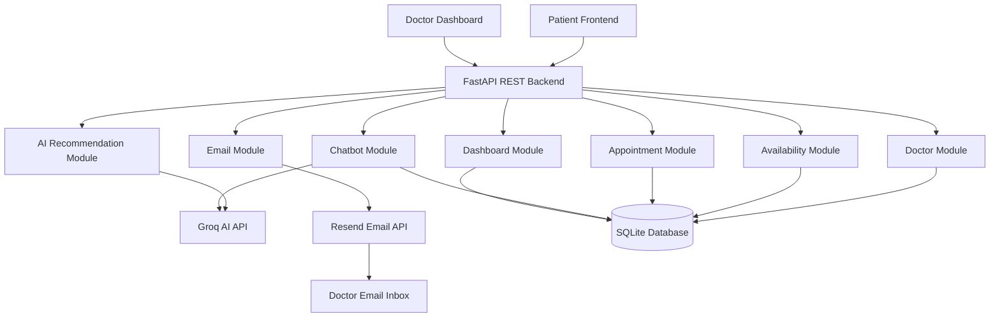

# Smart Doctor Connect AI — planning.md

**Project:** Smart Doctor Connect AI  
**Purpose:** Execution and implementation plan for the final refined `idea.md`  
**Hackathon Time Limit:** 2 hours  
**Role Assumption:** Senior Software Engineer + AI Engineer + Project Manager  
**Final Stack:** FastAPI + React/Next.js REST Frontend + Groq + Resend + SQLite/Supabase-ready DB  
**Rule:** This planning document must stay fully aligned with the final refined `idea.md`. No feature should be added that is not part of the agreed scope unless clearly marked as optional/future.

---

# 0. Planning Philosophy

This project must be built as a **focused hackathon MVP**, not a full hospital SaaS product.

The goal is to score highly on the hackathon evaluation criteria:

```txt
1. Doctor Recommendation Accuracy
2. Appointment & Scheduling Efficiency
3. AI Chatbot & Communication Performance
4. User Experience & Accessibility
5. System Reliability & Scalability
```

The project must demonstrate a complete working loop:

```txt
Patient enters symptoms
↓
AI detects specialization
↓
System recommends doctors
↓
Patient books appointment
↓
Doctor receives email
↓
If doctor unavailable, chatbot collects lead
↓
Doctor dashboard shows appointments and leads
```

---

# 1. Absolute Scope Boundary

## 1.1 Must Build in 2 Hours

```txt
[ ] FastAPI backend with strict REST APIs
[ ] SQLite database with SQLAlchemy models
[ ] Doctor seed data
[ ] Groq AI symptom analysis
[ ] Keyword fallback if Groq fails
[ ] Doctor recommendation scoring
[ ] React/Next.js frontend
[ ] Homepage search
[ ] Search results doctor cards
[ ] Doctor profile page
[ ] Appointment booking
[ ] Slot conflict prevention
[ ] Resend appointment email
[ ] AI chatbot for unavailable doctor
[ ] Chatbot lead save
[ ] Resend chatbot lead email
[ ] Doctor dashboard
[ ] Dockerfile for backend
[ ] Dockerfile for frontend
[ ] docker-compose.yml
[ ] demo.env
[ ] Test each module before commit
```

## 1.2 Must Not Build in 2 Hours

```txt
[ ] Google OAuth
[ ] Full auth system
[ ] Payment system
[ ] Video calls
[ ] Full patient dashboard
[ ] Full admin panel
[ ] WebSocket realtime chat
[ ] Reviews submission system
[ ] PMDC verification
[ ] Complex calendar UI
[ ] Cron reminders
[ ] File/profile image upload
```

These can be mentioned as future work only.

---

# 2. Final System Architecture



## 2.1 Integration Rule

```txt
Frontend never calls Groq directly.
Frontend never calls Resend directly.
Frontend never stores API keys.
Only FastAPI talks to Groq and Resend.
```

---

# 3. High-Level Build Timeline for 2 Hours

## 0–10 min: Project skeleton

```txt
Create backend folder
Create frontend folder
Create demo.env
Create Dockerfile placeholders
Create docker-compose.yml
Install dependencies
```

## 10–25 min: Database and seed data

```txt
Create SQLAlchemy models
Create SQLite DB
Seed doctors
Seed availability slots
```

## 25–45 min: Backend core APIs

```txt
Health API
Doctor APIs
Availability APIs
Recommendation API shell
```

## 45–65 min: Groq integration and scoring

```txt
Groq symptom analysis
Keyword fallback
Scoring formula
Recommendation response contract
```

## 65–85 min: Appointment module

```txt
Appointment creation
Conflict prevention
Slot booking
Resend appointment email
```

## 85–105 min: Chatbot module

```txt
Chatbot state machine
Groq chatbot response
Lead saving
Resend lead email
```

## 105–115 min: Dashboard API

```txt
Doctor stats
Appointment list
Chatbot lead list
Availability status
```

## 115–120 min: Final testing and demo run

```txt
Run backend tests
Run frontend smoke test
Run Docker build check
Prepare final demo path
```

---

# 4. Repository Structure

```txt
smart-doctor-connect-ai/
│
├── backend/
│   ├── app/
│   │   ├── main.py
│   │   ├── config.py
│   │   ├── database.py
│   │   ├── models.py
│   │   ├── schemas.py
│   │   │
│   │   ├── routes/
│   │   │   ├── health.py
│   │   │   ├── doctors.py
│   │   │   ├── recommendations.py
│   │   │   ├── availability.py
│   │   │   ├── appointments.py
│   │   │   ├── chatbot.py
│   │   │   ├── email.py
│   │   │   └── dashboard.py
│   │   │
│   │   ├── services/
│   │   │   ├── groq_service.py
│   │   │   ├── recommendation_service.py
│   │   │   ├── doctor_service.py
│   │   │   ├── availability_service.py
│   │   │   ├── appointment_service.py
│   │   │   ├── chatbot_service.py
│   │   │   ├── email_service.py
│   │   │   └── dashboard_service.py
│   │   │
│   │   ├── utils/
│   │   │   ├── constants.py
│   │   │   ├── symptom_map.py
│   │   │   ├── scoring.py
│   │   │   └── validators.py
│   │   │
│   │   └── seed.py
│   │
│   ├── tests/
│   │   ├── test_health.py
│   │   ├── test_doctors.py
│   │   ├── test_recommendations.py
│   │   ├── test_availability.py
│   │   ├── test_appointments.py
│   │   ├── test_chatbot.py
│   │   ├── test_email.py
│   │   └── test_dashboard.py
│   │
│   ├── requirements.txt
│   ├── Dockerfile
│   ├── .dockerignore
│   └── README.md
│
├── frontend/
│   ├── app/
│   │   ├── page.tsx
│   │   ├── search/
│   │   │   └── page.tsx
│   │   ├── doctors/
│   │   │   └── [doctorId]/
│   │   │       └── page.tsx
│   │   ├── book/
│   │   │   └── [doctorId]/
│   │   │       └── page.tsx
│   │   ├── chat/
│   │   │   └── [doctorId]/
│   │   │       └── page.tsx
│   │   └── dashboard/
│   │       └── doctor/
│   │           └── page.tsx
│   │
│   ├── components/
│   │   ├── Navbar.tsx
│   │   ├── HeroSection.tsx
│   │   ├── SearchBox.tsx
│   │   ├── DoctorCard.tsx
│   │   ├── DoctorProfile.tsx
│   │   ├── AppointmentForm.tsx
│   │   ├── ChatbotWidget.tsx
│   │   ├── AvailabilityBadge.tsx
│   │   ├── DashboardStats.tsx
│   │   ├── AppointmentTable.tsx
│   │   └── LeadTable.tsx
│   │
│   ├── lib/
│   │   ├── api.ts
│   │   └── types.ts
│   │
│   ├── Dockerfile
│   ├── .dockerignore
│   ├── package.json
│   └── README.md
│
├── demo.env
├── docker-compose.yml
├── planning.md
└── idea.md
```

---

# 5. API Contracts — Must Match idea.md Exactly

## 5.1 Health

### GET `/health`

Response:

```json
{
  "status": "ok",
  "service": "Smart Doctor Connect AI API"
}
```

---

## 5.2 Doctors

### GET `/doctors`

Returns all doctors.

### GET `/doctors/{doctor_id}`

Returns one doctor.

### POST `/doctors`

Creates a doctor profile.

### PUT `/doctors/{doctor_id}`

Updates doctor profile or availability.

### GET `/doctors/search?city=Lahore&specialization=Orthopedic&consultation_type=online`

Returns filtered doctors.

---

## 5.3 Recommendations

### POST `/recommendations`

Request:

```json
{
  "query": "I have severe back pain",
  "city": "Lahore",
  "consultation_type": "online"
}
```

Response:

```json
{
  "detected_specialization": "Orthopedic",
  "urgency": "medium",
  "ai_reason": "Back pain is commonly handled by orthopedic specialists.",
  "recommended_doctors": [
    {
      "id": 1,
      "name": "Dr. Sara Malik",
      "specialization": "Orthopedic",
      "city": "Lahore",
      "location": "Johar Town Clinic",
      "consultation_type": "both",
      "experience_years": 8,
      "rating": 4.8,
      "is_available": true,
      "score": 117.6,
      "recommendation_reason": "Recommended because your symptoms match orthopedic care, this doctor is available in Lahore, supports online consultation, and has a strong rating."
    }
  ],
  "safety_note": "This system helps find doctors. It does not provide diagnosis or emergency medical care."
}
```

Fallback response:

```json
{
  "detected_specialization": "Orthopedic",
  "ai_used": false,
  "fallback_used": true,
  "recommended_doctors": []
}
```

---

## 5.4 Availability

### GET `/availability/{doctor_id}?date=2026-05-12`

Response:

```json
{
  "doctor_id": 1,
  "date": "2026-05-12",
  "slots": [
    {
      "slot_id": 1,
      "time": "18:00",
      "is_booked": false
    }
  ],
  "earliest_available_slot": "18:00"
}
```

### POST `/availability/{doctor_id}`

Request:

```json
{
  "slot_date": "2026-05-12",
  "slot_time": "18:00"
}
```

### PUT `/availability/slot/{slot_id}`

Request:

```json
{
  "is_booked": true
}
```

---

## 5.5 Appointments

### POST `/appointments`

Request:

```json
{
  "doctor_id": 1,
  "patient_name": "Ali Khan",
  "patient_contact": "03001234567",
  "problem": "Severe back pain",
  "appointment_date": "2026-05-12",
  "appointment_time": "18:00",
  "consultation_type": "online"
}
```

Success response:

```json
{
  "message": "Appointment booked successfully.",
  "appointment_id": 10,
  "status": "pending",
  "email_sent": true
}
```

Conflict response:

```json
{
  "message": "This slot is already booked.",
  "available_alternative_slots": ["18:30", "19:00", "19:30"]
}
```

### GET `/appointments/doctor/{doctor_id}`

Returns doctor appointment list.

### GET `/appointments/{appointment_id}`

Returns one appointment.

### PUT `/appointments/{appointment_id}/status`

Request:

```json
{
  "status": "confirmed"
}
```

---

## 5.6 Chatbot

### POST `/chatbot/message`

Request:

```json
{
  "doctor_id": 1,
  "message": "I want to talk to the doctor",
  "conversation_state": "START",
  "collected_data": {
    "patient_name": null,
    "patient_contact": null,
    "problem": null
  }
}
```

Response:

```json
{
  "reply": "Dr. Sara is currently unavailable. I am the AI assistant. Please share your full name so I can notify the doctor.",
  "next_state": "ASK_NAME",
  "collected_data": {
    "patient_name": null,
    "patient_contact": null,
    "problem": null
  },
  "is_complete": false
}
```

### POST `/chatbot/lead`

Request:

```json
{
  "doctor_id": 1,
  "patient_name": "Ali Khan",
  "patient_contact": "03001234567",
  "problem": "Severe back pain since yesterday"
}
```

Response:

```json
{
  "message": "Your details have been saved and the doctor has been notified.",
  "lead_id": 5,
  "email_sent": true
}
```

### GET `/chatbot/leads/{doctor_id}`

Returns chatbot leads for one doctor.

---

## 5.7 Email

### POST `/email/send-appointment`

Sends appointment email to doctor.

### POST `/email/send-lead`

Sends chatbot lead email to doctor.

---

## 5.8 Dashboard

### GET `/dashboard/doctor/{doctor_id}`

Response:

```json
{
  "doctor": {
    "id": 1,
    "name": "Dr. Sara Malik",
    "specialization": "Orthopedic",
    "city": "Lahore",
    "is_available": true
  },
  "stats": {
    "total_appointments": 14,
    "pending_appointments": 4,
    "today_appointments": 3,
    "new_chatbot_leads": 2
  },
  "appointments": [],
  "chatbot_leads": []
}
```

---

# 6. Database Models

## 6.1 doctors

```sql
CREATE TABLE doctors (
    id INTEGER PRIMARY KEY AUTOINCREMENT,
    name TEXT NOT NULL,
    email TEXT NOT NULL,
    specialization TEXT NOT NULL,
    city TEXT NOT NULL,
    location TEXT,
    consultation_type TEXT NOT NULL,
    experience_years INTEGER DEFAULT 0,
    rating REAL DEFAULT 4.5,
    is_available BOOLEAN DEFAULT 1,
    bio TEXT,
    created_at DATETIME DEFAULT CURRENT_TIMESTAMP
);
```

## 6.2 appointments

```sql
CREATE TABLE appointments (
    id INTEGER PRIMARY KEY AUTOINCREMENT,
    doctor_id INTEGER NOT NULL,
    patient_name TEXT NOT NULL,
    patient_contact TEXT NOT NULL,
    problem TEXT NOT NULL,
    appointment_date TEXT NOT NULL,
    appointment_time TEXT NOT NULL,
    consultation_type TEXT NOT NULL,
    status TEXT DEFAULT 'pending',
    created_at DATETIME DEFAULT CURRENT_TIMESTAMP,
    FOREIGN KEY (doctor_id) REFERENCES doctors(id)
);
```

## 6.3 availability_slots

```sql
CREATE TABLE availability_slots (
    id INTEGER PRIMARY KEY AUTOINCREMENT,
    doctor_id INTEGER NOT NULL,
    slot_date TEXT NOT NULL,
    slot_time TEXT NOT NULL,
    is_booked BOOLEAN DEFAULT 0,
    FOREIGN KEY (doctor_id) REFERENCES doctors(id)
);
```

## 6.4 chatbot_leads

```sql
CREATE TABLE chatbot_leads (
    id INTEGER PRIMARY KEY AUTOINCREMENT,
    doctor_id INTEGER NOT NULL,
    patient_name TEXT NOT NULL,
    patient_contact TEXT NOT NULL,
    problem TEXT NOT NULL,
    status TEXT DEFAULT 'new',
    created_at DATETIME DEFAULT CURRENT_TIMESTAMP,
    FOREIGN KEY (doctor_id) REFERENCES doctors(id)
);
```

---

# 7. Environment Variables

Use `demo.env` as the single demo environment template.

## 7.1 Backend environment variables

```env
APP_NAME=Smart Doctor Connect AI
APP_ENV=demo
BACKEND_HOST=0.0.0.0
BACKEND_PORT=8000

DATABASE_URL=sqlite:///./smart_doctor.db

GROQ_API_KEY=replace_with_your_groq_api_key
GROQ_MODEL=llama-3.1-8b-instant

RESEND_API_KEY=replace_with_your_resend_api_key
RESEND_FROM_EMAIL=Smart Doctor Connect AI <onboarding@resend.dev>
RESEND_TEST_TO=replace_with_your_test_email

FRONTEND_URL=http://localhost:3000
CORS_ORIGINS=http://localhost:3000,http://127.0.0.1:3000
```

## 7.2 Frontend environment variables

```env
NEXT_PUBLIC_API_URL=http://localhost:8000
```

## 7.3 Where to get API keys

### Groq

```txt
1. Go to GroqCloud Console.
2. Create or sign in to account.
3. Open API Keys.
4. Create API key.
5. Copy it once.
6. Put it in GROQ_API_KEY.
```

Official note: Groq recommends configuring the API key as an environment variable named `GROQ_API_KEY`.

### Resend

```txt
1. Go to Resend dashboard.
2. Open API Keys.
3. Click Create API Key.
4. Choose Sending access for MVP.
5. Copy it once.
6. Put it in RESEND_API_KEY.
7. For quick testing, use onboarding@resend.dev as sender if allowed by your account.
8. For production, verify a domain in Resend.
```

Official note: Resend API keys can be created from the API Key dashboard, and Resend authenticates requests using an API key.

---

# 8. Docker and Deployment Readiness

The project must be deployable at any time.

## 8.1 Backend Dockerfile

Path:

```txt
backend/Dockerfile
```

Expected content:

```dockerfile
FROM python:3.11-slim

WORKDIR /app

COPY requirements.txt .

RUN pip install --no-cache-dir -r requirements.txt

COPY ./app ./app

EXPOSE 8000

CMD ["uvicorn", "app.main:app", "--host", "0.0.0.0", "--port", "8000"]
```

## 8.2 Backend .dockerignore

Path:

```txt
backend/.dockerignore
```

Expected content:

```txt
__pycache__
*.pyc
.env
smart_doctor.db
.venv
pytest_cache
```

## 8.3 Frontend Dockerfile

Path:

```txt
frontend/Dockerfile
```

Expected content:

```dockerfile
FROM node:20-alpine

WORKDIR /app

COPY package*.json ./

RUN npm install

COPY . .

EXPOSE 3000

CMD ["npm", "run", "dev"]
```

## 8.4 Frontend .dockerignore

```txt
node_modules
.next
.env.local
npm-debug.log
```

## 8.5 docker-compose.yml

Path:

```txt
docker-compose.yml
```

Expected content:

```yaml
services:
  backend:
    build:
      context: ./backend
    env_file:
      - ./demo.env
    ports:
      - "8000:8000"
    volumes:
      - ./backend:/app

  frontend:
    build:
      context: ./frontend
    environment:
      NEXT_PUBLIC_API_URL: "http://localhost:8000"
    ports:
      - "3000:3000"
    depends_on:
      - backend
```

## 8.6 Docker commands

```bash
docker compose --env-file demo.env up --build
```

Backend:

```txt
http://localhost:8000
```

Backend API docs:

```txt
http://localhost:8000/docs
```

Frontend:

```txt
http://localhost:3000
```

---

# 9. Module-by-Module Implementation Plan

Each module uses this rule:

```txt
Second last task = Testing
Last task = Commit
```

Do not commit a module until its tests pass.

---

## Module M0 — Project Setup and Standards

### Goal

Create the foundation for the whole project.

### Tasks

#### M0.T0 — Create repository structure

```txt
Create backend/
Create frontend/
Create demo.env
Create docker-compose.yml
Create planning.md
Keep idea.md in root
```

#### M0.T1 — Initialize backend

```bash
cd backend
python -m venv .venv
pip install fastapi uvicorn sqlalchemy pydantic python-dotenv groq resend pytest httpx
pip freeze > requirements.txt
```

#### M0.T2 — Initialize frontend

```bash
npx create-next-app@latest frontend
cd frontend
npm install lucide-react
```

#### M0.T3 — Add global naming conventions

```txt
Python files: snake_case
React components: PascalCase
API paths: lowercase plural nouns
DB tables: snake_case plural
```

#### M0.T4 — Create Docker files

```txt
backend/Dockerfile
frontend/Dockerfile
docker-compose.yml
```

#### M0.T5 — Testing

Test cases:

```txt
TC-M0-001: backend folder exists
TC-M0-002: frontend folder exists
TC-M0-003: demo.env exists
TC-M0-004: docker-compose.yml exists
TC-M0-005: backend dependencies install successfully
TC-M0-006: frontend dependencies install successfully
TC-M0-007: docker compose config validates
```

Commands:

```bash
docker compose --env-file demo.env config
cd backend && pytest -q
cd frontend && npm run build
```

#### M0.T6 — Commit

Commit message:

```txt
chore: initialize project structure and docker setup
```

---

## Module M1 — Backend Core Infrastructure

### Goal

Create FastAPI app, config loading, database connection, and CORS.

### Tasks

#### M1.T0 — Create config.py

Responsibilities:

```txt
Load APP_NAME
Load DATABASE_URL
Load GROQ_API_KEY
Load GROQ_MODEL
Load RESEND_API_KEY
Load RESEND_FROM_EMAIL
Load FRONTEND_URL
Load CORS_ORIGINS
```

#### M1.T1 — Create database.py

Responsibilities:

```txt
Create SQLAlchemy engine
Create SessionLocal
Create Base
Create get_db dependency
```

#### M1.T2 — Create main.py

Responsibilities:

```txt
Create FastAPI app
Add CORS middleware
Include all routers
Create startup event to create tables
```

#### M1.T3 — Create health route

Endpoint:

```http
GET /health
```

#### M1.T4 — Add error format standard

All errors should follow:

```json
{
  "message": "Human readable error",
  "detail": "Technical detail if safe"
}
```

#### M1.T5 — Testing

Test cases:

```txt
TC-M1-001: GET /health returns 200
TC-M1-002: GET /health returns status ok
TC-M1-003: CORS allows frontend origin
TC-M1-004: database session can be created
TC-M1-005: missing optional env does not crash app
```

Commands:

```bash
cd backend
pytest tests/test_health.py -q
uvicorn app.main:app --reload
```

Manual check:

```txt
Open http://localhost:8000/docs
```

#### M1.T6 — Commit

Commit message:

```txt
feat: add FastAPI core infrastructure and health endpoint
```

---

## Module M2 — Database Models and Seed Data

### Goal

Implement database tables exactly matching final idea.md.

### Tasks

#### M2.T0 — Create models.py

Models:

```txt
Doctor
Appointment
AvailabilitySlot
ChatbotLead
```

#### M2.T1 — Create schemas.py

Pydantic schemas:

```txt
DoctorCreate
DoctorUpdate
DoctorResponse

RecommendationRequest
RecommendationDoctorResponse
RecommendationResponse

AvailabilityCreate
AvailabilityUpdate
AvailabilityResponse

AppointmentCreate
AppointmentStatusUpdate
AppointmentResponse

ChatbotMessageRequest
ChatbotMessageResponse
ChatbotLeadCreate
ChatbotLeadResponse

DashboardResponse
```

#### M2.T2 — Create seed.py

Seed at least 12 doctors:

```txt
Orthopedic Lahore available
Orthopedic Lahore unavailable
Cardiologist Karachi available
Cardiologist Lahore unavailable
Dermatologist Karachi available
Dermatologist Islamabad unavailable
General Physician Peshawar available
Dentist Lahore available
Pediatrician Karachi available
Gynecologist Rawalpindi available
ENT Specialist Quetta available
Psychiatrist Islamabad available
```

#### M2.T3 — Seed availability slots

For each doctor:

```txt
2026-05-12 18:00
2026-05-12 18:30
2026-05-12 19:00
2026-05-12 19:30
```

#### M2.T4 — Add seed command

Command:

```bash
python -m app.seed
```

#### M2.T5 — Testing

Test cases:

```txt
TC-M2-001: doctors table is created
TC-M2-002: appointments table is created
TC-M2-003: availability_slots table is created
TC-M2-004: chatbot_leads table is created
TC-M2-005: seed creates at least 12 doctors
TC-M2-006: seed creates availability slots
TC-M2-007: doctor specialization is not null
TC-M2-008: doctor email is not null
```

Commands:

```bash
cd backend
python -m app.seed
pytest tests/test_doctors.py -q
```

#### M2.T6 — Commit

Commit message:

```txt
feat: add database models schemas and seed data
```

---

## Module M3 — Doctor Profile Module

### Goal

Implement doctor profile APIs and search.

### Tasks

#### M3.T0 — Create doctor_service.py

Functions:

```txt
get_all_doctors(db)
get_doctor_by_id(db, doctor_id)
create_doctor(db, payload)
update_doctor(db, doctor_id, payload)
search_doctors(db, city, specialization, consultation_type)
```

#### M3.T1 — Create doctors.py router

Endpoints:

```http
GET /doctors
GET /doctors/{doctor_id}
POST /doctors
PUT /doctors/{doctor_id}
GET /doctors/search
```

#### M3.T2 — Implement search filters

Search logic:

```txt
If city provided, filter by city.
If specialization provided, filter by specialization.
If consultation_type provided:
    online matches online or both
    physical matches physical or both
```

#### M3.T3 — Add not found behavior

If doctor does not exist:

```json
{
  "message": "Doctor not found"
}
```

Status:

```txt
404
```

#### M3.T4 — Testing

Test cases:

```txt
TC-M3-001: GET /doctors returns list
TC-M3-002: GET /doctors/{id} returns correct doctor
TC-M3-003: GET /doctors/999999 returns 404
TC-M3-004: POST /doctors creates doctor
TC-M3-005: PUT /doctors/{id} updates is_available
TC-M3-006: search by city returns matching city only
TC-M3-007: search by specialization returns matching specialization only
TC-M3-008: search online includes consultation_type both
```

Commands:

```bash
cd backend
pytest tests/test_doctors.py -q
```

#### M3.T5 — Commit

Commit message:

```txt
feat: implement doctor profile and search APIs
```

---

## Module M4 — AI Recommendation Module with Groq

### Goal

Use Groq to detect specialization and recommend doctors with scoring.

### Tasks

#### M4.T0 — Create symptom_map.py

Fallback mapping:

```txt
back pain -> Orthopedic
joint pain -> Orthopedic
skin allergy -> Dermatologist
acne -> Dermatologist
chest pain -> Cardiologist
heart pain -> Cardiologist
fever -> General Physician
flu -> General Physician
tooth pain -> Dentist
eye pain -> Eye Specialist
child fever -> Pediatrician
pregnancy -> Gynecologist
depression -> Psychiatrist
ear pain -> ENT Specialist
stomach pain -> Gastroenterologist
```

#### M4.T1 — Create groq_service.py

Functions:

```txt
analyze_symptoms_with_groq(query)
generate_recommendation_reason(query, doctor)
generate_chatbot_reply(...)
```

For symptom analysis, return:

```json
{
  "specialization": "Orthopedic",
  "urgency": "medium",
  "keywords": ["back pain"],
  "reason": "Back pain is commonly handled by orthopedic specialists."
}
```

#### M4.T2 — Create scoring.py

Formula:

```txt
Specialization match = 50
City match = 25
Available now = 15
Consultation type match = 10
Rating bonus = rating × 2
Experience bonus = min(experience_years, 10)
```

#### M4.T3 — Create recommendation_service.py

Functions:

```txt
detect_specialization(query)
recommend_doctors(query, city, consultation_type, db)
```

#### M4.T4 — Create recommendations.py router

Endpoint:

```http
POST /recommendations
```

#### M4.T5 — Add fallback behavior

If Groq fails:

```txt
Use keyword mapping.
Set ai_used = false.
Set fallback_used = true.
```

#### M4.T6 — Testing

Test cases:

```txt
TC-M4-001: back pain maps to Orthopedic
TC-M4-002: skin allergy maps to Dermatologist
TC-M4-003: chest pain maps to Cardiologist
TC-M4-004: unknown symptom maps to General Physician
TC-M4-005: recommendation returns doctors sorted by score
TC-M4-006: available doctor gets higher score than unavailable doctor
TC-M4-007: city match affects score
TC-M4-008: consultation type online matches both
TC-M4-009: Groq failure triggers fallback
TC-M4-010: response contains safety_note
```

Commands:

```bash
cd backend
pytest tests/test_recommendations.py -q
```

Manual demo:

```bash
curl -X POST http://localhost:8000/recommendations \
  -H "Content-Type: application/json" \
  -d '{"query":"I have back pain","city":"Lahore","consultation_type":"online"}'
```

#### M4.T7 — Commit

Commit message:

```txt
feat: add Groq powered doctor recommendation system
```

---

## Module M5 — Availability Module

### Goal

Track and return doctor slots, including earliest available slot.

### Tasks

#### M5.T0 — Create availability_service.py

Functions:

```txt
get_slots(db, doctor_id, date)
create_slot(db, doctor_id, slot_date, slot_time)
update_slot(db, slot_id, is_booked)
get_earliest_available_slot(slots)
get_alternative_slots(slots)
```

#### M5.T1 — Create availability.py router

Endpoints:

```http
GET /availability/{doctor_id}?date=YYYY-MM-DD
POST /availability/{doctor_id}
PUT /availability/slot/{slot_id}
```

#### M5.T2 — Implement earliest slot

Logic:

```txt
Filter is_booked = false
Sort by slot_time
Return first available time
```

#### M5.T3 — Implement alternative slots

If a selected slot is booked:

```txt
Return next 3 unbooked slots
```

#### M5.T4 — Testing

Test cases:

```txt
TC-M5-001: GET availability returns slots
TC-M5-002: earliest_available_slot returns first unbooked slot
TC-M5-003: POST creates slot
TC-M5-004: PUT marks slot booked
TC-M5-005: booked slot is not returned as earliest
TC-M5-006: invalid doctor returns 404
TC-M5-007: date filter returns only requested date
```

Commands:

```bash
cd backend
pytest tests/test_availability.py -q
```

#### M5.T5 — Commit

Commit message:

```txt
feat: implement doctor availability slot APIs
```

---

## Module M6 — Resend Email Module

### Goal

Send appointment and chatbot lead email notifications using Resend.

### Tasks

#### M6.T0 — Create email_service.py

Functions:

```txt
send_appointment_email(data)
send_chatbot_lead_email(data)
```

#### M6.T1 — Create email.py router

Endpoints:

```http
POST /email/send-appointment
POST /email/send-lead
```

#### M6.T2 — Add safe failure behavior

Rule:

```txt
If email fails, do not fail appointment or lead creation.
Return email_sent = false.
Log error safely.
```

#### M6.T3 — Add email templates

Appointment subject:

```txt
New Appointment Request - Smart Doctor Connect AI
```

Lead subject:

```txt
New Patient Lead - Smart Doctor Connect AI
```

#### M6.T4 — Testing

Test cases:

```txt
TC-M6-001: appointment email payload validates
TC-M6-002: lead email payload validates
TC-M6-003: missing doctor_email returns 422
TC-M6-004: mocked Resend success returns email_sent true
TC-M6-005: mocked Resend failure returns email_sent false
TC-M6-006: email template includes patient name
TC-M6-007: email template includes contact number
TC-M6-008: email template includes problem
```

Commands:

```bash
cd backend
pytest tests/test_email.py -q
```

Manual check:

```txt
Send one test email to RESEND_TEST_TO before demo.
```

#### M6.T5 — Commit

Commit message:

```txt
feat: add Resend email notification service
```

---

## Module M7 — Appointment Booking Module

### Goal

Allow patients to book appointments with conflict-free slot logic and email notification.

### Tasks

#### M7.T0 — Create appointment_service.py

Functions:

```txt
create_appointment(db, payload)
get_doctor_appointments(db, doctor_id)
get_appointment(db, appointment_id)
update_appointment_status(db, appointment_id, status)
check_slot_conflict(db, doctor_id, date, time)
mark_slot_booked(db, doctor_id, date, time)
```

#### M7.T1 — Create appointments.py router

Endpoints:

```http
POST /appointments
GET /appointments/doctor/{doctor_id}
GET /appointments/{appointment_id}
PUT /appointments/{appointment_id}/status
```

#### M7.T2 — Implement conflict prevention

Rule:

```txt
Same doctor + same date + same time cannot be booked twice.
```

#### M7.T3 — Integrate Resend

After appointment is saved:

```txt
Call send_appointment_email()
Return email_sent true or false.
```

#### M7.T4 — Implement alternative slots

If conflict:

```txt
Return available_alternative_slots.
```

#### M7.T5 — Testing

Test cases:

```txt
TC-M7-001: valid appointment creates appointment
TC-M7-002: appointment status defaults to pending
TC-M7-003: slot is marked booked after appointment
TC-M7-004: duplicate slot booking is rejected
TC-M7-005: duplicate slot response includes alternatives
TC-M7-006: appointment email is triggered
TC-M7-007: email failure does not block booking
TC-M7-008: GET doctor appointments returns created appointment
TC-M7-009: PUT status changes pending to confirmed
TC-M7-010: invalid doctor_id returns 404
```

Commands:

```bash
cd backend
pytest tests/test_appointments.py -q
```

Manual demo:

```txt
Book 18:00 once.
Try 18:00 again.
Confirm conflict response.
```

#### M7.T6 — Commit

Commit message:

```txt
feat: add conflict-free appointment booking
```

---

## Module M8 — AI Chatbot Module

### Goal

Handle unavailable doctor communication, collect patient details, save lead, and notify doctor.

### Tasks

#### M8.T0 — Create chatbot state constants

States:

```txt
START
ASK_NAME
ASK_CONTACT
ASK_PROBLEM
CONFIRM_DETAILS
SAVE_LEAD
SEND_EMAIL
END
```

#### M8.T1 — Create chatbot_service.py

Functions:

```txt
handle_chatbot_message(db, payload)
extract_or_update_collected_data(state, message, collected_data)
save_chatbot_lead(db, payload)
get_doctor_leads(db, doctor_id)
```

#### M8.T2 — Integrate Groq chatbot prompt

Prompt rules:

```txt
Never diagnose.
Never prescribe medicine.
Always identify as AI assistant.
Collect name, contact, problem.
Emergency keywords trigger emergency warning.
```

#### M8.T3 — Create chatbot.py router

Endpoints:

```http
POST /chatbot/message
POST /chatbot/lead
GET /chatbot/leads/{doctor_id}
```

#### M8.T4 — Integrate Resend lead email

After lead is saved:

```txt
Call send_chatbot_lead_email()
Return email_sent true or false.
```

#### M8.T5 — Testing

Test cases:

```txt
TC-M8-001: START state returns ASK_NAME
TC-M8-002: ASK_NAME captures patient name
TC-M8-003: ASK_CONTACT captures phone number
TC-M8-004: ASK_PROBLEM captures problem
TC-M8-005: complete collected data sets is_complete true
TC-M8-006: POST /chatbot/lead saves lead
TC-M8-007: lead email is triggered
TC-M8-008: email failure does not block lead saving
TC-M8-009: emergency keyword returns emergency warning
TC-M8-010: chatbot response does not give medical advice
TC-M8-011: GET leads returns doctor leads
```

Commands:

```bash
cd backend
pytest tests/test_chatbot.py -q
```

Manual demo:

```txt
Open unavailable doctor chat.
Enter name/contact/problem.
Check dashboard and email.
```

#### M8.T6 — Commit

Commit message:

```txt
feat: add AI chatbot lead capture flow
```

---

## Module M9 — Doctor Dashboard Module

### Goal

Show doctor profile, appointments, chatbot leads, and stats.

### Tasks

#### M9.T0 — Create dashboard_service.py

Functions:

```txt
get_doctor_dashboard(db, doctor_id)
count_total_appointments(db, doctor_id)
count_pending_appointments(db, doctor_id)
count_today_appointments(db, doctor_id)
count_new_chatbot_leads(db, doctor_id)
```

#### M9.T1 — Create dashboard.py router

Endpoint:

```http
GET /dashboard/doctor/{doctor_id}
```

#### M9.T2 — Aggregate dashboard response

Response must include:

```txt
doctor
stats
appointments
chatbot_leads
```

#### M9.T3 — Keep dashboard simple

No auth required for MVP demo.  
Use doctor ID in URL.

#### M9.T4 — Testing

Test cases:

```txt
TC-M9-001: dashboard returns doctor object
TC-M9-002: dashboard returns stats object
TC-M9-003: total_appointments count is correct
TC-M9-004: pending_appointments count is correct
TC-M9-005: new_chatbot_leads count is correct
TC-M9-006: appointments array is returned
TC-M9-007: chatbot_leads array is returned
TC-M9-008: invalid doctor returns 404
```

Commands:

```bash
cd backend
pytest tests/test_dashboard.py -q
```

#### M9.T5 — Commit

Commit message:

```txt
feat: implement doctor dashboard API
```

---

## Module M10 — Frontend API Client

### Goal

Create one frontend API layer matching backend contracts.

### Tasks

#### M10.T0 — Create lib/types.ts

Types:

```txt
Doctor
RecommendationRequest
RecommendationResponse
AvailabilitySlot
AppointmentRequest
AppointmentResponse
ChatbotMessageRequest
ChatbotMessageResponse
ChatbotLeadRequest
DashboardResponse
```

#### M10.T1 — Create lib/api.ts

Functions:

```txt
getDoctors()
getDoctor(id)
searchDoctors(params)
recommendDoctors(payload)
getAvailability(doctorId, date)
bookAppointment(payload)
sendChatbotMessage(payload)
saveChatbotLead(payload)
getDoctorDashboard(doctorId)
```

#### M10.T2 — Add error wrapper

Every API call should return:

```txt
data
error
loading state handled in UI
```

#### M10.T3 — Validate API URL

Use:

```txt
NEXT_PUBLIC_API_URL
```

#### M10.T4 — Testing

Test cases:

```txt
TC-M10-001: NEXT_PUBLIC_API_URL is used
TC-M10-002: recommendDoctors calls /recommendations
TC-M10-003: bookAppointment calls /appointments
TC-M10-004: saveChatbotLead calls /chatbot/lead
TC-M10-005: getDoctorDashboard calls /dashboard/doctor/{id}
TC-M10-006: API error response is handled
```

Commands:

```bash
cd frontend
npm run build
```

#### M10.T5 — Commit

Commit message:

```txt
feat: add frontend REST API client
```

---

## Module M11 — Frontend Homepage and Search

### Goal

Build search-first homepage and recommendation results.

### Tasks

#### M11.T0 — Build HeroSection

Text:

```txt
Find the right doctor instantly with AI
Search by symptom, city, or specialization and book online or physical appointments.
```

#### M11.T1 — Build SearchBox

Fields:

```txt
Symptom/query
City
Consultation type
Search button
```

#### M11.T2 — Build search/page.tsx

Responsibilities:

```txt
Call /recommendations
Show detected specialization
Show AI reason
Show safety note
Show doctor cards
```

#### M11.T3 — Build DoctorCard

Show:

```txt
Doctor name
Specialization
City
Rating
Experience
Available badge
Consultation type
AI reason
View profile button
Book button
Chat button
```

#### M11.T4 — Testing

Test cases:

```txt
TC-M11-001: homepage loads
TC-M11-002: search form accepts query
TC-M11-003: search form accepts city
TC-M11-004: search calls /recommendations
TC-M11-005: result page shows detected specialization
TC-M11-006: doctor cards render
TC-M11-007: available doctor badge is visible
TC-M11-008: mobile layout does not break
```

Commands:

```bash
cd frontend
npm run build
```

Manual demo:

```txt
Search: back pain + Lahore + online
```

#### M11.T5 — Commit

Commit message:

```txt
feat: build homepage and AI doctor search UI
```

---

## Module M12 — Frontend Doctor Profile and Booking UI

### Goal

Build doctor profile and appointment booking page.

### Tasks

#### M12.T0 — Build doctors/[doctorId]/page.tsx

Show:

```txt
Doctor name
Specialization
City
Location
Experience
Rating
Availability
Consultation type
Bio
Book appointment button
Chat button
```

#### M12.T1 — Build AvailabilityBadge

States:

```txt
Available Now
Unavailable
Online
Physical
Both
```

#### M12.T2 — Build book/[doctorId]/page.tsx

Fields:

```txt
Patient name
Patient contact
Problem
Appointment date
Appointment time
Consultation type
```

#### M12.T3 — Integrate availability slots

Call:

```txt
GET /availability/{doctor_id}?date=YYYY-MM-DD
```

#### M12.T4 — Submit booking

Call:

```txt
POST /appointments
```

Handle:

```txt
Success
Conflict
Email failure
```

#### M12.T5 — Testing

Test cases:

```txt
TC-M12-001: doctor profile loads by ID
TC-M12-002: invalid doctor shows error
TC-M12-003: availability slots load
TC-M12-004: appointment form validates required fields
TC-M12-005: valid booking shows success
TC-M12-006: duplicate slot shows conflict message
TC-M12-007: alternative slots are shown
TC-M12-008: mobile booking form is usable
```

Commands:

```bash
cd frontend
npm run build
```

Manual demo:

```txt
Book Dr. Sara at 18:00.
Try same slot again.
```

#### M12.T6 — Commit

Commit message:

```txt
feat: build doctor profile and booking UI
```

---

## Module M13 — Frontend Chatbot UI

### Goal

Build AI chatbot interface for unavailable doctors.

### Tasks

#### M13.T0 — Build chat/[doctorId]/page.tsx

Show:

```txt
Doctor name
Availability status
Chat window
Message input
Collected data progress
```

#### M13.T1 — Build ChatbotWidget

States:

```txt
START
ASK_NAME
ASK_CONTACT
ASK_PROBLEM
CONFIRM_DETAILS
END
```

#### M13.T2 — Integrate /chatbot/message

For each user message:

```txt
POST /chatbot/message
Render AI reply
Update state
Update collected data
```

#### M13.T3 — Integrate /chatbot/lead

When collected data complete:

```txt
POST /chatbot/lead
Show doctor notified message
```

#### M13.T4 — Testing

Test cases:

```txt
TC-M13-001: chatbot page loads
TC-M13-002: START sends first message
TC-M13-003: AI asks for name
TC-M13-004: AI asks for contact
TC-M13-005: AI asks for problem
TC-M13-006: lead is submitted when complete
TC-M13-007: success message appears
TC-M13-008: emergency warning appears for emergency keyword
TC-M13-009: mobile chat UI is usable
```

Commands:

```bash
cd frontend
npm run build
```

Manual demo:

```txt
Open unavailable doctor.
Complete chatbot flow.
Confirm dashboard lead.
```

#### M13.T5 — Commit

Commit message:

```txt
feat: build unavailable doctor AI chatbot UI
```

---

## Module M14 — Frontend Doctor Dashboard

### Goal

Show doctor-side appointments and leads.

### Tasks

#### M14.T0 — Build dashboard/doctor/page.tsx

Default demo doctor:

```txt
doctor_id = 1
```

#### M14.T1 — Build DashboardStats

Cards:

```txt
Total appointments
Pending appointments
Today appointments
New chatbot leads
Availability status
```

#### M14.T2 — Build AppointmentTable

Columns:

```txt
Patient name
Contact
Problem
Date
Time
Status
```

#### M14.T3 — Build LeadTable

Columns:

```txt
Patient name
Contact
Problem
Status
Created at
```

#### M14.T4 — Testing

Test cases:

```txt
TC-M14-001: dashboard page loads
TC-M14-002: stats cards render
TC-M14-003: appointments table renders
TC-M14-004: chatbot leads table renders
TC-M14-005: new appointment appears after booking
TC-M14-006: new lead appears after chatbot
TC-M14-007: mobile dashboard is readable
```

Commands:

```bash
cd frontend
npm run build
```

#### M14.T5 — Commit

Commit message:

```txt
feat: build doctor dashboard UI
```

---

## Module M15 — End-to-End Integration

### Goal

Prove the full system works.

### Tasks

#### M15.T0 — Start backend

```bash
cd backend
uvicorn app.main:app --reload
```

#### M15.T1 — Start frontend

```bash
cd frontend
npm run dev
```

#### M15.T2 — Run Docker compose

```bash
docker compose --env-file demo.env up --build
```

#### M15.T3 — Complete full demo path

Demo path:

```txt
1. Search "back pain" in Lahore
2. Show Orthopedic recommendation
3. Open doctor profile
4. Book appointment
5. Confirm email sent
6. Try duplicate booking
7. Open unavailable doctor chatbot
8. Submit patient lead
9. Confirm lead email sent
10. Open doctor dashboard
11. Show appointment and lead
```

#### M15.T4 — Testing

Test cases:

```txt
TC-M15-001: backend /health works in Docker
TC-M15-002: frontend loads in Docker
TC-M15-003: frontend can call backend
TC-M15-004: recommendation works end-to-end
TC-M15-005: appointment works end-to-end
TC-M15-006: duplicate slot is blocked end-to-end
TC-M15-007: chatbot lead works end-to-end
TC-M15-008: dashboard updates after booking and lead
TC-M15-009: Resend email works or fails safely
TC-M15-010: no API keys are exposed in frontend bundle
```

Commands:

```bash
docker compose --env-file demo.env up --build
cd backend && pytest -q
cd frontend && npm run build
```

#### M15.T5 — Commit

Commit message:

```txt
chore: complete end-to-end integration and docker readiness
```

---

# 10. Testing Strategy

## 10.1 Backend Testing

Use:

```txt
pytest
FastAPI TestClient
Mock Groq calls
Mock Resend calls
Temporary SQLite database
```

## 10.2 Frontend Testing

For 2-hour hackathon:

```txt
npm run build
Manual browser flow
Responsive check
API integration check
```

Optional if time:

```txt
React Testing Library
Playwright smoke test
```

## 10.3 Testing Before Each Commit

Before every module commit:

```bash
cd backend && pytest -q
cd frontend && npm run build
docker compose --env-file demo.env config
```

If time is short, use priority testing:

```txt
Backend targeted tests for changed module
Frontend build
Manual demo path
```

---

# 11. Demo Data Requirements

Seed doctors must cover these evaluation examples.

## 11.1 Required demo doctors

```txt
Dr. Sara Malik
Specialization: Orthopedic
City: Lahore
Available: true
Consultation: both
Rating: 4.8

Dr. Hamza Ali
Specialization: Orthopedic
City: Lahore
Available: false
Consultation: physical
Rating: 4.5

Dr. Ayesha Khan
Specialization: Dermatologist
City: Karachi
Available: true
Consultation: online
Rating: 4.9

Dr. Ahmed Raza
Specialization: Cardiologist
City: Lahore
Available: true
Consultation: physical
Rating: 4.7

Dr. Bilal Shah
Specialization: Cardiologist
City: Karachi
Available: false
Consultation: both
Rating: 4.6

Dr. Maria Noor
Specialization: Pediatrician
City: Peshawar
Available: true
Consultation: online
Rating: 4.8

Dr. Zainab Fatima
Specialization: Gynecologist
City: Rawalpindi
Available: true
Consultation: physical
Rating: 4.7

Dr. Usman Tariq
Specialization: Dentist
City: Lahore
Available: true
Consultation: both
Rating: 4.4

Dr. Hira Javed
Specialization: General Physician
City: Islamabad
Available: true
Consultation: online
Rating: 4.6

Dr. Salman Iqbal
Specialization: ENT Specialist
City: Quetta
Available: true
Consultation: physical
Rating: 4.3

Dr. Noor Ahmed
Specialization: Psychiatrist
City: Islamabad
Available: true
Consultation: online
Rating: 4.7

Dr. Farhan Saeed
Specialization: Gastroenterologist
City: Multan
Available: true
Consultation: both
Rating: 4.5
```

---

# 12. Exact Demo Script

## Step 1 — Search

Input:

```txt
Query: I have back pain
City: Lahore
Consultation type: online
```

Expected result:

```txt
Detected specialization: Orthopedic
Dr. Sara Malik appears first
AI reason visible
```

## Step 2 — Book appointment

Input:

```txt
Patient: Ali Khan
Contact: 03001234567
Problem: Severe back pain
Date: 2026-05-12
Time: 18:00
Consultation: online
```

Expected:

```txt
Appointment booked successfully.
Email sent true.
```

## Step 3 — Conflict check

Repeat same booking.

Expected:

```txt
This slot is already booked.
Alternative slots shown.
```

## Step 4 — Chatbot

Open unavailable doctor:

```txt
Dr. Hamza Ali
```

Chat:

```txt
Patient: I need help
AI: Please share your name
Patient: Ali Khan
AI: Please share your contact
Patient: 03001234567
AI: Please describe your problem
Patient: Severe back pain since yesterday
AI: Doctor has been notified
```

Expected:

```txt
Lead saved.
Email sent true.
```

## Step 5 — Dashboard

Open:

```txt
/dashboard/doctor
```

Expected:

```txt
Appointment visible
Chatbot lead visible
Stats updated
```

---

# 13. Safety and Compliance Rules

## 13.1 Medical Safety

The system must display:

```txt
Smart Doctor Connect AI helps patients find suitable doctors. It does not provide diagnosis, prescriptions, or emergency medical care.
```

## 13.2 Chatbot Safety

The chatbot must never:

```txt
Diagnose
Prescribe medicine
Say it is the doctor
Replace emergency care
```

## 13.3 Emergency Message

If emergency keyword detected:

```txt
This may be an emergency. Please contact local emergency services immediately. This AI assistant cannot provide emergency care.
```

## 13.4 Data Privacy

For MVP:

```txt
Do not show patient phone numbers publicly.
Show patient contact only in doctor dashboard.
Keep API keys backend-only.
Never commit demo.env with real keys.
```

---

# 14. Git Branching and Commit Plan

## 14.1 Branches

```txt
main
dev
feature/backend-core
feature/recommendations
feature/appointments
feature/chatbot
feature/frontend-ui
feature/dashboard
```

For 2-hour hackathon, if team is small:

```txt
main
dev
```

## 14.2 Commit Rule

Only commit after:

```txt
1. Module tests pass
2. Frontend build passes if frontend changed
3. API contract still matches planning.md
4. No real API keys committed
```

## 14.3 Commit Format

```txt
feat: add doctor search API
fix: prevent duplicate appointment booking
test: add chatbot lead tests
chore: add docker compose
docs: update planning
```

---

# 15. Risk Register

## Risk 1 — Groq API fails

Impact:

```txt
Recommendations/chatbot may fail.
```

Mitigation:

```txt
Use keyword fallback for recommendations.
Use deterministic chatbot fallback messages.
```

## Risk 2 — Resend email fails

Impact:

```txt
Doctor may not get email during demo.
```

Mitigation:

```txt
Still save appointment/lead.
Return email_sent false.
Show dashboard data.
```

## Risk 3 — Docker build takes time

Impact:

```txt
Deployment readiness delayed.
```

Mitigation:

```txt
Create Dockerfile early.
Use simple images.
Run docker compose config before final.
```

## Risk 4 — Frontend incomplete

Impact:

```txt
Demo weak.
```

Mitigation:

```txt
Prioritize search, booking, chatbot, dashboard only.
No extra pages.
```

## Risk 5 — Time limit

Impact:

```txt
Some modules incomplete.
```

Mitigation:

```txt
Build backend first.
Use Swagger docs for backup demo.
Frontend can be minimal.
```

---

# 16. Definition of Done

The project is done when:

```txt
[ ] Backend runs at http://localhost:8000
[ ] Swagger docs open at /docs
[ ] Frontend runs at http://localhost:3000
[ ] Doctor seed data exists
[ ] Search recommendation works
[ ] Appointment booking works
[ ] Duplicate booking blocked
[ ] Resend email works or fails safely
[ ] Chatbot collects lead
[ ] Dashboard shows appointment and lead
[ ] Docker compose starts services
[ ] demo.env exists
[ ] No secret keys committed
```

---

# 17. Final Evaluation Alignment Matrix

| Evaluation Criteria | Implementation | Proof in Demo |
|---|---|---|
| Doctor Recommendation Accuracy | Groq + keyword fallback + scoring | Search “back pain Lahore” returns Orthopedic |
| Location Suggestions | City filter and scoring | Lahore doctors appear first |
| Availability Recommendations | Available doctors get score boost | Available Now badge |
| AI Relevance | Groq reason and urgency | AI reason shown on card |
| Fast Booking | Simple appointment form | Book in under 60 seconds |
| Real-time Availability | Slot is marked booked immediately | Duplicate booking blocked |
| Conflict-Free Scheduling | Backend checks doctor/date/time | Same slot rejected |
| Waiting Time Reduction | Earliest slot and alternatives | Alternative slots shown |
| Instant Chatbot | /chatbot/message | AI replies when doctor unavailable |
| Patient Data Collection | State machine | Name/contact/problem collected |
| Email Delivery | Resend | Doctor receives email |
| Easy UX | Search-first UI | Home → Search → Book |
| Mobile Responsive | Tailwind | Browser mobile demo |
| Reliability | FastAPI modular backend | /health and /docs |
| Scalability | Docker + DB abstraction | Docker compose ready |
| Secure Data | Backend-only keys | No keys in frontend |

---

# 18. Final Command Checklist

## Local backend

```bash
cd backend
python -m app.seed
uvicorn app.main:app --reload
```

## Local frontend

```bash
cd frontend
npm run dev
```

## Tests

```bash
cd backend
pytest -q
```

## Frontend build

```bash
cd frontend
npm run build
```

## Docker

```bash
docker compose --env-file demo.env up --build
```

---

# 19. Final Notes for Antigravity Development

When starting implementation in Antigravity:

```txt
1. Open this planning.md first.
2. Do not invent new features.
3. Follow modules in order from M0 to M15.
4. Keep API contracts exactly as written.
5. After each module, run tests.
6. Commit only after testing.
7. Keep demo path working at all times.
8. If time is short, use Swagger UI as backup demo.
```

The highest priority is not code beauty.  
The highest priority is a complete, working, demo-ready flow.

---

# 20. Final One-Line Execution Goal

> In 2 hours, build a Docker-ready FastAPI + React AI doctor connection platform where a patient can search by symptoms, get Groq-powered doctor recommendations, book an appointment, use an AI chatbot when the doctor is unavailable, and notify the doctor through Resend email.
