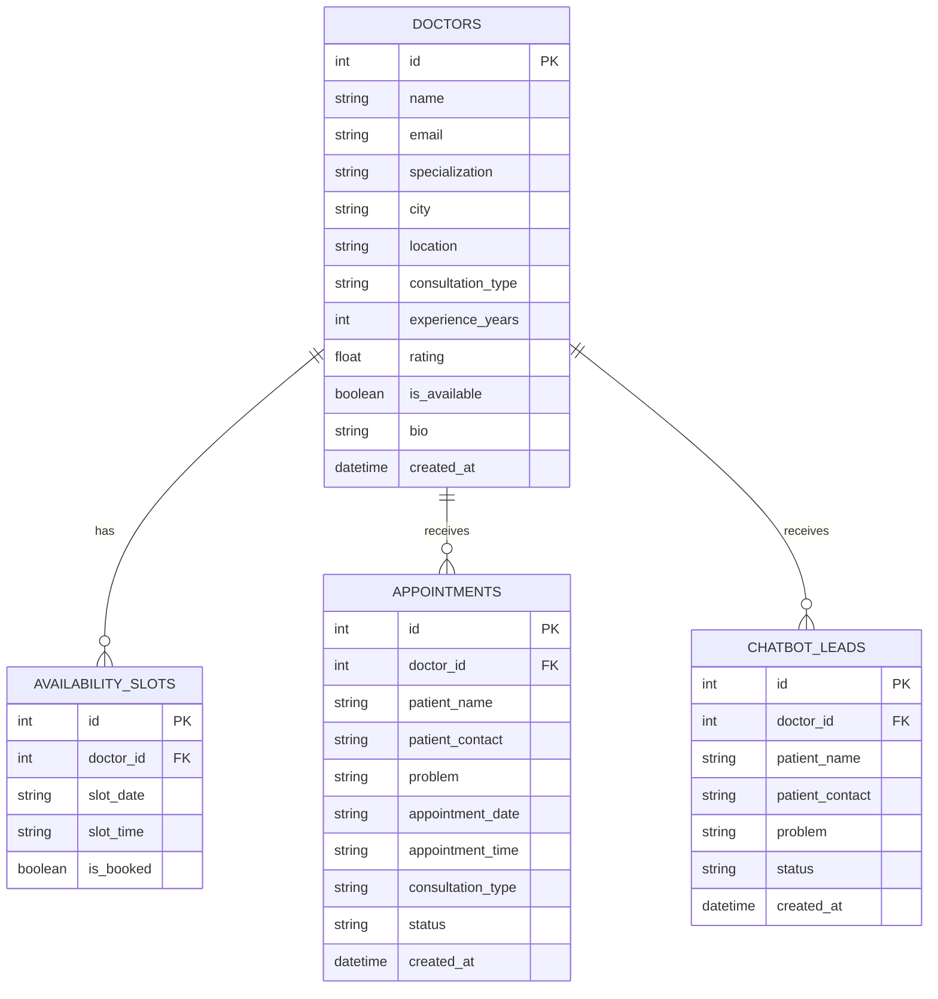
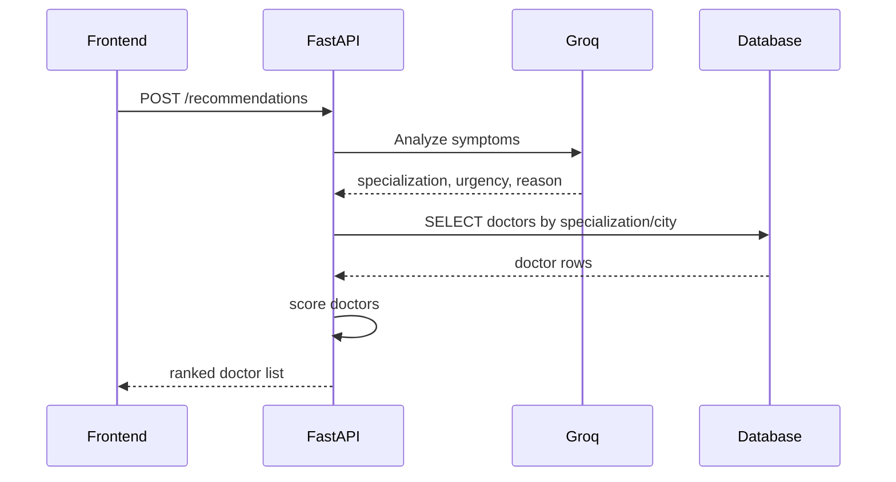
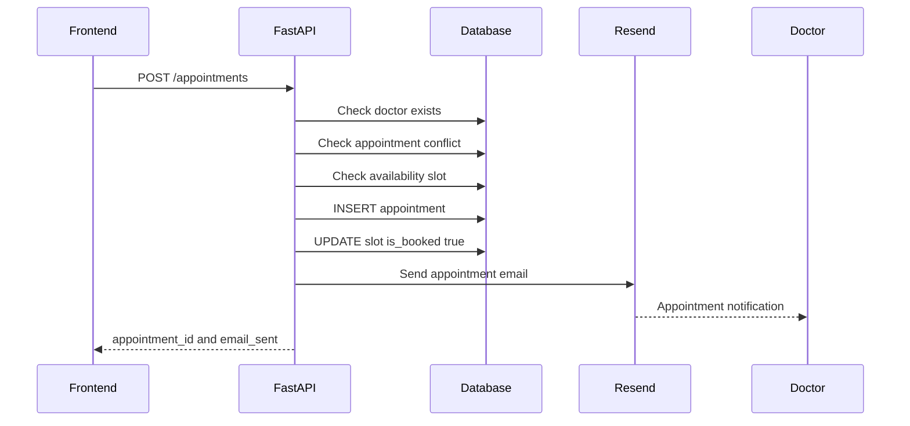
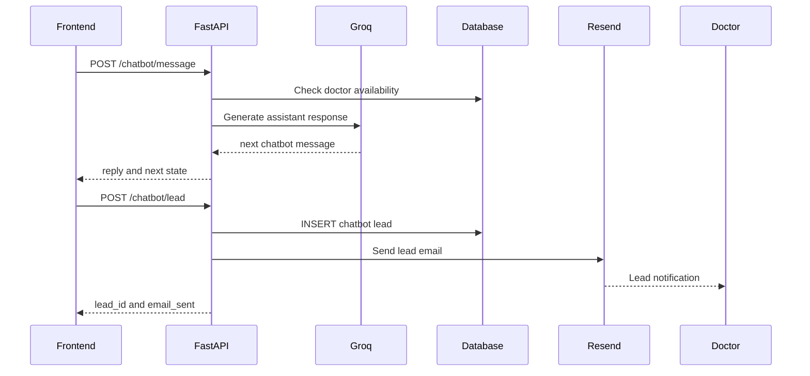
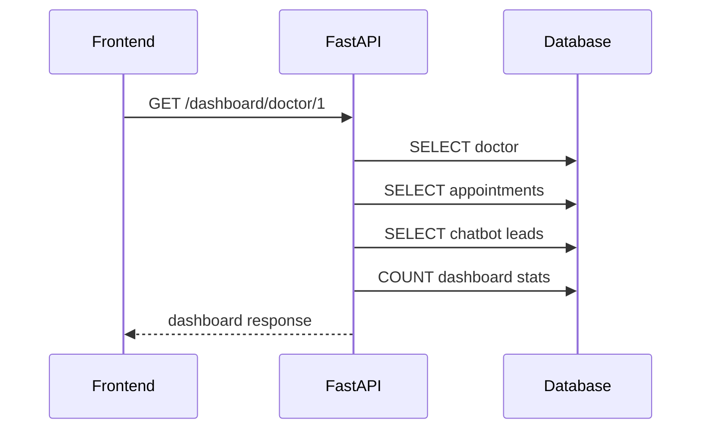

# Smart Doctor Connect AI — schema.md

**Project:** Smart Doctor Connect AI  
**Purpose:** Complete database schema, relationships, constraints, API-to-table mapping, and Supabase connection plan  
**Aligned With:** Final `idea.md` and `planning.md`  
**Backend:** FastAPI  
**ORM:** SQLAlchemy  
**MVP Database:** SQLite  
**Production/Scalable Database:** Supabase PostgreSQL  
**AI Provider:** Groq  
**Email Provider:** Resend  

---

# 1. Database Design Philosophy

The database must support the complete agreed system without overbuilding.

The system must store and manage:

```txt
1. Doctor profiles
2. Doctor availability slots
3. Patient appointments
4. AI chatbot leads
5. Appointment and chatbot communication data needed for dashboard
```

The database does **not** include these overkill features for the 2-hour MVP:

```txt
1. Full authentication tables
2. Admin panel tables
3. Reviews table
4. Payments table
5. Video consultation table
6. Real-time chat message table
7. Reminder cron table
8. File/profile image storage table
```

Those may be added in a future version, but they are not required for the hackathon MVP.

---

# 2. Final Database Tables

The final MVP database contains exactly these four core tables:

```txt
1. doctors
2. availability_slots
3. appointments
4. chatbot_leads
```

These tables are enough to satisfy:

```txt
Doctor profiles
Searchable doctors
Availability-based recommendations
Appointment booking
Conflict-free scheduling
AI chatbot lead collection
Doctor dashboard
Email notification workflows
```

---

# 3. High-Level Entity Relationship Diagram



---

# 4. Relationship Explanation

## 4.1 doctors → availability_slots

Relationship:

```txt
One doctor can have many availability slots.
One availability slot belongs to exactly one doctor.
```

Example:

```txt
Dr. Sara Malik
    ├── 2026-05-12 18:00
    ├── 2026-05-12 18:30
    └── 2026-05-12 19:00
```

Purpose:

```txt
Used for:
- Showing available times
- Booking appointments
- Preventing double booking
- Suggesting earliest available slot
```

---

## 4.2 doctors → appointments

Relationship:

```txt
One doctor can receive many appointments.
One appointment belongs to exactly one doctor.
```

Example:

```txt
Dr. Sara Malik
    ├── Appointment from Ali Khan at 18:00
    └── Appointment from Ayesha at 19:00
```

Purpose:

```txt
Used for:
- Doctor dashboard
- Appointment booking
- Conflict checking
- Email notifications
```

---

## 4.3 doctors → chatbot_leads

Relationship:

```txt
One doctor can receive many chatbot leads.
One chatbot lead belongs to exactly one doctor.
```

Example:

```txt
Dr. Hamza Ali unavailable
    └── AI chatbot collects Ali Khan's name, phone, and problem
```

Purpose:

```txt
Used for:
- Capturing patients when doctor is unavailable
- Sending Resend email to doctor
- Showing leads in doctor dashboard
```

---

# 5. Table 1 — doctors

## 5.1 Purpose

The `doctors` table stores all public doctor profile information.

It supports:

```txt
Doctor search
Doctor profile page
AI recommendation ranking
Availability status
Doctor dashboard identity
Email notifications
```

---

## 5.2 SQLite Schema for MVP

```sql
CREATE TABLE doctors (
    id INTEGER PRIMARY KEY AUTOINCREMENT,
    name TEXT NOT NULL,
    email TEXT NOT NULL,
    specialization TEXT NOT NULL,
    city TEXT NOT NULL,
    location TEXT,
    consultation_type TEXT NOT NULL,
    experience_years INTEGER DEFAULT 0,
    rating REAL DEFAULT 4.5,
    is_available BOOLEAN DEFAULT 1,
    bio TEXT,
    created_at DATETIME DEFAULT CURRENT_TIMESTAMP
);
```

---

## 5.3 Supabase PostgreSQL Schema

```sql
CREATE TABLE IF NOT EXISTS doctors (
    id BIGSERIAL PRIMARY KEY,
    name TEXT NOT NULL,
    email TEXT NOT NULL,
    specialization TEXT NOT NULL,
    city TEXT NOT NULL,
    location TEXT,
    consultation_type TEXT NOT NULL CHECK (consultation_type IN ('online', 'physical', 'both')),
    experience_years INTEGER NOT NULL DEFAULT 0 CHECK (experience_years >= 0),
    rating NUMERIC(2,1) NOT NULL DEFAULT 4.5 CHECK (rating >= 0 AND rating <= 5),
    is_available BOOLEAN NOT NULL DEFAULT TRUE,
    bio TEXT,
    created_at TIMESTAMPTZ NOT NULL DEFAULT NOW()
);
```

---

## 5.4 Column Details

| Column | Type | Required | Description |
|---|---:|---:|---|
| id | integer/bigserial | Yes | Unique doctor ID |
| name | text | Yes | Doctor full name |
| email | text | Yes | Doctor email used for Resend notifications |
| specialization | text | Yes | Medical specialization |
| city | text | Yes | Doctor city in Pakistan |
| location | text | No | Clinic/hospital/local area |
| consultation_type | text | Yes | `online`, `physical`, or `both` |
| experience_years | integer | No | Years of professional experience |
| rating | numeric/real | No | Demo rating from 0 to 5 |
| is_available | boolean | Yes | Whether doctor is currently available |
| bio | text | No | Short doctor description |
| created_at | timestamp | Yes | Record creation time |

---

## 5.5 Validation Rules

```txt
name cannot be empty
email cannot be empty
specialization cannot be empty
city cannot be empty
consultation_type must be online, physical, or both
experience_years cannot be negative
rating must be between 0 and 5
is_available defaults to true
```

---

## 5.6 Recommended Indexes

### SQLite

```sql
CREATE INDEX IF NOT EXISTS idx_doctors_city ON doctors(city);
CREATE INDEX IF NOT EXISTS idx_doctors_specialization ON doctors(specialization);
CREATE INDEX IF NOT EXISTS idx_doctors_availability ON doctors(is_available);
CREATE INDEX IF NOT EXISTS idx_doctors_consultation_type ON doctors(consultation_type);
```

### Supabase PostgreSQL

```sql
CREATE INDEX IF NOT EXISTS idx_doctors_city ON doctors(city);
CREATE INDEX IF NOT EXISTS idx_doctors_specialization ON doctors(specialization);
CREATE INDEX IF NOT EXISTS idx_doctors_is_available ON doctors(is_available);
CREATE INDEX IF NOT EXISTS idx_doctors_consultation_type ON doctors(consultation_type);
CREATE INDEX IF NOT EXISTS idx_doctors_search_combo
ON doctors(city, specialization, is_available);
```

---

# 6. Table 2 — availability_slots

## 6.1 Purpose

The `availability_slots` table stores individual bookable time slots for each doctor.

It supports:

```txt
Available slot display
Earliest available slot
Conflict-free booking
Waiting time estimate
Alternative slot suggestions
```

---

## 6.2 SQLite Schema for MVP

```sql
CREATE TABLE availability_slots (
    id INTEGER PRIMARY KEY AUTOINCREMENT,
    doctor_id INTEGER NOT NULL,
    slot_date TEXT NOT NULL,
    slot_time TEXT NOT NULL,
    is_booked BOOLEAN DEFAULT 0,
    FOREIGN KEY (doctor_id) REFERENCES doctors(id)
);
```

---

## 6.3 Supabase PostgreSQL Schema

```sql
CREATE TABLE IF NOT EXISTS availability_slots (
    id BIGSERIAL PRIMARY KEY,
    doctor_id BIGINT NOT NULL REFERENCES doctors(id) ON DELETE CASCADE,
    slot_date DATE NOT NULL,
    slot_time TIME NOT NULL,
    is_booked BOOLEAN NOT NULL DEFAULT FALSE,
    created_at TIMESTAMPTZ NOT NULL DEFAULT NOW(),
    UNIQUE (doctor_id, slot_date, slot_time)
);
```

---

## 6.4 Column Details

| Column | Type | Required | Description |
|---|---:|---:|---|
| id | integer/bigserial | Yes | Unique slot ID |
| doctor_id | integer/bigint | Yes | Linked doctor |
| slot_date | text/date | Yes | Appointment date |
| slot_time | text/time | Yes | Appointment start time |
| is_booked | boolean | Yes | Whether the slot is already booked |
| created_at | timestamp | PostgreSQL only | Record creation time |

---

## 6.5 Validation Rules

```txt
doctor_id must exist in doctors table
slot_date cannot be empty
slot_time cannot be empty
same doctor cannot have duplicate same date/time slot
is_booked defaults to false
```

---

## 6.6 Recommended Indexes

### SQLite

```sql
CREATE INDEX IF NOT EXISTS idx_slots_doctor_id ON availability_slots(doctor_id);
CREATE INDEX IF NOT EXISTS idx_slots_date ON availability_slots(slot_date);
CREATE INDEX IF NOT EXISTS idx_slots_booked ON availability_slots(is_booked);
CREATE UNIQUE INDEX IF NOT EXISTS uq_slots_doctor_date_time
ON availability_slots(doctor_id, slot_date, slot_time);
```

### Supabase PostgreSQL

```sql
CREATE INDEX IF NOT EXISTS idx_slots_doctor_id ON availability_slots(doctor_id);
CREATE INDEX IF NOT EXISTS idx_slots_date ON availability_slots(slot_date);
CREATE INDEX IF NOT EXISTS idx_slots_booked ON availability_slots(is_booked);
CREATE INDEX IF NOT EXISTS idx_slots_lookup
ON availability_slots(doctor_id, slot_date, is_booked);
```

---

# 7. Table 3 — appointments

## 7.1 Purpose

The `appointments` table stores confirmed or pending appointment requests.

It supports:

```txt
Appointment booking
Conflict-free scheduling
Doctor dashboard
Appointment email notification
Appointment status management
```

---

## 7.2 SQLite Schema for MVP

```sql
CREATE TABLE appointments (
    id INTEGER PRIMARY KEY AUTOINCREMENT,
    doctor_id INTEGER NOT NULL,
    patient_name TEXT NOT NULL,
    patient_contact TEXT NOT NULL,
    problem TEXT NOT NULL,
    appointment_date TEXT NOT NULL,
    appointment_time TEXT NOT NULL,
    consultation_type TEXT NOT NULL,
    status TEXT DEFAULT 'pending',
    created_at DATETIME DEFAULT CURRENT_TIMESTAMP,
    FOREIGN KEY (doctor_id) REFERENCES doctors(id)
);
```

---

## 7.3 Supabase PostgreSQL Schema

```sql
CREATE TABLE IF NOT EXISTS appointments (
    id BIGSERIAL PRIMARY KEY,
    doctor_id BIGINT NOT NULL REFERENCES doctors(id) ON DELETE CASCADE,
    patient_name TEXT NOT NULL,
    patient_contact TEXT NOT NULL,
    problem TEXT NOT NULL,
    appointment_date DATE NOT NULL,
    appointment_time TIME NOT NULL,
    consultation_type TEXT NOT NULL CHECK (consultation_type IN ('online', 'physical')),
    status TEXT NOT NULL DEFAULT 'pending'
        CHECK (status IN ('pending', 'confirmed', 'cancelled', 'completed')),
    created_at TIMESTAMPTZ NOT NULL DEFAULT NOW(),
    UNIQUE (doctor_id, appointment_date, appointment_time)
);
```

---

## 7.4 Column Details

| Column | Type | Required | Description |
|---|---:|---:|---|
| id | integer/bigserial | Yes | Unique appointment ID |
| doctor_id | integer/bigint | Yes | Linked doctor |
| patient_name | text | Yes | Patient name |
| patient_contact | text | Yes | Patient phone/email |
| problem | text | Yes | Patient medical concern |
| appointment_date | text/date | Yes | Appointment date |
| appointment_time | text/time | Yes | Appointment time |
| consultation_type | text | Yes | `online` or `physical` |
| status | text | Yes | `pending`, `confirmed`, `cancelled`, `completed` |
| created_at | timestamp | Yes | Booking creation time |

---

## 7.5 Validation Rules

```txt
doctor_id must exist
patient_name cannot be empty
patient_contact cannot be empty
problem cannot be empty
appointment_date cannot be empty
appointment_time cannot be empty
consultation_type must be online or physical
status must be pending, confirmed, cancelled, or completed
same doctor/date/time cannot be booked twice
```

---

## 7.6 Recommended Indexes

### SQLite

```sql
CREATE INDEX IF NOT EXISTS idx_appointments_doctor_id ON appointments(doctor_id);
CREATE INDEX IF NOT EXISTS idx_appointments_date ON appointments(appointment_date);
CREATE INDEX IF NOT EXISTS idx_appointments_status ON appointments(status);
CREATE UNIQUE INDEX IF NOT EXISTS uq_appointments_doctor_date_time
ON appointments(doctor_id, appointment_date, appointment_time);
```

### Supabase PostgreSQL

```sql
CREATE INDEX IF NOT EXISTS idx_appointments_doctor_id ON appointments(doctor_id);
CREATE INDEX IF NOT EXISTS idx_appointments_date ON appointments(appointment_date);
CREATE INDEX IF NOT EXISTS idx_appointments_status ON appointments(status);
CREATE INDEX IF NOT EXISTS idx_appointments_dashboard
ON appointments(doctor_id, appointment_date, status);
```

---

## 7.7 Important Scheduling Rule

This table must enforce the key hackathon scheduling requirement:

```txt
A doctor cannot have two appointments at the same date and time.
```

Enforce this at two levels:

```txt
1. Application-level check in FastAPI before insert
2. Database-level UNIQUE constraint on doctor_id + appointment_date + appointment_time
```

This protects against double booking even if two requests arrive at the same time.

---

# 8. Table 4 — chatbot_leads

## 8.1 Purpose

The `chatbot_leads` table stores patient details collected by AI when a doctor is unavailable.

It supports:

```txt
AI chatbot fallback
Patient lead capture
Doctor email notification
Doctor dashboard lead list
```

---

## 8.2 SQLite Schema for MVP

```sql
CREATE TABLE chatbot_leads (
    id INTEGER PRIMARY KEY AUTOINCREMENT,
    doctor_id INTEGER NOT NULL,
    patient_name TEXT NOT NULL,
    patient_contact TEXT NOT NULL,
    problem TEXT NOT NULL,
    status TEXT DEFAULT 'new',
    created_at DATETIME DEFAULT CURRENT_TIMESTAMP,
    FOREIGN KEY (doctor_id) REFERENCES doctors(id)
);
```

---

## 8.3 Supabase PostgreSQL Schema

```sql
CREATE TABLE IF NOT EXISTS chatbot_leads (
    id BIGSERIAL PRIMARY KEY,
    doctor_id BIGINT NOT NULL REFERENCES doctors(id) ON DELETE CASCADE,
    patient_name TEXT NOT NULL,
    patient_contact TEXT NOT NULL,
    problem TEXT NOT NULL,
    status TEXT NOT NULL DEFAULT 'new'
        CHECK (status IN ('new', 'contacted', 'closed')),
    created_at TIMESTAMPTZ NOT NULL DEFAULT NOW()
);
```

---

## 8.4 Column Details

| Column | Type | Required | Description |
|---|---:|---:|---|
| id | integer/bigserial | Yes | Unique lead ID |
| doctor_id | integer/bigint | Yes | Linked doctor |
| patient_name | text | Yes | Patient name collected by AI |
| patient_contact | text | Yes | Patient phone/email collected by AI |
| problem | text | Yes | Patient problem collected by AI |
| status | text | Yes | `new`, `contacted`, or `closed` |
| created_at | timestamp | Yes | Lead creation time |

---

## 8.5 Validation Rules

```txt
doctor_id must exist
patient_name cannot be empty
patient_contact cannot be empty
problem cannot be empty
status must be new, contacted, or closed
status defaults to new
```

---

## 8.6 Recommended Indexes

### SQLite

```sql
CREATE INDEX IF NOT EXISTS idx_leads_doctor_id ON chatbot_leads(doctor_id);
CREATE INDEX IF NOT EXISTS idx_leads_status ON chatbot_leads(status);
CREATE INDEX IF NOT EXISTS idx_leads_created_at ON chatbot_leads(created_at);
```

### Supabase PostgreSQL

```sql
CREATE INDEX IF NOT EXISTS idx_leads_doctor_id ON chatbot_leads(doctor_id);
CREATE INDEX IF NOT EXISTS idx_leads_status ON chatbot_leads(status);
CREATE INDEX IF NOT EXISTS idx_leads_dashboard
ON chatbot_leads(doctor_id, status, created_at);
```

---

# 9. Full Supabase PostgreSQL Migration Script

Use this script when moving from SQLite MVP to Supabase PostgreSQL.

```sql
-- ==========================================================
-- Smart Doctor Connect AI — Supabase PostgreSQL Schema
-- ==========================================================

CREATE TABLE IF NOT EXISTS doctors (
    id BIGSERIAL PRIMARY KEY,
    name TEXT NOT NULL,
    email TEXT NOT NULL,
    specialization TEXT NOT NULL,
    city TEXT NOT NULL,
    location TEXT,
    consultation_type TEXT NOT NULL CHECK (consultation_type IN ('online', 'physical', 'both')),
    experience_years INTEGER NOT NULL DEFAULT 0 CHECK (experience_years >= 0),
    rating NUMERIC(2,1) NOT NULL DEFAULT 4.5 CHECK (rating >= 0 AND rating <= 5),
    is_available BOOLEAN NOT NULL DEFAULT TRUE,
    bio TEXT,
    created_at TIMESTAMPTZ NOT NULL DEFAULT NOW()
);

CREATE TABLE IF NOT EXISTS availability_slots (
    id BIGSERIAL PRIMARY KEY,
    doctor_id BIGINT NOT NULL REFERENCES doctors(id) ON DELETE CASCADE,
    slot_date DATE NOT NULL,
    slot_time TIME NOT NULL,
    is_booked BOOLEAN NOT NULL DEFAULT FALSE,
    created_at TIMESTAMPTZ NOT NULL DEFAULT NOW(),
    UNIQUE (doctor_id, slot_date, slot_time)
);

CREATE TABLE IF NOT EXISTS appointments (
    id BIGSERIAL PRIMARY KEY,
    doctor_id BIGINT NOT NULL REFERENCES doctors(id) ON DELETE CASCADE,
    patient_name TEXT NOT NULL,
    patient_contact TEXT NOT NULL,
    problem TEXT NOT NULL,
    appointment_date DATE NOT NULL,
    appointment_time TIME NOT NULL,
    consultation_type TEXT NOT NULL CHECK (consultation_type IN ('online', 'physical')),
    status TEXT NOT NULL DEFAULT 'pending'
        CHECK (status IN ('pending', 'confirmed', 'cancelled', 'completed')),
    created_at TIMESTAMPTZ NOT NULL DEFAULT NOW(),
    UNIQUE (doctor_id, appointment_date, appointment_time)
);

CREATE TABLE IF NOT EXISTS chatbot_leads (
    id BIGSERIAL PRIMARY KEY,
    doctor_id BIGINT NOT NULL REFERENCES doctors(id) ON DELETE CASCADE,
    patient_name TEXT NOT NULL,
    patient_contact TEXT NOT NULL,
    problem TEXT NOT NULL,
    status TEXT NOT NULL DEFAULT 'new'
        CHECK (status IN ('new', 'contacted', 'closed')),
    created_at TIMESTAMPTZ NOT NULL DEFAULT NOW()
);

-- Indexes for doctor search
CREATE INDEX IF NOT EXISTS idx_doctors_city ON doctors(city);
CREATE INDEX IF NOT EXISTS idx_doctors_specialization ON doctors(specialization);
CREATE INDEX IF NOT EXISTS idx_doctors_is_available ON doctors(is_available);
CREATE INDEX IF NOT EXISTS idx_doctors_consultation_type ON doctors(consultation_type);
CREATE INDEX IF NOT EXISTS idx_doctors_search_combo
ON doctors(city, specialization, is_available);

-- Indexes for availability
CREATE INDEX IF NOT EXISTS idx_slots_doctor_id ON availability_slots(doctor_id);
CREATE INDEX IF NOT EXISTS idx_slots_date ON availability_slots(slot_date);
CREATE INDEX IF NOT EXISTS idx_slots_booked ON availability_slots(is_booked);
CREATE INDEX IF NOT EXISTS idx_slots_lookup
ON availability_slots(doctor_id, slot_date, is_booked);

-- Indexes for appointments
CREATE INDEX IF NOT EXISTS idx_appointments_doctor_id ON appointments(doctor_id);
CREATE INDEX IF NOT EXISTS idx_appointments_date ON appointments(appointment_date);
CREATE INDEX IF NOT EXISTS idx_appointments_status ON appointments(status);
CREATE INDEX IF NOT EXISTS idx_appointments_dashboard
ON appointments(doctor_id, appointment_date, status);

-- Indexes for chatbot leads
CREATE INDEX IF NOT EXISTS idx_leads_doctor_id ON chatbot_leads(doctor_id);
CREATE INDEX IF NOT EXISTS idx_leads_status ON chatbot_leads(status);
CREATE INDEX IF NOT EXISTS idx_leads_dashboard
ON chatbot_leads(doctor_id, status, created_at);
```

---

# 10. SQLAlchemy Models

These models should be used in `backend/app/models.py`.

```python
from sqlalchemy import (
    Column,
    Integer,
    String,
    Boolean,
    Float,
    DateTime,
    ForeignKey,
    UniqueConstraint,
)
from sqlalchemy.sql import func
from app.database import Base


class Doctor(Base):
    __tablename__ = "doctors"

    id = Column(Integer, primary_key=True, index=True)
    name = Column(String, nullable=False)
    email = Column(String, nullable=False)
    specialization = Column(String, nullable=False, index=True)
    city = Column(String, nullable=False, index=True)
    location = Column(String, nullable=True)
    consultation_type = Column(String, nullable=False)
    experience_years = Column(Integer, default=0)
    rating = Column(Float, default=4.5)
    is_available = Column(Boolean, default=True, index=True)
    bio = Column(String, nullable=True)
    created_at = Column(DateTime(timezone=True), server_default=func.now())


class AvailabilitySlot(Base):
    __tablename__ = "availability_slots"

    id = Column(Integer, primary_key=True, index=True)
    doctor_id = Column(Integer, ForeignKey("doctors.id"), nullable=False, index=True)
    slot_date = Column(String, nullable=False, index=True)
    slot_time = Column(String, nullable=False)
    is_booked = Column(Boolean, default=False, index=True)

    __table_args__ = (
        UniqueConstraint(
            "doctor_id",
            "slot_date",
            "slot_time",
            name="uq_slots_doctor_date_time",
        ),
    )


class Appointment(Base):
    __tablename__ = "appointments"

    id = Column(Integer, primary_key=True, index=True)
    doctor_id = Column(Integer, ForeignKey("doctors.id"), nullable=False, index=True)
    patient_name = Column(String, nullable=False)
    patient_contact = Column(String, nullable=False)
    problem = Column(String, nullable=False)
    appointment_date = Column(String, nullable=False, index=True)
    appointment_time = Column(String, nullable=False)
    consultation_type = Column(String, nullable=False)
    status = Column(String, default="pending", index=True)
    created_at = Column(DateTime(timezone=True), server_default=func.now())

    __table_args__ = (
        UniqueConstraint(
            "doctor_id",
            "appointment_date",
            "appointment_time",
            name="uq_appointments_doctor_date_time",
        ),
    )


class ChatbotLead(Base):
    __tablename__ = "chatbot_leads"

    id = Column(Integer, primary_key=True, index=True)
    doctor_id = Column(Integer, ForeignKey("doctors.id"), nullable=False, index=True)
    patient_name = Column(String, nullable=False)
    patient_contact = Column(String, nullable=False)
    problem = Column(String, nullable=False)
    status = Column(String, default="new", index=True)
    created_at = Column(DateTime(timezone=True), server_default=func.now())
```

---

# 11. Pydantic Schema Contracts

These schemas should be used in `backend/app/schemas.py`.

## 11.1 Doctor Schemas

```python
from pydantic import BaseModel, EmailStr
from typing import Optional, List


class DoctorCreate(BaseModel):
    name: str
    email: EmailStr
    specialization: str
    city: str
    location: Optional[str] = None
    consultation_type: str
    experience_years: int = 0
    rating: float = 4.5
    is_available: bool = True
    bio: Optional[str] = None


class DoctorUpdate(BaseModel):
    name: Optional[str] = None
    email: Optional[EmailStr] = None
    specialization: Optional[str] = None
    city: Optional[str] = None
    location: Optional[str] = None
    consultation_type: Optional[str] = None
    experience_years: Optional[int] = None
    rating: Optional[float] = None
    is_available: Optional[bool] = None
    bio: Optional[str] = None


class DoctorResponse(BaseModel):
    id: int
    name: str
    email: str
    specialization: str
    city: str
    location: Optional[str]
    consultation_type: str
    experience_years: int
    rating: float
    is_available: bool
    bio: Optional[str]

    class Config:
        from_attributes = True
```

---

## 11.2 Recommendation Schemas

```python
class RecommendationRequest(BaseModel):
    query: str
    city: str
    consultation_type: Optional[str] = None


class RecommendationDoctorResponse(BaseModel):
    id: int
    name: str
    specialization: str
    city: str
    location: Optional[str]
    consultation_type: str
    experience_years: int
    rating: float
    is_available: bool
    score: float
    recommendation_reason: str


class RecommendationResponse(BaseModel):
    detected_specialization: str
    urgency: Optional[str] = "medium"
    ai_reason: Optional[str]
    recommended_doctors: List[RecommendationDoctorResponse]
    safety_note: str = "This system helps find doctors. It does not provide diagnosis or emergency medical care."
```

---

## 11.3 Availability Schemas

```python
class AvailabilityCreate(BaseModel):
    slot_date: str
    slot_time: str


class AvailabilityUpdate(BaseModel):
    is_booked: bool


class AvailabilitySlotResponse(BaseModel):
    slot_id: int
    time: str
    is_booked: bool


class AvailabilityResponse(BaseModel):
    doctor_id: int
    date: str
    slots: List[AvailabilitySlotResponse]
    earliest_available_slot: Optional[str]
```

---

## 11.4 Appointment Schemas

```python
class AppointmentCreate(BaseModel):
    doctor_id: int
    patient_name: str
    patient_contact: str
    problem: str
    appointment_date: str
    appointment_time: str
    consultation_type: str


class AppointmentStatusUpdate(BaseModel):
    status: str


class AppointmentResponse(BaseModel):
    id: int
    doctor_id: int
    patient_name: str
    patient_contact: str
    problem: str
    appointment_date: str
    appointment_time: str
    consultation_type: str
    status: str

    class Config:
        from_attributes = True
```

---

## 11.5 Chatbot Schemas

```python
class ChatbotCollectedData(BaseModel):
    patient_name: Optional[str] = None
    patient_contact: Optional[str] = None
    problem: Optional[str] = None


class ChatbotMessageRequest(BaseModel):
    doctor_id: int
    message: str
    conversation_state: str
    collected_data: ChatbotCollectedData


class ChatbotMessageResponse(BaseModel):
    reply: str
    next_state: str
    collected_data: ChatbotCollectedData
    is_complete: bool


class ChatbotLeadCreate(BaseModel):
    doctor_id: int
    patient_name: str
    patient_contact: str
    problem: str


class ChatbotLeadResponse(BaseModel):
    id: int
    doctor_id: int
    patient_name: str
    patient_contact: str
    problem: str
    status: str

    class Config:
        from_attributes = True
```

---

## 11.6 Dashboard Schemas

```python
class DashboardStats(BaseModel):
    total_appointments: int
    pending_appointments: int
    today_appointments: int
    new_chatbot_leads: int


class DashboardDoctor(BaseModel):
    id: int
    name: str
    specialization: str
    city: str
    is_available: bool


class DashboardResponse(BaseModel):
    doctor: DashboardDoctor
    stats: DashboardStats
    appointments: list
    chatbot_leads: list
```

---

# 12. API-to-Database Mapping

This section is strict. APIs must use the listed tables only.

---

## 12.1 GET /doctors

Reads from:

```txt
doctors
```

Query:

```sql
SELECT * FROM doctors ORDER BY rating DESC;
```

---

## 12.2 GET /doctors/{doctor_id}

Reads from:

```txt
doctors
```

Query:

```sql
SELECT * FROM doctors WHERE id = :doctor_id;
```

---

## 12.3 POST /doctors

Writes to:

```txt
doctors
```

Insert fields:

```txt
name
email
specialization
city
location
consultation_type
experience_years
rating
is_available
bio
```

---

## 12.4 PUT /doctors/{doctor_id}

Updates:

```txt
doctors
```

Common update:

```sql
UPDATE doctors
SET is_available = :is_available
WHERE id = :doctor_id;
```

---

## 12.5 GET /doctors/search

Reads from:

```txt
doctors
```

Filter fields:

```txt
city
specialization
consultation_type
```

Consultation matching rule:

```txt
If consultation_type = online:
    return online and both

If consultation_type = physical:
    return physical and both

If consultation_type is empty:
    return all consultation types
```

---

## 12.6 POST /recommendations

Reads from:

```txt
doctors
```

External service:

```txt
Groq AI
```

Database write:

```txt
None
```

Process:

```txt
1. Analyze query using Groq
2. Fallback to symptom_map if Groq fails
3. Read doctors from database
4. Score doctors
5. Return top doctors
```

---

## 12.7 GET /availability/{doctor_id}

Reads from:

```txt
availability_slots
```

Query:

```sql
SELECT *
FROM availability_slots
WHERE doctor_id = :doctor_id
AND slot_date = :date
ORDER BY slot_time ASC;
```

---

## 12.8 POST /availability/{doctor_id}

Writes to:

```txt
availability_slots
```

Unique rule:

```txt
doctor_id + slot_date + slot_time must be unique
```

---

## 12.9 PUT /availability/slot/{slot_id}

Updates:

```txt
availability_slots
```

Query:

```sql
UPDATE availability_slots
SET is_booked = :is_booked
WHERE id = :slot_id;
```

---

## 12.10 POST /appointments

Reads from:

```txt
doctors
availability_slots
appointments
```

Writes to:

```txt
appointments
availability_slots
```

External service:

```txt
Resend
```

Process:

```txt
1. Confirm doctor exists
2. Check appointment conflict
3. Check slot availability
4. Insert appointment
5. Mark slot as booked
6. Send appointment email through Resend
7. Return appointment_id and email_sent
```

Important transaction rule:

```txt
Insert appointment and mark slot booked should happen in one transaction.
```

---

## 12.11 GET /appointments/doctor/{doctor_id}

Reads from:

```txt
appointments
```

Query:

```sql
SELECT *
FROM appointments
WHERE doctor_id = :doctor_id
ORDER BY appointment_date, appointment_time;
```

---

## 12.12 GET /appointments/{appointment_id}

Reads from:

```txt
appointments
```

Query:

```sql
SELECT *
FROM appointments
WHERE id = :appointment_id;
```

---

## 12.13 PUT /appointments/{appointment_id}/status

Updates:

```txt
appointments
```

Allowed statuses:

```txt
pending
confirmed
cancelled
completed
```

---

## 12.14 POST /chatbot/message

Reads from:

```txt
doctors
```

External service:

```txt
Groq AI
```

Database write:

```txt
None
```

Process:

```txt
1. Confirm doctor exists
2. Check doctor availability
3. Use Groq chatbot prompt or fallback state response
4. Return next chatbot state and collected data
```

---

## 12.15 POST /chatbot/lead

Reads from:

```txt
doctors
```

Writes to:

```txt
chatbot_leads
```

External service:

```txt
Resend
```

Process:

```txt
1. Confirm doctor exists
2. Insert lead
3. Send lead email through Resend
4. Return lead_id and email_sent
```

---

## 12.16 GET /chatbot/leads/{doctor_id}

Reads from:

```txt
chatbot_leads
```

Query:

```sql
SELECT *
FROM chatbot_leads
WHERE doctor_id = :doctor_id
ORDER BY created_at DESC;
```

---

## 12.17 GET /dashboard/doctor/{doctor_id}

Reads from:

```txt
doctors
appointments
chatbot_leads
```

Process:

```txt
1. Get doctor
2. Count all appointments
3. Count pending appointments
4. Count today's appointments
5. Count new chatbot leads
6. Return recent appointments
7. Return recent leads
```

---

# 13. Transaction Design

## 13.1 Appointment Booking Transaction

Appointment booking is the most important database workflow.

Pseudo-flow:

```python
def create_appointment(db, payload):
    doctor = get_doctor(payload.doctor_id)

    if doctor is None:
        raise 404

    conflict = db.query(Appointment).filter(
        Appointment.doctor_id == payload.doctor_id,
        Appointment.appointment_date == payload.appointment_date,
        Appointment.appointment_time == payload.appointment_time,
        Appointment.status != "cancelled",
    ).first()

    if conflict:
        return conflict_response_with_alternative_slots()

    slot = db.query(AvailabilitySlot).filter(
        AvailabilitySlot.doctor_id == payload.doctor_id,
        AvailabilitySlot.slot_date == payload.appointment_date,
        AvailabilitySlot.slot_time == payload.appointment_time,
    ).first()

    if slot and slot.is_booked:
        return conflict_response_with_alternative_slots()

    appointment = Appointment(...)
    db.add(appointment)

    if slot:
        slot.is_booked = True

    db.commit()
    db.refresh(appointment)

    email_sent = send_appointment_email_safely(...)

    return success_response
```

Important:

```txt
Email should happen after database commit.
If email fails, appointment should remain saved.
```

---

## 13.2 Chatbot Lead Transaction

Pseudo-flow:

```python
def save_chatbot_lead(db, payload):
    doctor = get_doctor(payload.doctor_id)

    if doctor is None:
        raise 404

    lead = ChatbotLead(...)
    db.add(lead)
    db.commit()
    db.refresh(lead)

    email_sent = send_lead_email_safely(...)

    return lead_id, email_sent
```

Important:

```txt
Email failure must not delete or block the saved lead.
```

---

# 14. Supabase Connection Plan

The MVP uses SQLite for speed, but the schema is designed to move to Supabase PostgreSQL with minimal change.

---

## 14.1 Local SQLite DATABASE_URL

Use this for 2-hour hackathon:

```env
DATABASE_URL=sqlite:///./smart_doctor.db
```

SQLAlchemy engine example:

```python
engine = create_engine(
    settings.DATABASE_URL,
    connect_args={"check_same_thread": False}
)
```

The `check_same_thread` option is needed for SQLite in a FastAPI development server.

---

## 14.2 Supabase PostgreSQL DATABASE_URL

For Supabase:

```env
DATABASE_URL=postgresql+psycopg2://postgres:[YOUR-PASSWORD]@[HOST]:5432/postgres
```

or, when using Supabase pooler:

```env
DATABASE_URL=postgresql+psycopg2://postgres.[PROJECT-REF]:[YOUR-PASSWORD]@[POOLER-HOST]:6543/postgres
```

Important SQLAlchemy rule:

```txt
Use postgresql+psycopg2:// for SQLAlchemy.
If Supabase gives postgres://, convert it to postgresql+psycopg2:// or postgresql:// depending on driver.
```

Recommended for deployed FastAPI:

```txt
Use the Supabase pooler connection string if deploying on serverless or limited connection platforms.
Use direct connection if running a long-lived backend server and IPv6/networking works.
```

---

## 14.3 Where to Find Supabase Connection String

Steps:

```txt
1. Open Supabase dashboard.
2. Select your project.
3. Click Connect.
4. Choose your connection method.
5. Copy the database connection string.
6. Replace [YOUR-PASSWORD] with your actual database password.
7. Put the final value in DATABASE_URL.
```

Never place Supabase `DATABASE_URL` in frontend `.env.local`.

It must only be used in backend `.env` or deployment secret settings.

---

## 14.4 Required Backend Dependencies for Supabase PostgreSQL

Add to `backend/requirements.txt`:

```txt
psycopg2-binary
```

or use async driver later:

```txt
asyncpg
```

For this FastAPI MVP with standard SQLAlchemy session:

```txt
psycopg2-binary is simpler.
```

---

## 14.5 SQLAlchemy Engine for SQLite and PostgreSQL

Use a helper that handles SQLite separately.

```python
from sqlalchemy import create_engine
from sqlalchemy.orm import sessionmaker, declarative_base
from app.config import settings

connect_args = {}

if settings.DATABASE_URL.startswith("sqlite"):
    connect_args = {"check_same_thread": False}

engine = create_engine(
    settings.DATABASE_URL,
    connect_args=connect_args,
    pool_pre_ping=True,
)

SessionLocal = sessionmaker(
    autocommit=False,
    autoflush=False,
    bind=engine,
)

Base = declarative_base()
```

For Supabase PostgreSQL, `connect_args` remains empty.

---

## 14.6 Supabase Migration Steps

When moving from SQLite to Supabase:

```txt
1. Create Supabase project.
2. Copy DATABASE_URL.
3. Add DATABASE_URL to backend environment.
4. Install psycopg2-binary.
5. Run the Supabase PostgreSQL migration script from this schema.md.
6. Run seed script adjusted for PostgreSQL.
7. Start backend.
8. Test /health.
9. Test /doctors.
10. Test /recommendations.
11. Test /appointments.
12. Test /dashboard/doctor/1.
```

---

# 15. Data Seeding Plan

## 15.1 Required Seed Doctors

```sql
INSERT INTO doctors
(name, email, specialization, city, location, consultation_type, experience_years, rating, is_available, bio)
VALUES
('Dr. Sara Malik', 'sara@example.com', 'Orthopedic', 'Lahore', 'Johar Town Clinic', 'both', 8, 4.8, TRUE, 'Experienced orthopedic specialist for back pain, joint pain, and bone injuries.'),
('Dr. Hamza Ali', 'hamza@example.com', 'Orthopedic', 'Lahore', 'Gulberg Clinic', 'physical', 7, 4.5, FALSE, 'Orthopedic consultant for bone and back pain.'),
('Dr. Ayesha Khan', 'ayesha@example.com', 'Dermatologist', 'Karachi', 'Clifton Clinic', 'online', 9, 4.9, TRUE, 'Skin specialist for acne, allergy, and dermatology consultations.'),
('Dr. Ahmed Raza', 'ahmed@example.com', 'Cardiologist', 'Lahore', 'Model Town Heart Center', 'physical', 12, 4.7, TRUE, 'Heart specialist for cardiac consultation.'),
('Dr. Bilal Shah', 'bilal@example.com', 'Cardiologist', 'Karachi', 'DHA Medical Center', 'both', 10, 4.6, FALSE, 'Cardiologist offering online and physical appointments.'),
('Dr. Maria Noor', 'maria@example.com', 'Pediatrician', 'Peshawar', 'University Road Clinic', 'online', 6, 4.8, TRUE, 'Child specialist for fever, flu, and pediatric issues.'),
('Dr. Zainab Fatima', 'zainab@example.com', 'Gynecologist', 'Rawalpindi', 'Saddar Women Clinic', 'physical', 11, 4.7, TRUE, 'Gynecologist for women health and pregnancy care.'),
('Dr. Usman Tariq', 'usman@example.com', 'Dentist', 'Lahore', 'DHA Dental Studio', 'both', 5, 4.4, TRUE, 'Dentist for tooth pain and dental care.'),
('Dr. Hira Javed', 'hira@example.com', 'General Physician', 'Islamabad', 'Blue Area Clinic', 'online', 6, 4.6, TRUE, 'General physician for fever, flu, and general health concerns.'),
('Dr. Salman Iqbal', 'salman@example.com', 'ENT Specialist', 'Quetta', 'Jinnah Road ENT Clinic', 'physical', 8, 4.3, TRUE, 'ENT specialist for ear, nose, and throat problems.'),
('Dr. Noor Ahmed', 'noor@example.com', 'Psychiatrist', 'Islamabad', 'F-8 Mental Wellness Clinic', 'online', 9, 4.7, TRUE, 'Psychiatrist for stress, anxiety, and mental health support.'),
('Dr. Farhan Saeed', 'farhan@example.com', 'Gastroenterologist', 'Multan', 'Cantt Medical Center', 'both', 10, 4.5, TRUE, 'Stomach and digestive system specialist.');
```

---

## 15.2 Required Availability Seed

For each doctor, create slots:

```txt
2026-05-12 18:00
2026-05-12 18:30
2026-05-12 19:00
2026-05-12 19:30
```

Example:

```sql
INSERT INTO availability_slots
(doctor_id, slot_date, slot_time, is_booked)
VALUES
(1, '2026-05-12', '18:00', FALSE),
(1, '2026-05-12', '18:30', FALSE),
(1, '2026-05-12', '19:00', FALSE),
(1, '2026-05-12', '19:30', FALSE);
```

---

# 16. Data Flow by Feature

## 16.1 AI Recommendation Data Flow



Tables used:

```txt
doctors
```

External service:

```txt
Groq
```

Database writes:

```txt
None
```

---

## 16.2 Appointment Booking Data Flow



Tables used:

```txt
doctors
appointments
availability_slots
```

External service:

```txt
Resend
```

---

## 16.3 Chatbot Lead Data Flow



Tables used:

```txt
doctors
chatbot_leads
```

External services:

```txt
Groq
Resend
```

---

## 16.4 Dashboard Data Flow



Tables used:

```txt
doctors
appointments
chatbot_leads
```

---

# 17. Strict API Contracts and Database Effects

## 17.1 Endpoint Summary

| Endpoint | Method | Reads | Writes | External Service |
|---|---|---|---|---|
| `/health` | GET | none | none | none |
| `/doctors` | GET | doctors | none | none |
| `/doctors/{doctor_id}` | GET | doctors | none | none |
| `/doctors` | POST | none | doctors | none |
| `/doctors/{doctor_id}` | PUT | doctors | doctors | none |
| `/doctors/search` | GET | doctors | none | none |
| `/recommendations` | POST | doctors | none | Groq |
| `/availability/{doctor_id}` | GET | availability_slots | none | none |
| `/availability/{doctor_id}` | POST | doctors | availability_slots | none |
| `/availability/slot/{slot_id}` | PUT | availability_slots | availability_slots | none |
| `/appointments` | POST | doctors, appointments, availability_slots | appointments, availability_slots | Resend |
| `/appointments/doctor/{doctor_id}` | GET | appointments | none | none |
| `/appointments/{appointment_id}` | GET | appointments | none | none |
| `/appointments/{appointment_id}/status` | PUT | appointments | appointments | none |
| `/chatbot/message` | POST | doctors | none | Groq |
| `/chatbot/lead` | POST | doctors | chatbot_leads | Resend |
| `/chatbot/leads/{doctor_id}` | GET | chatbot_leads | none | none |
| `/email/send-appointment` | POST | none | none | Resend |
| `/email/send-lead` | POST | none | none | Resend |
| `/dashboard/doctor/{doctor_id}` | GET | doctors, appointments, chatbot_leads | none | none |

---

# 18. Data Integrity and Debugging Rules

## 18.1 Common Database Bugs

### Bug: Duplicate appointments

Cause:

```txt
No unique constraint or no conflict check.
```

Fix:

```txt
Add UNIQUE(doctor_id, appointment_date, appointment_time).
Check conflict before insert.
```

---

### Bug: Slot booked but no appointment exists

Cause:

```txt
Slot updated before appointment insert and transaction failed.
```

Fix:

```txt
Use transaction.
Insert appointment and update slot before commit.
Rollback if failure.
```

---

### Bug: Appointment exists but slot not marked booked

Cause:

```txt
Appointment inserted but slot update skipped.
```

Fix:

```txt
After insert appointment, update availability_slots.is_booked = true in same transaction.
```

---

### Bug: Doctor dashboard empty after booking

Cause:

```txt
Wrong doctor_id used or appointment not committed.
```

Debug query:

```sql
SELECT * FROM appointments WHERE doctor_id = 1;
```

---

### Bug: Chatbot lead email sends but dashboard empty

Cause:

```txt
Email called before DB insert or insert failed.
```

Fix:

```txt
Save lead first.
Commit.
Then send email.
```

---

### Bug: Supabase connection fails

Possible causes:

```txt
Wrong DATABASE_URL
Wrong password
Project paused
Wrong pooler/direct connection
Missing psycopg2-binary
Using postgres:// instead of SQLAlchemy-compatible URL
Network/IPv6 issue
```

Fix checklist:

```txt
1. Confirm Supabase project is active.
2. Copy fresh connection string from Connect menu.
3. Replace password correctly.
4. Use postgresql+psycopg2://.
5. Install psycopg2-binary.
6. Use pooler connection if direct connection fails.
7. Test with /health and /doctors.
```

---

# 19. Database Testing Plan

## 19.1 Required Tests

### Doctor table tests

```txt
TC-DB-001: Create doctor succeeds with valid data
TC-DB-002: Doctor cannot be created without name
TC-DB-003: Doctor search by city works
TC-DB-004: Doctor search by specialization works
TC-DB-005: Doctor availability update works
```

### Availability table tests

```txt
TC-DB-006: Create slot succeeds
TC-DB-007: Duplicate doctor/date/time slot fails
TC-DB-008: Get slots by doctor/date works
TC-DB-009: Mark slot booked works
TC-DB-010: Earliest available slot excludes booked slots
```

### Appointment table tests

```txt
TC-DB-011: Create appointment succeeds
TC-DB-012: Appointment requires doctor_id
TC-DB-013: Duplicate doctor/date/time appointment fails
TC-DB-014: Appointment status defaults to pending
TC-DB-015: Appointment status update works
```

### Chatbot lead table tests

```txt
TC-DB-016: Create chatbot lead succeeds
TC-DB-017: Lead requires doctor_id
TC-DB-018: Lead defaults to status new
TC-DB-019: Get leads by doctor works
TC-DB-020: Lead status can be updated later if endpoint added
```

### Dashboard tests

```txt
TC-DB-021: Total appointment count is correct
TC-DB-022: Pending appointment count is correct
TC-DB-023: Today appointment count is correct
TC-DB-024: New chatbot lead count is correct
```

---

# 20. Production Upgrade Path

After hackathon, upgrade as follows:

## 20.1 Add users table

```txt
Only add when authentication is implemented.
```

Future table:

```sql
CREATE TABLE users (
    id UUID PRIMARY KEY,
    email TEXT NOT NULL UNIQUE,
    full_name TEXT NOT NULL,
    role TEXT NOT NULL CHECK (role IN ('doctor', 'patient')),
    phone TEXT,
    city TEXT,
    created_at TIMESTAMPTZ NOT NULL DEFAULT NOW()
);
```

## 20.2 Add doctor user mapping

Future field in `doctors`:

```sql
user_id UUID REFERENCES users(id)
```

## 20.3 Add RLS policies

Future Supabase security:

```txt
Doctor profiles public read
Doctors can update own profile
Doctors can view own appointments and leads
Patients can view own appointments
```

## 20.4 Add reviews

Future table:

```txt
reviews
```

## 20.5 Add reminders

Future table:

```txt
reminders
```

## 20.6 Add chat_messages

Future table:

```txt
chat_messages
```

Do not add these in the 2-hour MVP unless core features are fully complete.

---

# 21. Final Schema Checklist

Before development starts, confirm:

```txt
[ ] doctors table exists
[ ] availability_slots table exists
[ ] appointments table exists
[ ] chatbot_leads table exists
[ ] doctors has seed data
[ ] availability_slots has seed data
[ ] doctor_id foreign keys are correct
[ ] appointment duplicate constraint exists
[ ] slot duplicate constraint exists
[ ] search indexes exist
[ ] DATABASE_URL works locally
[ ] Supabase DATABASE_URL plan is documented
[ ] API contracts match idea.md and planning.md
```

---

# 22. Final Database Rule

The database must support the demo path without confusion:

```txt
Search doctors
Book appointment
Block duplicate slot
Save chatbot lead
Show doctor dashboard
Send doctor email
```

If a schema change does not directly support that demo path, it should not be added during the 2-hour hackathon.

---

# 23. Final One-Line Database Summary

> The Smart Doctor Connect AI database is a focused four-table schema that connects doctors, availability slots, appointments, and AI-collected chatbot leads, with strict constraints to prevent double booking and a clean `DATABASE_URL` path from SQLite MVP to Supabase PostgreSQL deployment.
